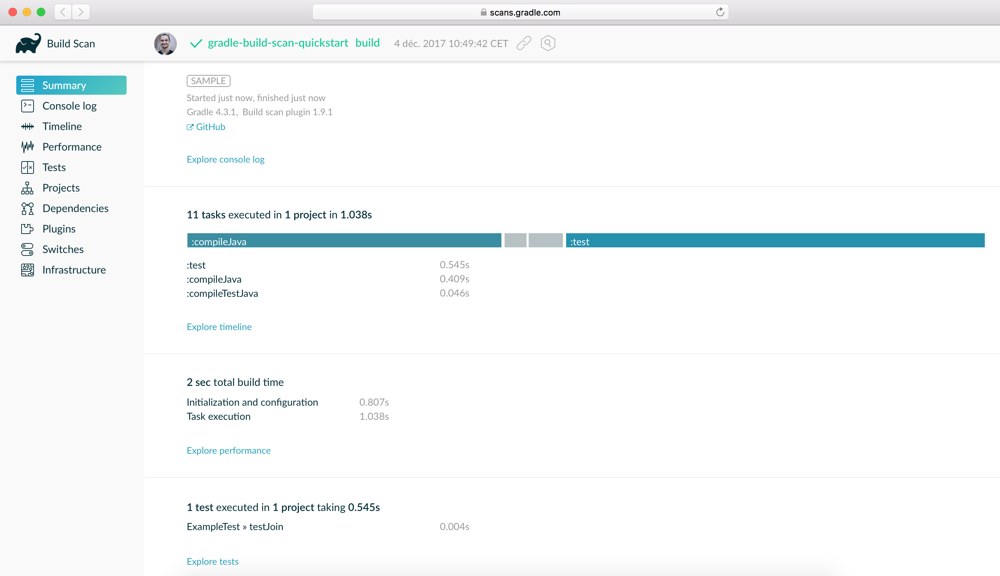

[TOC]

# 前言

本文转自官方文档：https://guides.gradle.org/creating-build-scans/


Build Scans 能提供非常丰富的项目构建信息，包括项目构建情况、耗时、依赖、插件等，如下图




# 一、创建Build Scans

下载官方提供的 [demo工程](https://github.com/gradle/gradle-build-scan-quickstart)，然后再根目录执行`gradlew build --scan`，项目就会开始构建，并在最后询问是否接受许可协议，若选择是，将构建结果发布到`https://gradle.com`，则控制台会返回一个构建结果对应的链接，如下：

```bash
$ ./gradlew build --scan

BUILD SUCCESSFUL in 6s

Do you accept the Gradle Cloud Services license agreement (https://gradle.com/terms-of-service)? [yes, no]
yes
Gradle Cloud Services license agreement accepted.

Publishing build scan...
https://gradle.com/s/czajmbyg73t62
```


## 2.启用发布

下面我们通过在脚本配置文件 `build.gradle`中修改 `build-scan plugin`的配置，来让 `gradle` 构建完成之后，不再询问，而是直接发布到`https://gradle.com`


（1）声明 `build-scan plugin`

```groovy
plugins {
    id 'com.gradle.build-scan' version '2.1'   
}
```


（2）配置接受许可协议

```
buildScan {
    termsOfServiceUrl = 'https://gradle.com/terms-of-service'
    termsOfServiceAgree = 'yes'
}
```


