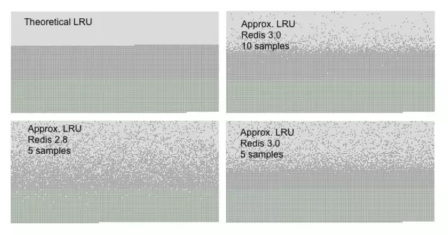

原文地址：https://mp.weixin.qq.com/s/HA5ERs-he3ldiwsvObCeqA

Redis 是基于内存的 key-value 数据库，因为系统的内存大小有限，所以我们在使用 Redis 的时候可以配置 Redis 能使用的最大的内存大小。

##### 1、通过配置文件配置

通过在 Redis 安装目录下面的 redis.conf 配置文件中添加以下配置设置内存大小

```
//设置Redis最大占用内存大小为100Mmaxmemory 100mb复制代码
```

> redis 的配置文件不一定使用的是安装目录下面的 redis.conf 文件，启动 redis 服务的时候是可以传一个参数指定 redis 的配置文件的

##### 2、通过命令修改

Redis 支持运行时通过命令动态修改内存大小

```
//设置Redis最大占用内存大小为100M127.0.0.1:6379> config set maxmemory 100mb//获取设置的Redis能使用的最大内存大小127.0.0.1:6379> config get maxmemory复制代码
```

> 如果不设置最大内存大小或者设置最大内存大小为 0，在 64 位操作系统下不限制内存大小，在 32 位操作系统下最多使用 3GB 内存

### Redis 的内存淘汰

既然可以设置 Redis 最大占用内存大小，那么配置的内存就有用完的时候。那在内存用完的时候，还继续往 Redis 里面添加数据不就没内存可用了吗？

实际上 Redis 定义了几种策略用来处理这种情况：

**noeviction(默认策略)**：对于写请求不再提供服务，直接返回错误（DEL 请求和部分特殊请求除外）

**allkeys-lru**：从所有 key 中使用 LRU 算法进行淘汰

**volatile-lru**：从设置了过期时间的 key 中使用 LRU 算法进行淘汰

**allkeys-random**：从所有 key 中随机淘汰数据

**volatile-random**：从设置了过期时间的 key 中随机淘汰

**volatile-ttl**：在设置了过期时间的 key 中，根据 key 的过期时间进行淘汰，越早过期的越优先被淘汰

> 当使用**volatile-lru**、**volatile-random**、**volatile-ttl**这三种策略时，如果没有 key 可以被淘汰，则和**noeviction**一样返回错误

##### 如何获取及设置内存淘汰策略

获取当前内存淘汰策略：

```
127.0.0.1:6379> config get maxmemory-policy
```

通过配置文件设置淘汰策略（修改 redis.conf 文件）：

```
maxmemory-policy allkeys-lru
```

通过命令修改淘汰策略：

```
127.0.0.1:6379> config set maxmemory-policy allkeys-lru
```

### LRU 算法

##### 什么是 LRU?

上面说到了 Redis 可使用最大内存使用完了，是可以使用 LRU 算法进行内存淘汰的，那么什么是 LRU 算法呢？

> **LRU(Least Recently Used)**，即最近最少使用，是一种缓存置换算法。在使用内存作为缓存的时候，缓存的大小一般是固定的。当缓存被占满，这个时候继续往缓存里面添加数据，就需要淘汰一部分老的数据，释放内存空间用来存储新的数据。这个时候就可以使用 LRU 算法了。其核心思想是：如果一个数据在最近一段时间没有被用到，那么将来被使用到的可能性也很小，所以就可以被淘汰掉。

##### 使用 java 实现一个简单的 LRU 算法

```
public class LRUCache<k, v> {    //容量    private int capacity;    //当前有多少节点的统计    private int count;    //缓存节点    private Map<k, Node<k, v>> nodeMap;    private Node<k, v> head;    private Node<k, v> tail;    public LRUCache(int capacity) {        if (capacity < 1) {            throw new IllegalArgumentException(String.valueOf(capacity));        }        this.capacity = capacity;        this.nodeMap = new HashMap<>();        //初始化头节点和尾节点，利用哨兵模式减少判断头结点和尾节点为空的代码        Node headNode = new Node(null, null);        Node tailNode = new Node(null, null);        headNode.next = tailNode;        tailNode.pre = headNode;        this.head = headNode;        this.tail = tailNode;    }    public void put(k key, v value) {        Node<k, v> node = nodeMap.get(key);        if (node == null) {            if (count >= capacity) {                //先移除一个节点                removeNode();            }            node = new Node<>(key, value);            //添加节点            addNode(node);        } else {            //移动节点到头节点            moveNodeToHead(node);        }    }    public Node<k, v> get(k key) {        Node<k, v> node = nodeMap.get(key);        if (node != null) {            moveNodeToHead(node);        }        return node;    }    private void removeNode() {        Node node = tail.pre;        //从链表里面移除        removeFromList(node);        nodeMap.remove(node.key);        count--;    }    private void removeFromList(Node<k, v> node) {        Node pre = node.pre;        Node next = node.next;        pre.next = next;        next.pre = pre;        node.next = null;        node.pre = null;    }    private void addNode(Node<k, v> node) {        //添加节点到头部        addToHead(node);        nodeMap.put(node.key, node);        count++;    }    private void addToHead(Node<k, v> node) {        Node next = head.next;        next.pre = node;        node.next = next;        node.pre = head;        head.next = node;    }    public void moveNodeToHead(Node<k, v> node) {        //从链表里面移除        removeFromList(node);        //添加节点到头部        addToHead(node);    }    class Node<k, v> {        k key;        v value;        Node pre;        Node next;        public Node(k key, v value) {            this.key = key;            this.value = value;        }    }}复制代码
```

> 上面这段代码实现了一个简单的 LUR 算法，代码很简单，也加了注释，仔细看一下很容易就看懂。

### LRU 在 Redis 中的实现

##### 近似 LRU 算法

Redis 使用的是近似 LRU 算法，它跟常规的 LRU 算法还不太一样。近似 LRU 算法通过随机采样法淘汰数据，每次随机出 5（默认）个 key，从里面淘汰掉最近最少使用的 key。

> 可以通过 maxmemory-samples 参数修改采样数量：例：maxmemory-samples 10 maxmenory-samples 配置的越大，淘汰的结果越接近于严格的 LRU 算法

Redis 为了实现近似 LRU 算法，给每个 key 增加了一个额外增加了一个 24bit 的字段，用来存储该 key 最后一次被访问的时间。

##### Redis3.0 对近似 LRU 的优化

Redis3.0 对近似 LRU 算法进行了一些优化。新算法会维护一个候选池（大小为 16），池中的数据根据访问时间进行排序，第一次随机选取的 key 都会放入池中，随后每次随机选取的 key 只有在访问时间小于池中最小的时间才会放入池中，直到候选池被放满。当放满后，如果有新的 key 需要放入，则将池中最后访问时间最大（最近被访问）的移除。

当需要淘汰的时候，则直接从池中选取最近访问时间最小（最久没被访问）的 key 淘汰掉就行。

##### LRU 算法的对比

我们可以通过一个实验对比各 LRU 算法的准确率，先往 Redis 里面添加一定数量的数据 n，使 Redis 可用内存用完，再往 Redis 里面添加 n/2 的新数据，这个时候就需要淘汰掉一部分的数据，如果按照严格的 LRU 算法，应该淘汰掉的是最先加入的 n/2 的数据。生成如下各 LRU 算法的对比图（[图片来源]

你可以看到图中有三种不同颜色的点：

- 浅灰色是被淘汰的数据
- 灰色是没有被淘汰掉的老数据
- 绿色是新加入的数据

我们能看到 Redis3.0 采样数是 10 生成的图最接近于严格的 LRU。而同样使用 5 个采样数，Redis3.0 也要优于 Redis2.8。

### LFU 算法

LFU 算法是 Redis4.0 里面新加的一种淘汰策略。它的全称是**Least Frequently Used**，它的核心思想是根据 key 的最近被访问的频率进行淘汰，很少被访问的优先被淘汰，被访问的多的则被留下来。

LFU 算法能更好的表示一个 key 被访问的热度。假如你使用的是 LRU 算法，一个 key 很久没有被访问到，只刚刚是偶尔被访问了一次，那么它就被认为是热点数据，不会被淘汰，而有些 key 将来是很有可能被访问到的则被淘汰了。如果使用 LFU 算法则不会出现这种情况，因为使用一次并不会使一个 key 成为热点数据。

LFU 一共有两种策略：

- volatile-lfu：在设置了过期时间的 key 中使用 LFU 算法淘汰 key
- allkeys-lfu：在所有的 key 中使用 LFU 算法淘汰数据

> 设置使用这两种淘汰策略跟前面讲的一样，不过要注意的一点是这两周策略只能在 Redis4.0 及以上设置，如果在 Redis4.0 以下设置会报错

### 问题

最后留一个小问题，可能有的人注意到了，我在文中并没有解释为什么 Redis 使用近似 LRU 算法而不使用准确的 LRU 算法，可以在评论区给出你的答案，大家一起讨论学习。
