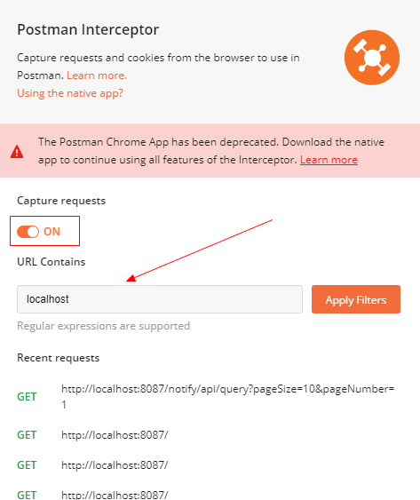
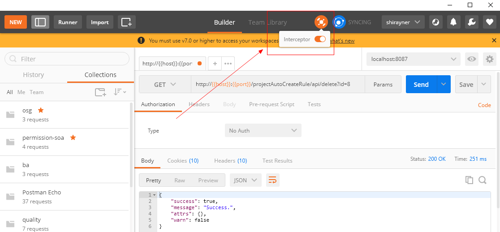

[[toc]]

[toc]

## 一、VsCode REST Client（推荐）

## 二、Postman

chrom 安装 postman 插件：

> 提供方为：[postman.com](http://postman.com/) ， 需要安装两个：
>
> - [postman-chorme-app](https://chrome.google.com/webstore/detail/postman/fhbjgbiflinjbdggehcddcbncdddomop?hl=zh-CN)
> - [Postman Interceptor](https://chrome.google.com/webstore/detail/postman-interceptor/aicmkgpgakddgnaphhhpliifpcfhicfo)

### 1.Postman Interceptor

启用 Postman Interceptor ，并设置要拦截 url 的匹配规则

### 2.Postman Chrome App

接着运行 Postman Chrome App

然后打开 Interceptor

这样，postman 就可以自动拦截到浏览器中的 cookie 了
