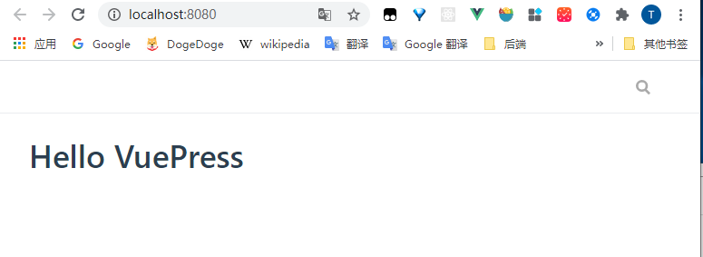
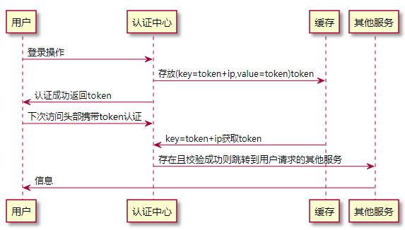

[[toc]]

[toc]

## 推荐阅读

> - [vuepress 官方文档](https://vuepress.vuejs.org/zh/)
> - [vuepress/awesome-vuepress](https://github.com/vuepress/awesome-vuepress)
> - [vuePress 博客搭建指南](https://book.hliedu.com/guide/notes/vuepress.html)
> - [vuepress 踩坑记录](https://ououe.com/posts/2019/07/07/vuepress/)
> - [vuepress + GitHub 搭建个人博客笔记（1）](https://segmentfault.com/a/1190000022666197)
> - [使用 Vuepress 搭建博客](http://www.inode.club/webframe/tool/vuepressBlog.html)
> - [VuePress 搭建技术网站与个人博客](https://www.jianshu.com/p/37509da5a020)
> - [当前博客的相关配置\_山海以南](https://mu-yan.cn/blogs/web/2021/21041601.html)

## 推荐视频

> - [1 小时带你搭建 vuepress 高大上个人博客（极速上手版）\_B 站](https://www.bilibili.com/video/BV17t41177cr?p=3)
> - [【啰里啰嗦】一步步搭建 VuePress 及优化\_B 站](https://www.bilibili.com/video/BV1vb411m7NY?from=search&seid=5580076089125444455)

## 推荐案例网站

> - [午后南杂](https://www.recoluan.com/)
> - [君哥的学习笔记](https://book.hliedu.com/)

## 一、起步

### 1. 快速上手

```bash
## 1.创建并进入博客目录
mkdir vuepress-sample && cd knowledge-hierarchy

## 2.初始化项目, 会创建一个package.json文件
npm init -y

## 3.本地安装 vuepress
npm install -D vuepress

## 4.创建第一篇文档
mkdir docs && echo '# Hello VuePress' > docs/README.md
```

（5）然后在 package.json 中添加一些 scripts

```js
{
  "scripts": {
    "docs:dev": "vuepress dev docs",
    "docs:build": "vuepress build docs"
  }
}
```

（6）然后通过如下命令，即可在本地启动服务器

```bash
npm run docs:dev

success [15:04:28] Build 4675e9 finished in 7196 ms!
> VuePress dev server listening at http://localhost:8080/
```



### 2.目录结构

VuePress 遵循 **“约定优于配置”** 的原则，推荐的目录结构如下：

```properties
.
├── docs
│   ├── .vuepress (可选的)
│   │   ├── components (可选的)
│   │   ├── theme (可选的)
│   │   │   └── Layout.vue
│   │   ├── public (可选的)
│   │   ├── styles (可选的)
│   │   │   ├── index.styl
│   │   │   └── palette.styl
│   │   ├── templates (可选的, 谨慎配置)
│   │   │   ├── dev.html
│   │   │   └── ssr.html
│   │   ├── config.js (可选的)
│   │   └── enhanceApp.js (可选的)
│   │
│   ├── README.md
│   ├── guide
│   │   └── README.md
│   └── config.md
│
└── package.json
```

- `docs/.vuepress`: 用于存放全局的配置、组件、静态资源等。
- `docs/.vuepress/components`: 该目录中的 Vue 组件将会被自动注册为全局组件。
- `docs/.vuepress/theme`: 用于存放本地主题。
- `docs/.vuepress/styles`: 用于存放样式相关的文件。
- `docs/.vuepress/styles/index.styl`: 将会被自动应用的全局样式文件，会生成在最终的 CSS 文件结尾，具有比默认样式更高的优先级。
- `docs/.vuepress/styles/palette.styl`: 用于重写默认颜色常量，或者设置新的 stylus 颜色常量。
- `docs/.vuepress/public`: 静态资源目录。
- `docs/.vuepress/templates`: 存储 HTML 模板文件。
- `docs/.vuepress/templates/dev.html`: 用于开发环境的 HTML 模板文件。
- `docs/.vuepress/templates/ssr.html`: 构建时基于 Vue SSR 的 HTML 模板文件。
- `docs/.vuepress/config.js`: 配置文件的入口文件，也可以是 `YML` 或 `toml`。
- `docs/.vuepress/enhanceApp.js`: 客户端应用的增强。

### 3.默认的页面路由

此处我们把 `docs` 目录作为 `targetDir` （参考 [命令行接口](https://vuepress.vuejs.org/zh/api/cli.html#基本用法)），下面所有的“文件的相对路径”都是相对于 `docs` 目录的。在项目根目录下的 `package.json` 中添加 `scripts` ：

```json
{
  "scripts": {
    "dev": "vuepress dev docs",
    "build": "vuepress build docs"
  }
}
```

对于上述的目录结构，默认页面路由地址如下：

| 文件的相对路径     | 页面路由地址   |
| ------------------ | -------------- |
| `/README.md`       | `/`            |
| `/guide/README.md` | `/guide/`      |
| `/config.md`       | `/config.html` |

### 4.基本配置

现在让我们来添加一些配置，从而让我们的网站丰富起来。

（1）创建一个 `.vuepress` 目录，所有 VuePress 相关的文件都将会被放在这里，你的项目结构可能是这样：

```bash
.
├─ docs
│  ├─ README.md
│  └─ .vuepress
│     └─ config.js
└─ package.json
```

（2）一个 VuePress 网站必要的配置文件是 `.vuepress/config.js`，它应该导出一个 JavaScript 对象：

```js
module.exports = {
  title: "Hello VuePress",
  description: "Just playing around",
};
```

对于上述的配置，如果你运行起 dev server，你应该能看到一个页面，它包含一个页头，里面包含一个标题和一个搜索框。VuePress 内置了基于 headers 的搜索 —— 它会自动为所有页面的标题、`h2` 和 `h3` 构建起一个简单的搜索索引。


其他可配置项参见：[配置](https://vuepress.vuejs.org/zh/config/)

#### 4.1 导航栏配置

##### 4.1 导航栏 Logo

```js
// .vuepress/config.js
module.exports = {
  themeConfig: {
    logo: "/assets/img/logo.png",
  },
};
```

##### 4.2 导航栏链接

```js
// .vuepress/config.js
module.exports = {
  themeConfig: {
    // 导航栏链接
    nav: [
      { text: "Home", link: "/" },
      // 配置单个链接
      { text: "Guide", link: "/guide/" },
      // 当提供了 items 数组时，将显示成一个下拉列表
      {
        text: "Languages",
        ariaLabel: "Language Menu",
        items: [
          { text: "Chinese", link: "/language/chinese/" },
          { text: "Japanese", link: "/language/japanese/" },
        ],
      },
      // 通过嵌套的 items 可以在 下拉列表 中设置分组
      {
        text: "LanguageGroup",
        items: [
          {
            text: "Group1",
            items: [
              { text: "zh-CN", link: "/language/chinese/" },
              { text: "ja-JP", link: "/language/japanese/" },
            ],
          },
          {
            text: "Group2",
            items: [
              { text: "zh-CN", link: "/language/chinese/" },
              { text: "en-US", link: "/language/japanese/" },
            ],
          },
        ],
      },
      // 配置外部链接
      {
        text: "External",
        link: "https://google.com",
        target: "_self",
        rel: "",
      },
    ],
  },
};
```

导航栏显示效果如下：


##### 4.3 禁用导航栏

你可以使用 `themeConfig.navbar` 来禁用所有页面的导航栏：

```js
// .vuepress/config.js
module.exports = {
  themeConfig: {
    navbar: false,
  },
};
```

你也可以通过 `YAML front matter` 来禁用某个指定页面的导航栏：

```yaml
---
navbar: false
---

```

#### 4.2 侧边栏

如果你想为不同的页面组来显示不同的侧边栏，首先，将你的页面文件组织成下述的目录结构：

```bash
.
├─ README.md
├─ contact.md
├─ about.md
├─ foo/
│  ├─ README.md
│  ├─ one.md
│  └─ two.md
└─ bar/
   ├─ README.md
   ├─ three.md
   └─ four.md
```

接着，遵循以下的侧边栏配置：

```js
// .vuepress/config.js
module.exports = {
  themeConfig: {
    sidebar: {
      "/foo/": [
        "" /* /foo/ */,
        "one" /* /foo/one.html */,
        "two" /* /foo/two.html */,
      ],

      "/bar/": [
        "" /* /bar/ */,
        "three" /* /bar/three.html */,
        "four" /* /bar/four.html */,
      ],

      // fallback
      "/": [
        "" /* / */,
        "contact" /* /contact.html */,
        "about" /* /about.html */,
      ],
    },
  },
};
```

### 5.相关插件

推荐阅读：

> - [当前博客的相关配置\_山海以南](https://mu-yan.cn/blogs/web/2021/21041601.html)
> - [moefy-vuepress](https://moefyit.github.io/moefy-vuepress/)

#### 5.1 最后修改时间

> - 作用：转换文章上次更新日期的格式
> - 插件地址：[@vuepress/plugin-last-updated](https://github.com/vuejs/vuepress/tree/master/packages/@vuepress/plugin-last-updated)

首先安装 moment 来转换日期格式

```bash
npm install moment --save
```

然后配置插件：

```js
const moment = require("moment");

module.exports = {
  plugins: [
    [
      "@vuepress/last-updated",
      {
        transformer: (timestamp, lang) => {
          // 不要忘了安装 moment
          const moment = require("moment");
          moment.locale(lang);
          return moment(timestamp).fromNow();
        },
      },
    ],
  ],
};
```


#### 5.2 kanbanniang

> - 作用：在页面右下角出现一个看板娘
> - 插件地址：[https://vuepress-theme-reco.recoluan.com/views/plugins/kanbanniang.html](https://vuepress-theme-reco.recoluan.com/views/plugins/kanbanniang.html)

（1）先本地安装

```bash
npm install -D @vuepress-reco/vuepress-plugin-kan-ban-niang
```

（2）然后配置插件

```js
module.exports = {
  plugins: [
    [
      "@vuepress-reco/vuepress-plugin-kan-ban-niang",
      {
        theme: ["miku"],
        clean: true,
        modelStyle: {
          right: "50px",
          bottom: "10px",
          opacity: "0.9",
        },
      },
    ],
  ],
};
```

页面右下角会出现一只小猫：


#### 5.3 代码复制

> - 作用：复制代码
> - 插件地址：[https://www.npmjs.com/package/vuepress-plugin-nuggets-style-copy
>   ](https://www.npmjs.com/package/vuepress-plugin-nuggets-style-copy)

本地安装：

```bash
npm install -D vuepress-plugin-nuggets-style-copy
```

然后配置插件：

```js
module.exports = {
  plugins: [
    [
      "vuepress-plugin-nuggets-style-copy",
      {
        copyText: "复制",
        tip: {
          content: "复制成功!",
        },
      },
    ],
  ],
};
```

效果如下：


#### 5.4 vuepress-plugin-cursor-effects

> - 作用：鼠标样式
> - 插件地址：[https://github.com/moefyit/vuepress-plugin-cursor-effects](https://github.com/moefyit/vuepress-plugin-cursor-effects)

本地安装：

```bash
npm install -D vuepress-plugin-cursor-effects
```

然后配置插件：

```js
module.exports = {
  plugins: [
    [
      "vuepress-plugin-nuggets-style-copy",
      {
        copyText: "复制",
        tip: {
          content: "复制成功!",
        },
      },
    ],
  ],
};
```

效果如下：

#### 5.5 支持中文文件名

当文件名含有中文时，对应页面无法跳转，可通过如下插件解决这个问题

本地安装：

```bash
npm install -D  vuepress-plugin-permalink-pinyin
```

然后配置插件：

```js
module.exports = {
  plugins: [
    // 支持中文文件名
    [
      "permalink-pinyin",
      {
        lowercase: true, // Converted into lowercase, default: true
        separator: "-", // Separator of the slug, default: '-'
      },
    ],
  ],
};
```

#### 5.6 自动生成侧边栏

本地安装：

```bash
npm install -D  vuepress-plugin-auto-sidebar
```

然后配置插件：

```js
module.exports = {
  plugins: {
    "vuepress-plugin-auto-sidebar": {},
  },
};
```

#### 5.7 pwa

本地安装：

```bash
npm install -D @vuepress/plugin-pwa
```

然后配置插件：

```js
module.exports = {
  plugins: [
    // 支持pwa
    [
      "@vuepress/pwa",
      {
        serviceWorker: true,
        updatePopup: {
          message: "发现新内容可用.",
          buttonText: "刷新",
        },
      },
    ],
  ],
};
```

#### 5.8 markdown 相关插件

##### 5.8.1 支持 PlantUml

> - 作用： 支持 PlantUml
> - 插件地址：[https://github.com/gmunguia/markdown-it-plantuml](https://github.com/gmunguia/markdown-it-plantuml)

（1）安装与配置

本地安装：

```bash
npm install -D  markdown-it-plantuml-ex
```

然后配置插件：

```js
module.exports = {
  markdown: {
    lineNumbers: true,
    extendMarkdown: (md) => {
      md.set({ breaks: true });
      md.use(require("markdown-it-plantuml-ex"));
    },
  },
};
```

（2）演示

````markdown
​```plantuml
@startuml

用户 -> 认证中心: 登录操作
认证中心 -> 缓存: 存放(key=token+ip,value=token)token

用户 <- 认证中心 : 认证成功返回 token
用户 -> 认证中心: 下次访问头部携带 token 认证
认证中心 <- 缓存: key=token+ip 获取 token
其他服务 <- 认证中心: 存在且校验成功则跳转到用户请求的其他服务
其他服务 -> 用户: 信息

@enduml
​```
````



### 6.VuePress 热更新

> - 参考：[vuepress 热更新失效研究](https://blog.csdn.net/alnorthword/article/details/109456547)

### 7.GitHub Pages and Travis CI 自动化部署

（1）在项目的根目录创建 `.travis.yml`

参考 [travis-ci](https://docs.travis-ci.com/user/deployment/pages/) 来配置，或者复制下面的配置

```yml
language: node_js
node_js:
  - lts/*
install:
  - yarn
cache:
  directories:
    - node_modules
script:
  - yarn build
deploy:
  committer_from_gh: true
  provider: pages
  skip-cleanup: true
  local_dir: dist
  github-token: $GITHUB_TOKEN
  keep-history: true
  on:
    branch: master
```

- 进入

github (opens new window)

获取 token

- settings -> Developer settings -> Personal access tokens -> Generate new token
- 输入 Note 同时勾选所有 -> Generate token
- 复制 token

- 进入

travis ci (opens new window)

创建

```bash
GITHUB_TOKEN
```

- 进入你对应仓库的 settings
- 在 Environment Variables 下面的 NAME 中输入 `GITHUB_TOKEN`，在 VALUE 中粘贴从 github 中复制的值
- 点击 add 增加环境变量

## 二、相关异常

## 1.中文路由导致 RangeError: Maximum call stack size exceeded

（1） 异常信息

```log
RangeError: Maximum call stack size exceeded
```

(2) 异常原因

包含中文路由

（3）异常解决

> [分类和标签包含中文会导致路由匹配不到，跳转至 404 页面](https://github.com/vuepress-reco/vuepress-theme-reco/issues/276)
