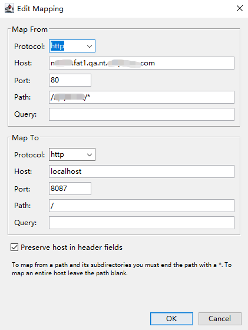

# 代理转发工具

[toc]

## 开源项目推荐

> - https://github.com/youzan/zan-proxy
> - https://github.com/alibaba/anyproxy
> - https://github.com/yize/xswitch
>
> 

## 一、Charles

### 推荐阅读

> [Charles设置代理](https://www.jianshu.com/p/83e26d2a25f5)

（1）拦截请求，并将请求转发到本地

依次点击 `Tools` -> `Map Remote Settings` ，然后设置一下Map From 和 To，注意 From Path 里的 `*`

然后即可发现请求已经从 From 转发到了To

