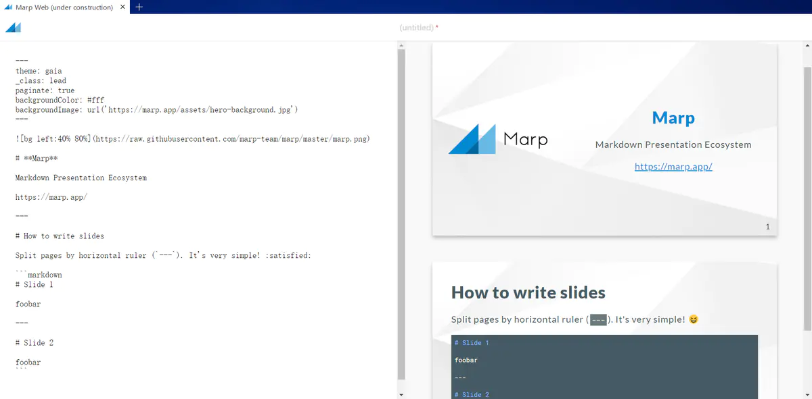
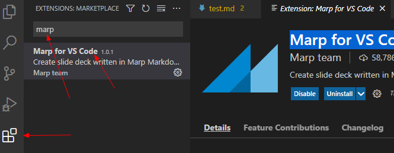
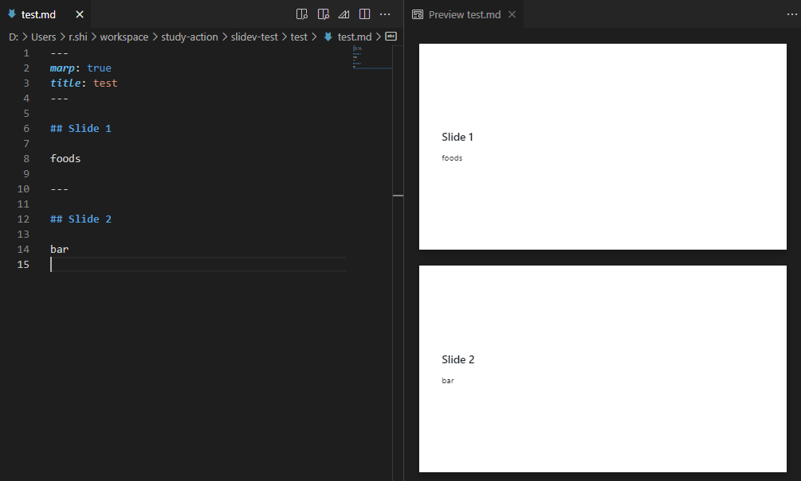
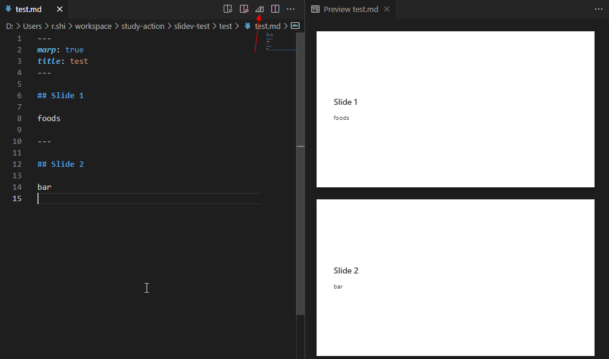
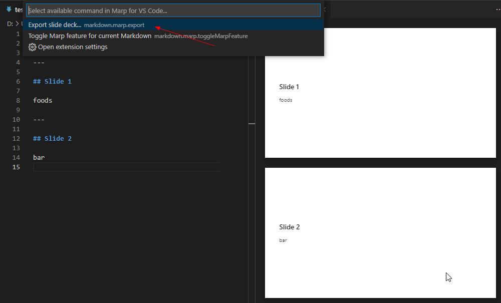
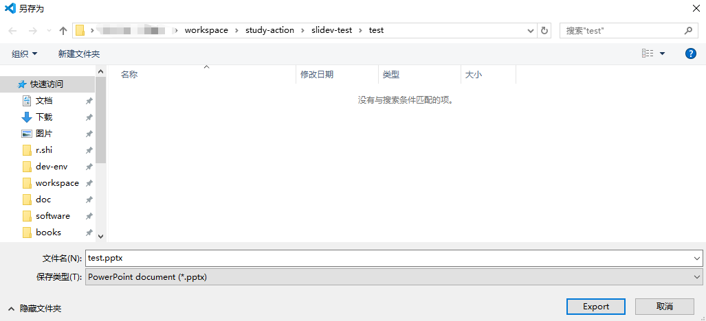
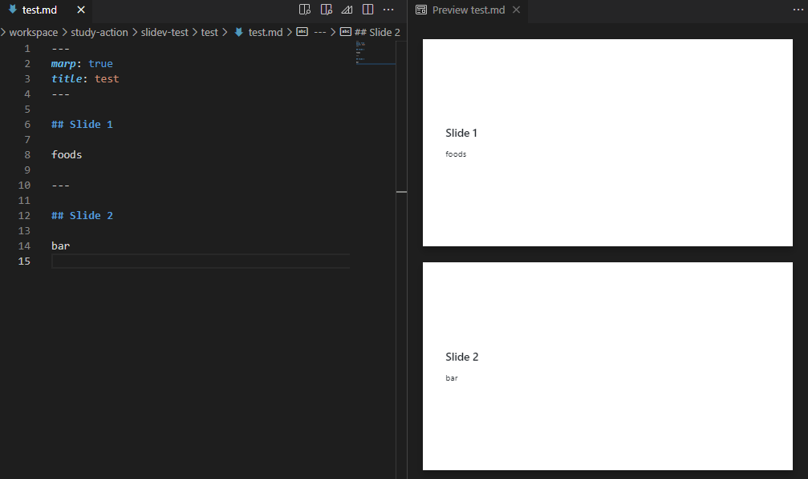

[[toc]]

[toc]

## 推荐工具

（1）Marp

> - [marp-team/marpit](https://github.com/marp-team/marpit)
> - [Marp：Markdown 制作 PPT 的利器](https://www.jianshu.com/p/70382d05955c)
> - [Marp 工具：一种基于 Markdown「写」PPT 的新方法](https://github.com/zoomla/marpit-ppt)

## 一、Marp

可以直接使用 [Marp 网页版](https://web.marp.app/)



但更推荐使用 VsCode 的 Marp 插件来写 PPT

### 1.安装 Marp for VS Code

直接搜索 Marp 插件进行安装



### 2.示例

插件安装完成后，就可以通过编写 markdown 来写 PPT 了。

```markdown
---
marp: true
---

# Slide 1

foo

---

# Slide 2

bar
```

然后使用快捷键 `ctrl+shift+v` 即可预览 PPT。

效果如下：



然后还可以导出为`.pptx`格式的文件。







### 3.相关用法

#### 3.1 分割页

通过 `---`来分割 PPT 页面



#### 3.2 图片

```markdown

```
