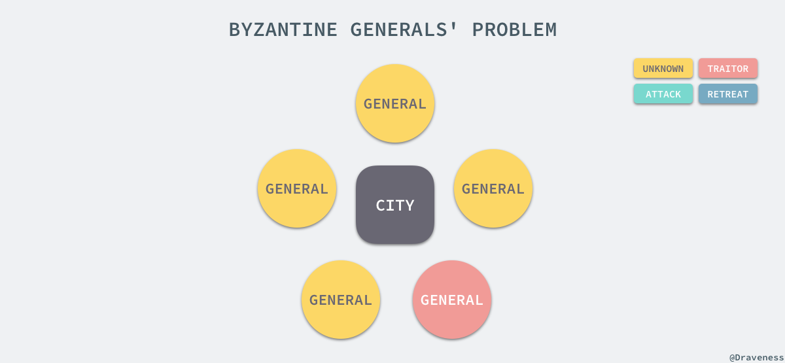
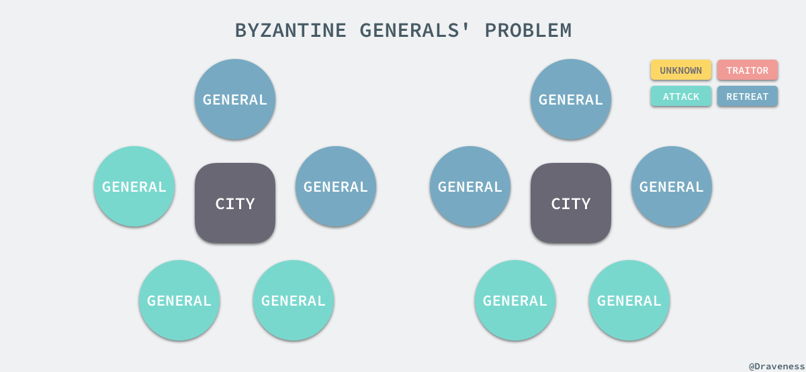
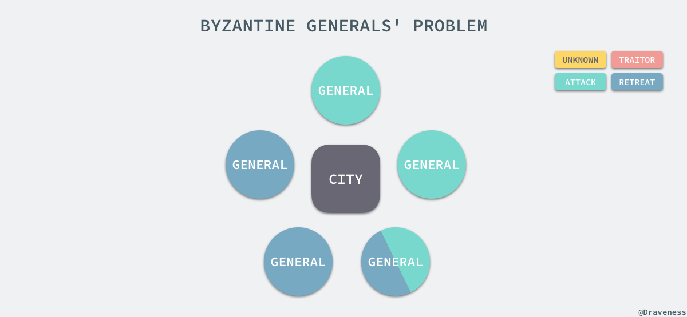

# 分布式基础理论

[toc]

## 推荐阅读

## 一、CAP理论

转自： [CAP 定理的含义_阮一峰](https://www.ruanyifeng.com/blog/2018/07/cap.html)

### 推荐阅读

> - [CAP 定理的含义_阮一峰](https://www.ruanyifeng.com/blog/2018/07/cap.html)
> - [An Illustrated Proof of the CAP Theorem](https://mwhittaker.github.io/blog/an_illustrated_proof_of_the_cap_theorem/)
> - [分布式系统的CAP理论](https://www.hollischuang.com/archives/666)
> - [分布式理论(一) - CAP定理](https://juejin.cn/post/6844903621490901006)
> - [CAP理论十二年回顾："规则"变了](https://www.infoq.cn/article/cap-twelve-years-later-how-the-rules-have-changed/)
> - [分布式一致性与共识算法](https://draveness.me/consensus/)

分布式系统（distributed system）正变得越来越重要，大型网站几乎都是分布式的。

分布式系统的最大难点，就是**各个节点的状态如何同步**。CAP 定理是这方面的基本定理，也是理解分布式系统的起点。

本文介绍该定理。它其实很好懂，而且是显而易见的。下面的内容主要参考了 Michael Whittaker 的[文章](https://mwhittaker.github.io/blog/an_illustrated_proof_of_the_cap_theorem/)。

### 1.分布式系统的三个指标

1998年，加州大学的计算机科学家 Eric Brewer 提出，分布式系统有三个指标。

> - Consistency
> - Availability
> - Partition tolerance

它们的第一个字母分别是 C、A、P。

Eric Brewer 说，这三个指标不可能同时做到。这个结论就叫做 CAP 定理。

| 指标                              | 描述                                                         |
| --------------------------------- | ------------------------------------------------------------ |
| Consistency（一致性）             | 指数据在多个副本之间能够保持一致的特性（严格的一致性）       |
| Availability（可用性）            | 指系统提供的服务必须一直处于可用的状态，每次请求都能获取到非错的响应（不保证获取的数据为最新数据） |
| Partition tolerance（分区容错性） | 分布式系统在遇到任何网络分区故障的时候，仍然能够对外提供满足一致性和可用性的服务，除非整个网络环境都发生了故障 |

### 2.Partition tolerance

先看 Partition tolerance，中文叫做"分区容错"。

**大多数分布式系统都分布在多个子网络。每个子网络就叫做一个区（partition）。分区容错的意思是，区间通信可能失败**。比如，一台服务器放在中国，另一台服务器放在美国，这就是两个区，它们之间可能无法通信。

上图中，G1 和 G2 是两台跨区的服务器。G1 向 G2 发送一条消息，G2 可能无法收到。系统设计的时候，必须考虑到这种情况。

一般来说，分区容错无法避免，因此可以认为 CAP 的 P 总是成立。CAP 定理告诉我们，剩下的 C 和 A 无法同时做到。

### 3.Consistency

Consistency 中文叫做"一致性"。意思是，**写操作之后的读操作，必须返回该值**。举例来说，某条记录是 v0，用户向 G1 发起一个写操作，将其改为 v1。

接下来，用户的读操作就会得到 v1。这就叫一致性。

问题是，用户有可能向 G2 发起读操作，由于 G2 的值没有发生变化，因此返回的是 v0。G1 和 G2 读操作的结果不一致，这就不满足一致性了。

为了让 G2 也能变为 v1，就要在 G1 写操作的时候，让 G1 向 G2 发送一条消息，要求 G2 也改成 v1。

这样的话，用户向 G2 发起读操作，也能得到 v1。

### 4.Availability

Availability 中文叫做"可用性"，意思是**只要收到用户的请求，服务器就必须给出回应**。

用户可以选择向 G1 或 G2 发起读操作。不管是哪台服务器，只要收到请求，就必须告诉用户，到底是 v0 还是 v1，否则就不满足可用性。

### 5.Consistency 和 Availability 的矛盾

一致性和可用性，为什么不可能同时成立？答案很简单，因为可能通信失败（即出现分区容错）。

如果保证 G2 的一致性，那么 G1 必须在写操作时，锁定 G2 的读操作和写操作。只有数据同步后，才能重新开放读写。锁定期间，G2 不能读写，没有可用性。

如果保证 G2 的可用性，那么势必不能锁定 G2，所以一致性不成立。

综上所述，G2 无法同时做到一致性和可用性。系统设计时只能选择一个目标。如果追求一致性，那么无法保证所有节点的可用性；如果追求所有节点的可用性，那就没法做到一致性。

[更新 2018.7.17]

读者问，在什么场合，可用性高于一致性？

举例来说，发布一张网页到 CDN，多个服务器有这张网页的副本。后来发现一个错误，需要更新网页，这时只能每个服务器都更新一遍。

一般来说，网页的更新不是特别强调一致性。短时期内，一些用户拿到老版本，另一些用户拿到新版本，问题不会特别大。当然，所有人最终都会看到新版本。所以，这个场合就是可用性高于一致性。

## 二、BASE理论

### 推荐阅读

> - [分布式理论(二) - BASE理论_零壹技术栈](https://juejin.cn/post/6844903621495095304)
> - [分布式系统的BASE理论_Hollis](https://www.hollischuang.com/archives/672)
> - [从分布式一致性谈到CAP理论、BASE理论_五月的仓颉](https://www.cnblogs.com/xrq730/p/4944768.html)

eBay的架构师Dan Pritchett源于对大规模分布式系统的实践总结，在ACM上发表文章提出BASE理论。BASE是对CAP中一致性和可用性权衡的结果，是对CAP理论的延伸，其**核心思想**是：

> 即使无法做到强一致性（Strong Consistency，[CAP](http://www.hollischuang.com/archives/666)的一致性就是强一致性），但应用可以采用合适的方式达到最终一致性（Eventual Consitency）

Base 理论三要素：

> - 基本可用（Basically Available）
> - 软状态（ Soft State）
> - 最终一致性（ Eventual Consistency）

### 1.基本可用

基本可用是指 **分布式系统在出现不可预知故障的时候，允许损失部分可用性** ----注意，这绝不等价于系统不可用。比如：

> （1）**响应时间上的损失**。正常情况下，一个在线搜索引擎需要在0.5秒之内返回给用户相应的查询结果，但由于出现故障，查询结果的响应时间增加了1~2秒
>
> （2）**系统功能上的损失**：正常情况下，在一个电子商务网站上进行购物的时候，消费者几乎能够顺利完成每一笔订单，但是在一些节日大促购物高峰的时候，由于消费者的购物行为激增，为了保护购物系统的稳定性，部分消费者可能会被引导到一个降级页面

### 2.软状态

软状态指允许系统中的数据存在中间状态，并认为该中间状态的存在不会影响系统的整体可用性，即允许系统在不同节点的数据副本之间进行数据同步的过程存在延时

### 3.最终一致性

最终一致性强调的是所有的数据副本，在经过一段时间的同步之后，最终都能够达到一个一致的状态。因此，最终一致性的本质是需要系统保证最终数据能够达到一致，而不需要实时保证系统数据的强一致性。

### 4.总结

总体来说，BASE理论面向的是大型高可用、可扩展的分布式系统。不同于ACID的强一致性模型，BASE提出**通过牺牲强一致性来获得可用性，并允许数据在短时间内不一致，但是最终达到一致状态**。同时，在实际分布式场景中，不同业务对数据的一致性要求不一样。因此在设计中，ACID和BASE理论往往又会结合使用。

## 三、拜占庭将军问题

拜占庭将军问题是 Leslie Lamport 在 [The Byzantine Generals Problem](https://web.archive.org/web/20170205142845/http://lamport.azurewebsites.net/pubs/byz.pdf) 论文中提出的分布式领域的容错问题，它是分布式领域中最复杂、最严格的容错模型。

在该模型下，系统不会对集群中的节点做任何的限制，它们可以向其他节点发送随机数据、错误数据，也可以选择不响应其他节点的请求，这些无法预测的行为使得容错这一问题变得更加复杂。

拜占庭将军问题描述了一个如下的场景，有一组将军分别指挥一部分军队，每一个将军都不知道其它将军是否是可靠的，也不知道其他将军传递的信息是否可靠，但是它们需要通过投票选择是否要进攻或者撤退：

> 在这一节中，黄色代表状态未知，绿色代表进攻，蓝色代表撤退，最后红色代表当前将军的信息不可靠。

在这时，无论将军是否可靠，只要所有的将军达成了统一的方案，选择进攻或者撤退其实就是没有任何问题的：

上述的情况不会对当前的战局有太多的影响，也不会造成损失，但是如果其中的一个将军告诉其中一部分将军选择进攻、另一部分选择撤退，就会出现非常严重的问题了。

由于将军的队伍中出了一个叛徒或者信息在传递的过程中被拦截，会导致一部分将军会选择进攻，剩下的一部分会选择撤退，它们都认为自己的选择是大多数人的选择，这时就出现了严重的不一致问题。

拜占庭将军问题是对分布式系统容错的最高要求，然而这不是日常工作中使用的大多数分布式系统中会面对的问题，我们遇到更多的还是节点故障宕机或者不响应等情况，这就大大简化了系统对容错的要求；不过类似 Bitcoin、Ethereum 等分布式系统确实需要考虑拜占庭容错的问题。

## 四、FLP

FLP 不可能定理是分布式系统领域最重要的定理之一，它给出了一个非常重要的结论：**在网络可靠并且存在节点失效的异步模型系统中，不存在一个可以解决一致性问题的确定性算法**。

> In this paper, we show the surprising result that no completely asynchronous consensus protocol can tolerate even a single unannounced process death. We do not consider Byzantine failures, and we assume that the message system is reliable it delivers all messages correctly and exactly once.

这个定理其实也就是告诉我们不要浪费时间去为异步分布式系统设计在任意场景上都能够实现共识的算法，异步系统完全没有办法保证能在有限时间内达成一致，在这里作者并不会尝试去证明 FLP 不可能定理，读者可以阅读相关论文 [Impossibility of Distributed Consensuswith One Faulty Process](https://groups.csail.mit.edu/tds/papers/Lynch/jacm85.pdf) 了解更多的内容。

