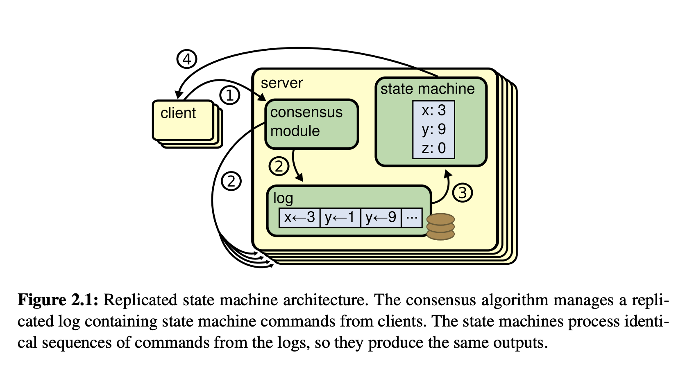
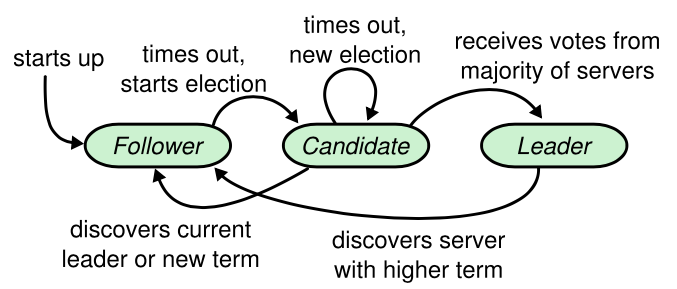
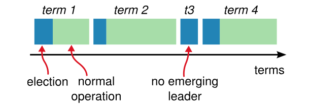
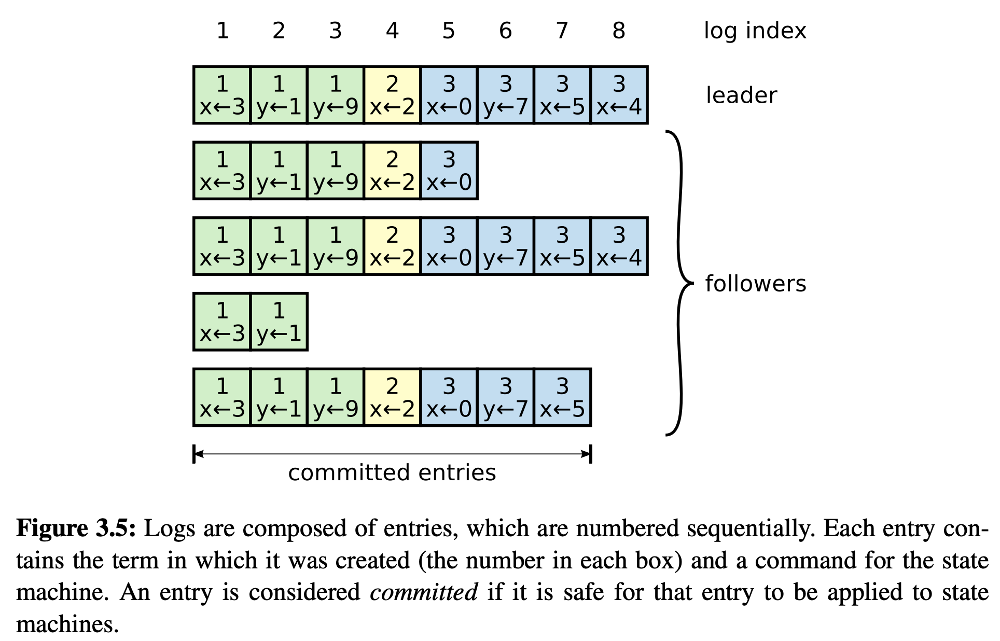

# 分布式共识算法-02-Raft

[toc]

## 推荐阅读

官网与论文：

> - [The Raft Consensus Algorithm_官网](https://raft.github.io/)
> - 原版论文：https://raft.github.io/raft.pdf
> - 论文中文翻译: [**Raft论文**](https://docs.qq.com/doc/DY0VxSkVGWHFYSlZJ)
> - 论文中文翻译：[分布式一致性算法：Raft 算法（论文翻译）](https://www.cnblogs.com/linbingdong/p/6442673.html)
> - 论文中文翻译2：[寻找一种易于理解的一致性算法（扩展版）](https://github.com/maemual/raft-zh_cn/blob/master/raft-zh_cn.md)

动画演示：

动画演示：

> - [benbjohnson/thesecretlivesofdata_英文原版](https://github.com/benbjohnson/thesecretlivesofdata)
> - [raft-animation_英文](https://github.com/benbjohnson/thesecretlivesofdata)
> - [raft-animation_中文](https://github.com/klboke/raft-animation)

推荐文章：

> - [一文搞懂Raft算法](https://www.cnblogs.com/xybaby/p/10124083.html)
> - [Raft协议解读](https://zhuanlan.zhihu.com/p/191795038)
> - [Raft协议原理详解](https://zhuanlan.zhihu.com/p/91288179)
> - [RAFT协议介绍](http://huhansi.com/2020/04/14/SpringCloud/2020-04-14-003-RAFT%E5%8D%8F%E8%AE%AE%E4%BB%8B%E7%BB%8D/)
> - [Raft](https://fisco-bcos-documentation.readthedocs.io/zh_CN/latest/docs/design/consensus/raft.html)

推荐实现：

> - [vision9527/raft-demo](https://github.com/vision9527/raft-demo)

## 一、Raft

### 1.复制状态机

一致性算法通常会在 Replicated State Machine 的上下文中来描述，即多个机器拥有状态的多份副本，并能在一些机器故障时不中断的提供服务。replicated state machine用于解决分布式系统中的各种容错问题。

Replicated state machine通常使用replicated log来实现，如图：

server中的一致性模块接收客户端传来的指令并添加到自己的日志中，它也可以和其他server中的一致性模块沟通来确保每一条log都能有相同的内容和顺序，即使其中一些server宕机。 一旦指令被正确复制，就可以称作**committed**。每一个server中的状态机按日志顺序处理committed指令，并将输出返回客户端。

### 2.什么是Raft

Raft是一种用于替代 Paxos 的易于理解的共识算法，并且在性能、可靠性、可用性方面是不输于Paxos。

Raft使用了两种技术来简化算法：

- 问题分解：

  > 在任何可能的地方将问题划分成几块来解决，可以独立的分析和理解，比如我们在Raft中我们设计了Leader选举、日志复制、和安全三部分。

- 状态简化:

  > 过减少状态数来简化状态空间，尽可能消除系统中的不确定性，比如Raft限制log的使用方式来减少这种不确定性，当然有时候引入一些不确定性也会便于我们的理解，我们会使用随机化来简化Leader的选举过程

### 3.Raft 基础

#### 3.1 三种状态

一个Raft集群会包含数个server，在任何时候每个server都会处于如下三种状态中的一种：

> - leader
> - follower
> - candidate

在正常情况下会只有一个leader，其他节点都是follower，follower是消极的，他们不会主动发出请求而仅仅对来自leader和candidate的请求作出回应。

leader处理所有来自客户端的请求(如果客户端访问follower，会把请求重定向到leader)。Candidate状态用来选举出一个leader。如图：

#### 3.2 term

（1）每一次选举会开启一次新的任期，即任期自增：

> - Raft 把时间分割成任意长度的任期（term），任期用连续的整数标记。
> - 每一段任期从一次选举开始，一个或者多个 candidate 尝试成为 leader。
> - 如果一个 candidate 赢得选举，然后他就在该任期剩下的时间里充当 leader。
> - 在某些情况下，一次选举无法选出 leader 。在这种情况下，这一任期会以没有 leader 结束；一个新的任期（包含一次新的选举）会很快重新开始。
> - Raft 保证了在任意一个任期内，最多只有一个 leader。

（2）过期任期的更新

> - 任期在Raft中起到了逻辑时钟的作用，它可以帮助server检测过期信息比如过期的leader。
> - 每一个server都存储有current term字段，会自动随时间增加。当server间通信的时候，会交换current term，如果一个节点的current term比另一个小，它会自动将其更新为较大者。如果candidate或者leader发现了自己的term过期了，它会立刻转为follower状态。
> - 如果一个节点收到了一个含有过期的term的请求，它会拒绝该请求。

（3）两种RPC

> Raft节点之间通过RPC进行通信，基本的一致性算法仅仅需要两种RPC。RequestVote RPC由candidate在选举过程中发出，AppendEntries RPC由leader发出，用于复制日志和提供心跳。每一个请求类型都有对应的response，Raft假定request和response都可能会丢失，因此要求请求者有超时重试的能力。为了性能，RPC请求会并行发出，而且不保证RPC的到达顺序。

### 4.Leader选举

Raft使用心跳机制来触发leader选举。

（1）启动时处于 follower 状态

- server在启动时是处于follower状态的
- 当它可以收到来自leader或者candidate的有效RPC请求时就会保持follower的状态
- 如果一个follower一段时间(称为election timeout)没有收到消息，它就会假定leader失效并开始新的选举。

（2）到达选举超时时间（election timeout），开启新的选举

- 为了开始新一轮选举，follower会提高自己*current term*并转为candidate状态

- 它会先给自己投一票然后并行向集群中的其他server发出RequestVote RPC，candidate会保持这个状态，直到下面三种事情之一发生：

  > - **胜选**：当candidate收到了集群中相同term的多数节点的赞成票时就会选举成功，每一个server在给定的term内至多只能投票给一个candidate，先到先得。收到多数节点的选票可以确保在一个term内至多只能有一个leader选出。一旦一个candidate赢得选举，它就会成为leader。它之后会发送心跳消息来建立自己的权威，并阻止新的选举。
  > - **败选**：在等待投票的过程中，candidate可能收到来自其他server的AppendEntries RPC，声明它才是leader。如果RPC中的term大于等于candidate的*current term*，candidate就会认为这个leader是合法的并转为follower状态。如果RPC中的term比自己当前的小，将会拒绝这个请求并保持candidate状态。
  > - **没有获胜者产生，等待选举超时**：candidate没有选举成功或者失败，如果许多follower同时变成candidate，选票就会被瓜分，形不成多数派。这种情况发生时，candidate将会超时并触发新一轮的选举，提高term并发送新的RequestVote RPC。然而如果不采取其他措施的话，选票将可能会被再次瓜分。

Raft使用**随机选举超时**来确保选票被瓜分的情况很少出现，即便出现了也可以被很快解决。**election timeout的值会在一个固定区间内随机的选取(比如150-300ms)**。这使得在大部分情况下仅有一个server会超时，它将会在其他节点超时前赢得选举并发送心跳。candidate在发起选举前也会重置自己的随机election timeout，也可以帮助减少新的选举轮次内选票瓜分的情况。

### 5.日志复制

（1）leader执行客户端请求的过程

一旦一个leader被选举出来，它开始为客户端请求提供服务。每一个客户端请求都包含着一个待状态机执行的命令，leader会将这个命令作为新的一条日志追加到自己的日志中，然后并行向其他server发出AppendEntries RPC来复制日志。当日志被安全的复制之后，leader可以将日志apply到自己的状态机，并将执行结果返回给客户端。如果follower宕机或运行很慢，甚至丢包，leader会无限的重试RPC(即使已经将结果报告给了客户端)，直到所有的follower最终都存储了相同的日志。

（2）日志的结构

日志按下图的方式进行组织，每一条日志储存了一条命令和leader接收到该指令时的term序号。日志中的term序号可以用来检测不一致的情况，每一条日志也拥有一个整数索引用于定位。

