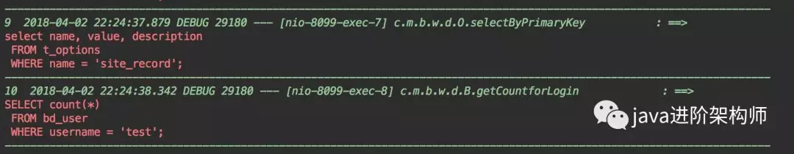
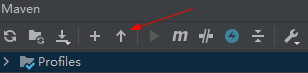
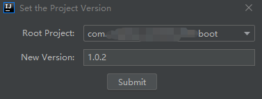

[[toc]]

## 前言

Key promoter 快捷键提示 <https://plugins.jetbrains.com/plugin/4455?pr=idea>

CamelCase 驼峰式命名和下划线命名交替变化 <https://plugins.jetbrains.com/plugin/7160?pr=idea>

CheckStyle-IDEA 代码规范检查 <https://plugins.jetbrains.com/plugin/1065?pr=idea>

FindBugs-IDEA 潜在 Bug 检查 <https://plugins.jetbrains.com/plugin/3847?pr=idea>

MetricsReloaded 代码复杂度检查 <https://plugins.jetbrains.com/plugin/93?pr=idea>

Statistic 代码统计 <https://plugins.jetbrains.com/plugin/4509?pr=idea>

JRebel Plugin 热部署 <https://plugins.jetbrains.com/plugin/?id=4441>

CodeGlance 在编辑代码最右侧，显示一块代码小地图 <https://plugins.jetbrains.com/plugin/7275?pr=idea>

GsonFormat 把 JSON 字符串直接实例化成类 <https://plugins.jetbrains.com/plugin/7654?pr=idea>

Eclipse Code Formatter 使用 Eclipse 的代码格式化风格，在一个团队中如果公司有规定格式化风格，这个可以使用。 <https://plugins.jetbrains.com/plugin/6546?pr=idea>

Ace Jump AceJump 其实是一款能够代替鼠标的软件，只要安装了这款插件，可以在代码中跳转到任意位置。按快捷键进入 AceJump 模式后（默认是 Ctrl+J），再按任一个字符，插件就会在屏幕中这个字符的所有出现位置都打上标签，你只要再按一下标签的字符，就能把光标移到该位置上。换言之，你要 移动光标时，眼睛一直看着目标位置就行了，根本不用管光标的当前位置。

## 一、插件合辑

## 二、插件列表

### 1.Lombok

支持 lombok 的各种注解，从此不用写 getter setter 这些 可以把注解还原为原本的 java 代码 非常方便

### 2.JRebel for IntelliJ

### 3. Maven Helper

一键查看 maven 依赖，查看冲突的依赖，一键进行 exclude 依赖

对于大型项目 非常方便

### 4. Alibaba Java Coding Guidelines

### 5.SonarLint

### 6. CamelCase

### 7. Free MyBatis plugin

### 8. YAML/Ansible support

### 9.p3c

### 10.FindBugs-IDEA

检测代码中可能的 bug 及不规范的位置，检测的模式相比 p3c 更多，

写完代码后检测下 避免低级 bug，强烈建议用一下，一不小心就发现很多老代码的 bug

### 11.GsonFormat

一键根据 json 文本生成 java 类 非常方便

### 12.VisualVM Launcher

运行 java 程序的时候启动 visualvm，方便查看 jvm 的情况 比如堆内存大小的分配

某个对象占用了多大的内存，jvm 调优必备工具

### 13. GenerateAllSetter

一键调用一个对象的所有 set 方法并且赋予默认值 在对象字段多的时候非常方便

### 14. MyBatisCodeHelperPro

mybatis 代码自动生成插件，大部分单表操作的代码可自动生成 减少重复劳动 大幅提升效率

### 15. Translation

最好用的翻译插件，功能很强大，界面很漂亮

### 16.Key promoter

Key promoter 这款插件适合新手使用。当你点击鼠标一个功能的时候，可以提示你这个功能快捷键是什么。这是一个非常有用的功能，很快就可以熟悉软件的快捷功能了。
如果有快捷键的，会直接显示快捷键

### 17. Grep Console

日志高亮

### 18. MyBatis Log Plugin

Mybatis 现在是 java 中操作数据库的首选，在开发的时候，我们都会把 Mybatis 的脚本直接输出在 console 中，但是默认的情况下，输出的脚本不是一个可以直接执行的。



如果我们想直接执行，还需要在手动转化一下。

MyBatis Log Plugin 这款插件是直接将 Mybatis 执行的 sql 脚本显示出来，无需处理，可以直接复制出来执行的，如图：


执行程序后，我们可以很清晰的看到我们执行了哪些 sql 脚本，而且脚本可以执行拿出来运行。

### 19.String Manipulation

强大的字符串转换工具。使用快捷键，Alt+m。

### 20.`Eclipse Code Formatter`

### 21 Tomcat 插件

推荐：

> - [intellij idea 安装及 Tomcat 插件集成](https://blog.csdn.net/qq_33352259/article/details/81975882)

对于社区版，推荐如下 Tomcat 插件

> - Tomcat runner plugin for IntelliJ
> - Smart Tomcat

### 22 Maven Project Version

```java
- A
  - B
  - C
    - D
    - E
```

有如上工程结构，A 为父 Pom 工程，统一管理了所有工程的版本号。当有某个工程更新了代码，需要更新版本时，这时需要先更新 A 的 version，然后还需要去其他各个子工程中修改 parent 节点的 version，也就是说要去所有工程里改一遍 version，过程很繁琐。

为了解决这个问题，可以安装 Idea 插件 Maven Project Version，当需要更新版本时，通过插件可以自动地把所有工程的 version 一键改掉。

（1）点击 `Set the project version`



（2）给 Root Project 设置新的 version，然后点击 submit 即可发现所有工程的 version 都由 1.0.1 改成了 1.0.2



## 23. GenerateAllSetter

> [【IDEA】（3）---非常实用提高开发效率和水平的插件](https://www.cnblogs.com/qdhxhz/p/10933769.html)

## 参考资料

> - [工匠小猪猪\_\_Java 工程师居家必备的 Intellij IDEA Top10 插件](https://mp.weixin.qq.com/s/H4diUwA7wdgI3OZSWN6Dgg)
