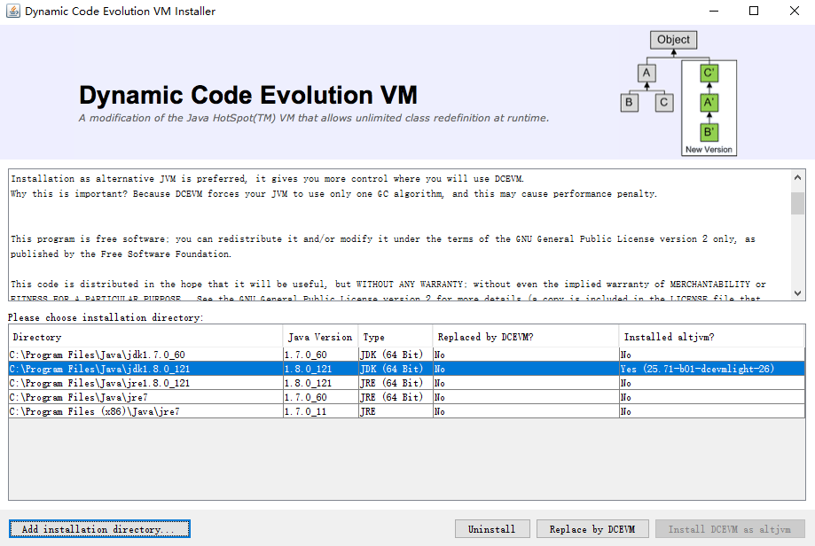
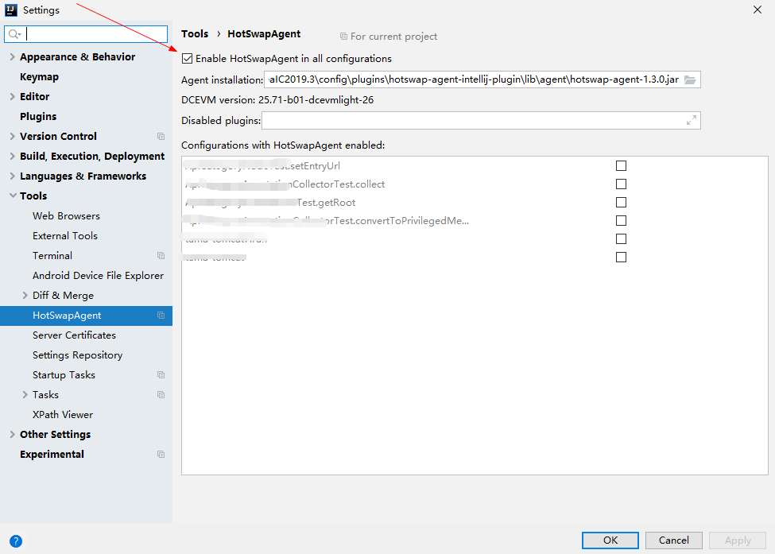
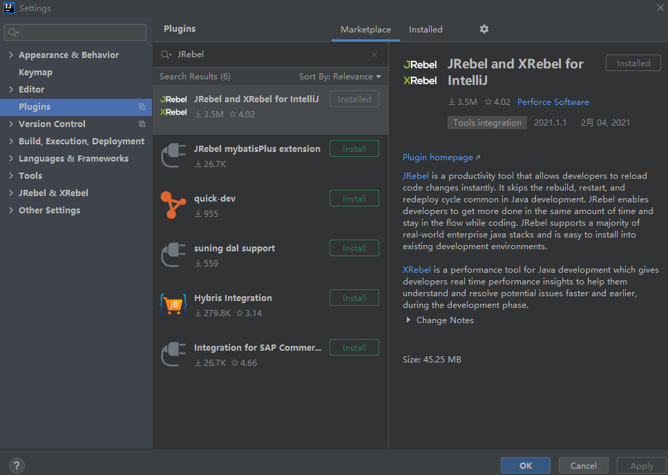
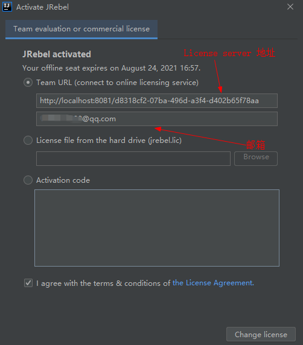
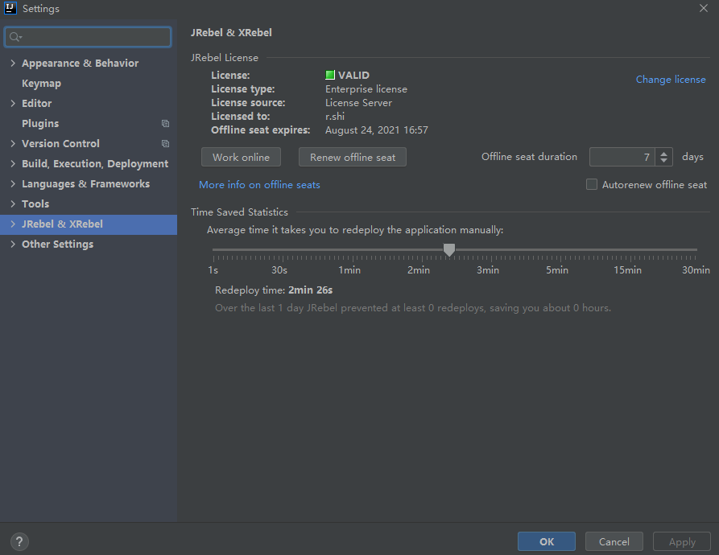

[[toc]]

[toc]

## 前言

## 一、DCEVM

参考：

> - [玩转 DCEVM + HotwapAgent 热加载，免费、开源！](https://www.codercto.com/a/45548.html)
> - [如何用 HotSwapAgent 和 DCEVM 让 java 开发像 js 开发一样高效（JRebel 的替代方案）](https://blog.csdn.net/u013613428/article/details/51499911)
> - [DCEVM+HotSwapAgent 实现 java 类热加载](http://www.renhl.com/java/2017/08/16/dcevm-hotswapagent-idea)

### 1.安装 DCEVM

（1）前往 dcevm 的 github 仓库下载最新版本的 jar

> [https://github.com/dcevm/dcevm/releases](https://github.com/dcevm/dcevm/releases)


（2）然后运行安装 jar

```bash
 java -jar DCEVM-8u181-installer-build2.jar
```

（3）接着选择`Install DCEVM as altjvm` 来进行安装

> 注意：若没有自动列出已安装的 JDK，则需要点击`Add installation directory`，来手动选择 JDK 安装目录



（5）Idea 插件市场搜索并安装 `HotSwapAgent`，然后将其启用



### 2.异常

可能会出现：

```java
JDWP exit error JVMTI_ERROR_INVALID_THREAD(10): cannot get thread local storage [threadControl.c:195]
FATAL ERROR in native method: JDWP cannot get thread local storage, jvmtiError=JVMTI_ERROR_INVALID_THREAD(10)
```

## 二、JRebel

Idea 版本：2020.3

### 1.安装并激活

（1）Idea 安装 Jrebel 插件

Idea 插件市场中搜索 JRebel，然后安装并重启



（2）依次 点击 File -> Settings -> JRebel & XRebel ，然后点击 Activate now，出现 JRebel 激活页面



填写邮箱和 License server 地址 即可激活，License server 地址的获取请参见下一节

（3）调整工作模式为 Work offline



### 2.自建 JRebel License Server

GitHub 推荐项目：

> - [Dec12th/JrebelBrainsLicenseServerforJava](https://github.com/Dec12th/JrebelBrainsLicenseServerforJava)
> - [gsls200808/JrebelLicenseServerforJava](https://gitee.com/gsls200808/JrebelLicenseServerforJava)

推荐博客：

> - [分享自建的 Jrebel License Server 激活 Jrebel](https://www.cnblogs.com/sunshinekevin/p/12195607.html)

（1）运行 JRebel License Server

```bash
# 1.克隆项目
git clone https://gitee.com/gsls200808/JrebelLicenseServerforJava.git

# 2.编译打包项目
cd JrebelLicenseServerforJava/
mvn clean package

# 3.运行项目
cd target
java -jar JrebelBrainsLicenseServerforJava-1.0-SNAPSHOT.jar -p 8081
```

（2） 访问如下网址，在线生成 GUID

> [https://www.guidgen.com/](https://www.guidgen.com/)

（3）得到 JRebel License Server 激活地址：

> [http://localhost:8081/{GUID}](http://localhost:8081/{GUID})
