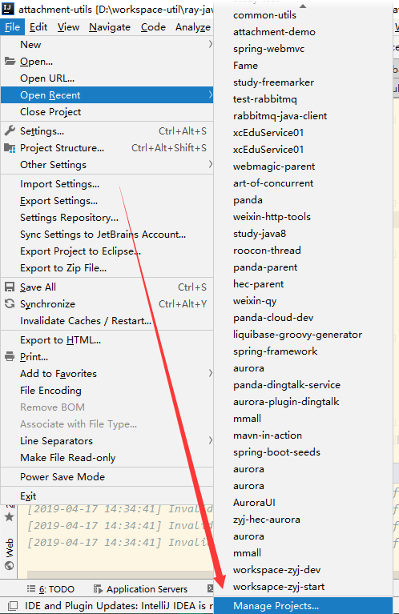
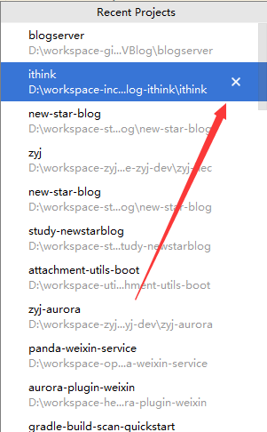
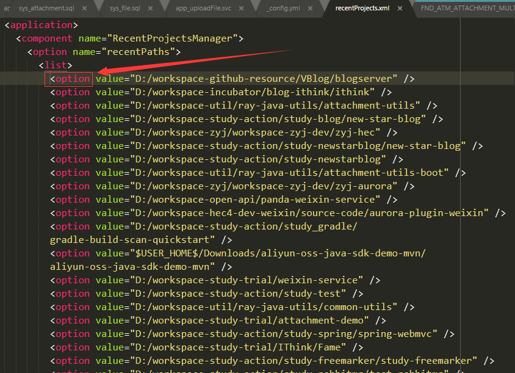

[[toc]]

## 前言

## 一、清空最近打开的项目列表

有如下两种方法：

### 1.`Manage Projects`

（1） `File -> Open Recent -> Manage Projects ...`



（2）点击删除标志，一个一个删除



### 2.修改 recentProjects.xml

（1）在用户目录下，找到`recentProjects.xml`

```java
%home%\.IntelliJIdea2018.3\config\options\recentProjects.xml
```

（2）将 `<list>` 子节点 `<option>` 节点清空即可



## 参考资料

> - [IntelliJ Idea 清除 Open Recent 里面的项目列表](https://www.jianshu.com/p/7d42c99d56f6)
