[[toc]]

[toc]

## 推荐阅读

常见的 Bean 映射框架：

> - [DTO/DO 等 POJO 对象的使用场景和 orika-mapper 框架的使用](https://www.cnblogs.com/harrychinese/p/SpringBoot_DTO_Orika.html)
> - [https://www.baeldung.com/java-performance-mapping-frameworks](https://www.baeldung.com/java-performance-mapping-frameworks)
> - [面试官：你知道几种对象属性拷贝方式，说来看看？](https://zhuanlan.zhihu.com/p/135270403)
> - [Orika 对象复制教程（完美笔记）](https://www.cnblogs.com/fuzongle/p/12609063.html)
> - [打开 orika 的正确方式](https://www.cnkirito.moe/orika/)

MapStruct:

> - [mapstruct/mapstruct](https://github.com/mapstruct/mapstruct)
> - https://mapstruct.org/documentation/reference-guide/
> - [MapStruct 1.3.0.Final 参考指南](http://www.kailing.pub/MapStruct1.3/index.html#Preface)

JSR 269 与 MapStruct：

> - [JSR269 插件化注解 API](http://www.cyblogs.com/2020/05/13/2020/05/JSR269%E6%8F%92%E4%BB%B6%E5%8C%96%E6%B3%A8%E8%A7%A3API/)
> - [由 lombok 说起，浅析 JSR-269 原理及应用](https://blog.csdn.net/weixin_43983762/article/details/105867398)
> - [Mapstruct 源码解析- 框架实现原理](https://juejin.cn/post/6844904199755415559)

## 一、环境说明

> - jdk: open-jdk-16

最开始是用 JDK1.8，但是 Debug 的时候只能看到反编译后的代码，太痛苦了，而在 jdk9 模块化之后，tools.jar 包被放进了 java 的源码包下，所以为了方便看源码 Debug，后来又将 jdk 改成了 open-jdk-16。

## 二、常见的 Bean 映射框架


## 三、MapStruct 使用入门

### 1. 引入依赖

```xml
    <properties>
        <mapstruct.version>1.4.1.Final</mapstruct.version>
    </properties>

    <dependencies>
        <dependency>
            <groupId>org.mapstruct</groupId>
            <artifactId>mapstruct</artifactId>
            <version>${mapstruct.version}</version>
            <scope>compile</scope>
        </dependency>
        <dependency>
            <groupId>org.mapstruct</groupId>
            <artifactId>mapstruct-processor</artifactId>
            <version>${mapstruct.version}</version>
            <scope>compile</scope>
        </dependency>
    </dependencies>
```

### 2. 类型转换规则

> - 对于类型相同且是基本类型的同名属性，可以自动转换
> - 对于类型不同且是基本类型的同名属性，可以隐式地自动转换
> - 对于类型相同且是基本类型的不同名属性，可以在借助 `@Mapping` 注解进行转换
> - 对于类型不同的同名属性，可以使用 `@Mapper#use`来自定义类型转换器去进行转换
> - 对于类型不同且属性名也不相同的属性，可以结合 `@Mapper#use` 和 `@Mapping` 注解来实现类型转换

### 3. 用法示例

#### 3.1 基本类型转换

（1）先定义两个实体类

对于 Bean 映射的场景，我们可以假设有个 Dto 用来映射前端请求参数，然后转成业务实体，然后进行业务逻辑的处理。

```java
// 数据传输对象,用来接收前端请求参数
@Data
public class ResourceDTO {
    private Integer id;
    private String code;
    private Boolean resourceStatus;
}

// 业务实体,用于系统内部业务逻辑处理
@Data
public class Resource {
    private Long id;
    private String resourceCode;
    private Boolean resourceStatus;
}
```

然后我们需要对这两个类进行相互转换。

（2）定义一个 Mapper 用于这两个类型的相互转换。

此时只需要定义如下接口，即可实现这两个类型的相互转换。

```java
@Mapper
public interface ResourceConverter {

    ResourceConverter INSTANCE = Mappers.getMapper(ResourceConverter.class);

    @Mapping(source = "resourceCode", target = "code")
    ResourceDTO toD(Resource entity);

    @Mapping(source = "code", target = "resourceCode")
    Resource toE(ResourceDTO dto);

}
```

（3）测试用例

```java
public class ResourceConverterTest {

    @Test
    public void toD() {
        Resource resource = mockResource();
        ResourceDTO resourceDTO = ResourceConverter.INSTANCE.toD(resource);
        System.out.println(resourceDTO); // ResourceDTO(id=1, code=/api/user/list, resourceStatus=true)
        Assert.assertNotNull(resourceDTO.getCode());
    }

    @Test
    public void toE() {
        Resource resource = mockResource();
        ResourceDTO resourceDTO = ResourceConverter.INSTANCE.toD(resource);

        resource = ResourceConverter.INSTANCE.toE(resourceDTO);
        System.out.println(resource); // Resource(id=1, resourceCode=/api/user/list, resourceStatus=true)
        Assert.assertNotNull(resource.getResourceCode());
    }

    private static Resource mockResource() {
        Resource resource = new Resource();
        resource.setId(1L);
        resource.setResourceCode("/api/user/list");
        resource.setResourceStatus(Boolean.TRUE);
        return resource;
    }
}
```

（4）分析

> - `resourceStatus` ：类型相同且是基本类型，属性名相同，可以自动转换
> - `id`：类型不同且是基本类型，属性名相同，可以自动隐式转换
> - `resourceCode`：类型相同且是基本类型，但是属性名不相同，可以借助 `@Mapping` 注解进行转换

#### 3.2 不同类型转换

（1）先来看一个简单的同名属性且是基本类型的例子

```java

@Data
public class RoleDTO {
    private Long roleId;
    private String roleCode;
}

@Data
public class Role {
    private Long roleId;
    private String roleCode;
}
```

先通过 BaseConverter 接口来定义两个类型之间的相互转换：

```java
public interface BaseConverter<E, D> {

    D toD(E e);

    E toE(D d);

    List<D> toD(List<E> e);

    List<E> toE(List<D> d);

}
```

然后通过 `RoleConverter` 即可实现 RoleDto 和 Role 的相互转换

```java
@Mapper(uses = {}, unmappedTargetPolicy = ReportingPolicy.IGNORE)
public interface RoleConverter extends BaseConverter<RoleDTO, Role> {

    RoleConverter INSTANCE = Mappers.getMapper(RoleConverter.class);

}
```

编译时，会生成接口 RoleConverter 的实现类，如下所示：

```java
@Generated(
    value = "org.mapstruct.ap.MappingProcessor",
    date = "2021-05-26T17:24:27+0800",
    comments = "version: 1.4.1.Final, compiler: javac, environment: Java 1.8.0_181 (Oracle Corporation)"
)
public class RoleConverterImpl implements RoleConverter {

    @Override
    public Role toD(RoleDTO e) {
        if ( e == null ) {
            return null;
        }

        Role role = new Role();

        role.setRoleId( e.getRoleId() );
        role.setRoleCode( e.getRoleCode() );

        return role;
    }

    @Override
    public RoleDTO toE(Role d) {
        if ( d == null ) {
            return null;
        }

        RoleDTO roleDTO = new RoleDTO();

        roleDTO.setRoleId( d.getRoleId() );
        roleDTO.setRoleCode( d.getRoleCode() );

        return roleDTO;
    }

    @Override
    public List<Role> toD(List<RoleDTO> e) {
        if ( e == null ) {
            return null;
        }

        List<Role> list = new ArrayList<Role>( e.size() );
        for ( RoleDTO roleDTO : e ) {
            list.add( toD( roleDTO ) );
        }

        return list;
    }

    @Override
    public List<RoleDTO> toE(List<Role> d) {
        if ( d == null ) {
            return null;
        }

        List<RoleDTO> list = new ArrayList<RoleDTO>( d.size() );
        for ( Role role : d ) {
            list.add( toE( role ) );
        }

        return list;
    }
}

```

测试用例如下：

```java
public class RoleConverterTest {

    @Test
    public void toD() {
        Role role = mockRole();
        RoleDTO roleDTO = RoleConverter.INSTANCE.toE(role);
        System.out.println(roleDTO); // RoleDTO(roleId=1, roleCode=ADMIN)
        Assert.assertNotNull(roleDTO.getRoleId());
    }

    @Test
    public void toE() {
    }

    @Test
    public void testToD() {
        List<Role> roles = mockRoleList();
        List<RoleDTO> roleDTOS = RoleConverter.INSTANCE.toE(roles);
        System.out.println(roleDTOS); // [RoleDTO(roleId=1, roleCode=ADMIN)]
        Assert.assertNotEquals(0, roleDTOS.size());
    }

    @Test
    public void testToE() {
    }

    private static List<Role> mockRoleList() {
        List<Role> roles = new ArrayList<>();
        roles.add(mockRole());
        return roles;
    }


    private static Role mockRole() {
        Role role = new Role();
        role.setRoleId(1L);
        role.setRoleCode("ADMIN");
        return role;
    }
}
```

（2）然后对于复杂类型和不同类型的转换示例如下：

```java
@Data
public class UserDTO {
    private Long id;
    private String userName;
    private Boolean userStatus;
    private Long createTime;

    private List<RoleDTO> roles;
}

@Data
public class User {
    private Long id;
    private String userName;
    private Boolean userStatus;
    private Date createTime;
    private List<Role> roles;
}
```

然后定义一个 Date 和 Long 的类型转换器来帮助 createTime 进行类型转换

```java
public class DateMapper {

    public Long asLong(Date date) {
        return date == null ? null : date.getTime();
    }

    public Date asDate(Long date) {
        return date == null ? null : new Date(date);
    }

}
```

然后对于 RoleDTO 和 Role ，可以借助前面定义的 `RoleConverter` 去进行转换，因此我们得到 UserDTO 和 User 的转换器：

```java
@Mapper(uses = {DateMapper.class, RoleConverter.class}, unmappedTargetPolicy = ReportingPolicy.IGNORE)
public interface UserConverter extends BaseConverter<UserDTO, User> {

    UserConverter INSTANCE = Mappers.getMapper(UserConverter.class);

}
```

可以看到编译会生成如下实现类：

```java
@Generated(
    value = "org.mapstruct.ap.MappingProcessor",
    date = "2021-05-26T17:24:27+0800",
    comments = "version: 1.4.1.Final, compiler: javac, environment: Java 1.8.0_181 (Oracle Corporation)"
)
public class UserConverterImpl implements UserConverter {

    private final DateMapper dateMapper = new DateMapper();
    private final RoleConverter roleConverter = Mappers.getMapper( RoleConverter.class );

    @Override
    public User toD(UserDTO e) {
        if ( e == null ) {
            return null;
        }

        User user = new User();

        user.setId( e.getId() );
        user.setUserName( e.getUserName() );
        user.setUserStatus( e.getUserStatus() );
        user.setCreateTime( dateMapper.asDate( e.getCreateTime() ) );
        user.setRoles( roleConverter.toD( e.getRoles() ) );

        return user;
    }

    @Override
    public UserDTO toE(User d) {
        if ( d == null ) {
            return null;
        }

        UserDTO userDTO = new UserDTO();

        userDTO.setId( d.getId() );
        userDTO.setUserName( d.getUserName() );
        userDTO.setUserStatus( d.getUserStatus() );
        userDTO.setCreateTime( dateMapper.asLong( d.getCreateTime() ) );
        userDTO.setRoles( roleConverter.toE( d.getRoles() ) );

        return userDTO;
    }

    @Override
    public List<User> toD(List<UserDTO> e) {
        if ( e == null ) {
            return null;
        }

        List<User> list = new ArrayList<User>( e.size() );
        for ( UserDTO userDTO : e ) {
            list.add( toD( userDTO ) );
        }

        return list;
    }

    @Override
    public List<UserDTO> toE(List<User> d) {
        if ( d == null ) {
            return null;
        }

        List<UserDTO> list = new ArrayList<UserDTO>( d.size() );
        for ( User user : d ) {
            list.add( toE( user ) );
        }

        return list;
    }
}
```

测试用例如下：

```java
public class UserConverterTest {

    @Test
    public void toD() {
        User user = mockUser();
        UserDTO userDTO = UserConverter.INSTANCE.toE(user);
        System.out.println(userDTO); // UserDTO(id=1, userName=tom, userStatus=true, createTime=1622030464158, roles=[RoleDTO(roleId=1, roleCode=ADMIN)])
        Assert.assertNotNull(user.getId());
    }

    @Test
    public void toE() {
    }

    @Test
    public void testToD() {
    }

    @Test
    public void testToE() {
    }


    private static User mockUser() {
        List<Role> roles = new ArrayList<>();
        roles.add(mockRole());

        User user = new User();
        user.setId(1L);
        user.setUserName("tom");
        user.setUserStatus(Boolean.TRUE);
        user.setCreateTime(new Date());
        user.setRoles(roles);
        return user;
    }

    private static Role mockRole() {
        Role role = new Role();
        role.setRoleId(1L);
        role.setRoleCode("ADMIN");
        return role;
    }
}
```

分析：

> - `createTime`：类型不同的同名属性，可以使用 `@Mapper#use`来自定义类型转换器去进行转换
> - `roles`：类型不同的同名属性，可以使用 `@Mapper#use`来自定义类型转换器去进行转换

## 四、JSR 269 入门示例

推荐阅读：

> - [动手实现 Lombok](https://lilu.org.cn/2020/12/19/javaee/lombok/impl-simple-lombok/)
> - [Java-JSR-269-插入式注解处理器](https://liuyehcf.github.io/2018/02/02/Java-JSR-269-%E6%8F%92%E5%85%A5%E5%BC%8F%E6%B3%A8%E8%A7%A3%E5%A4%84%E7%90%86%E5%99%A8/)
> - [基于 APT(注解处理器)实现 Lombok 的@getter @setter @toString 功能](https://nicky-chin.cn/2019/05/03/apt_lombok_implement/)
> - [插入式注解处理 API（JSR269）介绍](https://mouse0w0.github.io/2018/11/28/Introduce-to-Pluggable-Annotation-Processing-API/)
> - https://jcp.org/en/jsr/detail?id=269
> - [【JSR269 实战】之编译时操作 AST，修改字节码文件，以实现和 lombok 类似的功能](https://blog.csdn.net/justry_deng/article/details/106176181)
> - [动态的 Java - 无废话 JavaCompilerAPI 中文指南](http://pfmiles.github.io/blog/dynamic-java/)
> - [Javac 早期(编译期)](https://www.cnblogs.com/wade-luffy/p/6050331.html)


## 五、Javac 编译过程详解

推荐阅读：

> - [10 | Java 编译器（二）：语法分析之后，还要做些什么？](http://65.49.135.49/geek/geek/144-%E7%BC%96%E8%AF%91%E5%8E%9F%E7%90%86%E5%AE%9E%E6%88%98%E8%AF%BE/10%E4%B8%A8Java%E7%BC%96%E8%AF%91%E5%99%A8%EF%BC%88%E4%BA%8C%EF%BC%89%EF%BC%9A%E8%AF%AD%E6%B3%95%E5%88%86%E6%9E%90%E4%B9%8B%E5%90%8E%EF%BC%8C%E8%BF%98%E8%A6%81%E5%81%9A%E4%BA%9B%E4%BB%80%E4%B9%88%EF%BC%9F.html)
> - [《深入理解 JVM 虚拟机》](dsd)
> - [《深入解析 Java 编译器》](dsdsd)

### 1.概述

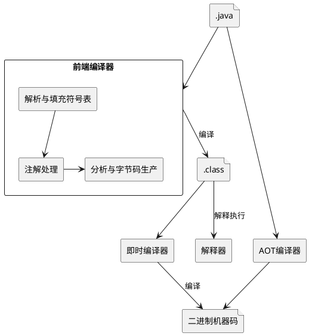

Java 语言的“编译期”其实是一段“不确定”的操作过程，因为它可能是指一个前端编译器（其实叫“编译器的前端”更准确一些）把*.java 文件转变成*.class 文件的过程；也可能是指虚拟机的后端运行期编译器（JIT 编译器，Just In Time Compiler）把字节码转变成机器码的过程；还可能是指使用静态提前编译器（AOT 编译器，Ahead Of Time Compiler）直接把\*.java 文件编译成本地机器代码的过程。

下面列举了这 3 类编译过程中一些比较有代表性的编译器。

> - 前端编译器：Sun 的 Javac、Eclipse JDT 中的增量式编译器（ECJ）。
> - JIT 编译器：HotSpot VM 的 C1、C2 编译器。
> - AOT 编译器：GNU Compiler for the Java（GCJ）、Excelsior JET。

Javac 编译器的编译过程大致如下：

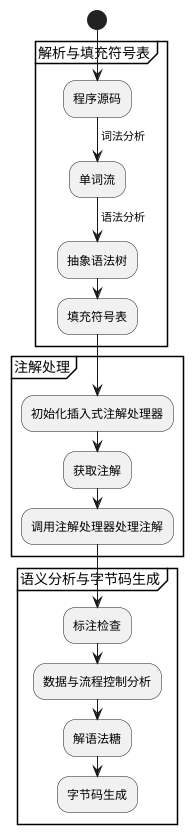

整个流程对应这个`com.sun.tools.javac.comp.CompileStates`

```java

 public enum CompileState {
        INIT(0),     //初始化
        PARSE(1),    //词法和语法分析
        ENTER(2),    //建立符号表
        PROCESS(3),  //处理注解
        ATTR(4),     //属性计算
        FLOW(5),     //数据流分析
        TRANSTYPES(6),    //去除语法糖：泛型处理
        TRANSPATTERNS(7), //去除语法糖：模式匹配处理
        UNLAMBDA(8),      //去除语法糖：Lambda表达式处理(转换成方法)
        LOWER(9),         //去除语法糖：内部类、foreach循环、断言等
        GENERATE(10);     //生成字节码
 }
```

### 2.编译的入口

（1）通过 `com.sun.tools.javac.Main` 来编译 java 文件

> - 参考： [程序员实用 JDK 小工具归纳，工作用得到](https://www.cnblogs.com/huaweiyun/p/13071560.html)

javac 命令是收录于 JDK 中的 Java 语言编译器，可以将后缀名为.java 的源文件编译为后缀名为.class 的可以运行于 Java 虚拟机的字节码文件。比如有如下 java 源文件：

```java
//Hello.java
public class Hello{
    public static void main(String[] args)throws Exception{
        while(true){
            test1();
            Thread.sleep(1000L);
        }
    }
    public static void test1(){
        test2();
    }
    public static void test2(){
        System.out.println("invoke test2");
    }
}
```

可以通过 javac 命令来编译.java 源文件文件得到.class 字节码文件：

```bash
javac Hello.java
```

而当我们在命令行使用 javac 命令来编译 Java 文件时，实际上内部是调用的 `%JAVA_HOME%/lib/tools.jar`（在 Java9 之后，直接被包含在 Java 的 src，而不是以扩展 jar 包的形式引用）的`com.sun.tools.javac.Main#main`方法来启动编译过程，所以我们也可以通过如下方法来编译源文件：

```bash
java -cp tools.jar com.sun.tools.javac.Main Hello.java
```

两者等效，都可以编译源文件

（2）编译的入口为 JavaCompiler

这里以 Javac 命令为例，程序首先会进入到 `com.sun.tools.javac.Main#main`

```java
// com.sun.tools.javac.Main
@Exported
public class Main {
    public Main() {
    }

    // 这就是一个正常的main方法
    public static void main(String[] var0) throws Exception {
        System.exit(compile(var0));
    }

    public static int compile(String[] var0) {
        com.sun.tools.javac.main.Main var1 = new com.sun.tools.javac.main.Main("javac");
        return var1.compile(var0).exitCode;
    }

    public static int compile(String[] var0, PrintWriter var1) {
        com.sun.tools.javac.main.Main var2 = new com.sun.tools.javac.main.Main("javac", var1);
        return var2.compile(var0).exitCode;
    }
}
```

然后会经过 `com.sun.tools.javac.main.Main#compile`方法，在此方法中会调用 `com.sun.tools.javac.main.JavaCompiler#compile`。

```java
    /**
     * Main method: compile a list of files, return all compiled classes
     *
     * @param sourceFileObjects file objects to be compiled
     * @param classnames class names to process for annotations
     * @param processors user provided annotation processors to bypass
     * discovery, {@code null} means that no processors were provided
     * @param addModules additional root modules to be used during
     * module resolution.
     */
    public void compile(Collection<JavaFileObject> sourceFileObjects,
                        Collection<String> classnames,
                        Iterable<? extends Processor> processors,
                        Collection<String> addModules)
    {
        ...
        // 准备过程：初始化插入式注解处理器，最终是通过ServiceLoader获取所有Processor.class的实现类
        initProcessAnnotations(processors, sourceFileObjects, classnames);

        // These method calls must be chained to avoid memory leaks
        // 2. 执行注解处理
        processAnnotations(
            // 1.2 填充符号表
            enterTrees(
                    stopIfError(CompileState.ENTER,
                            initModules(stopIfError(CompileState.ENTER,
                                // 1.1 词法分析、语法分析，从而构建出一棵AST抽象语法树，sourceFileObjects即为Java源文件在内存中的表示
                                parseFiles(sourceFileObjects))))
            ),
            classnames
        );
        ...

        if (!CompileState.ATTR.isAfter(shouldStopPolicyIfNoError)) {
            switch (compilePolicy) {
            ...
            case BY_TODO:
                while (!todo.isEmpty())
                    // 3.语义分析及字节码生成
                    generate(desugar(flow(attribute(todo.remove()))));
                break;
            ...
        }
```

若是在其他情况下，如 Maven、Idea、Eclipse 等的编译，可能会通过调用`com.sun.tools.javac.api.JavacTaskImpl`而最终进入到`com.sun.tools.javac.main.JavaCompiler#compile`，也就是说，JavaCompiler 就是编译的入口。

### 3.编译期 Debug

运行期的 Debug 我们都会，那么如何进行编译期的 Debug？可以借助 Maven 实现，如下所示：

（1）在指定项目下，执行 `mvnDebug clean compile`

```bash
$ mvnDebug clean compile
Preparing to execute Maven in debug mode
Listening for transport dt_socket at address: 8000
```

(2) 然后在 Idea 中, 创建一个 `Remote JVM Debug`, 并指定端口为前面的 `8000`

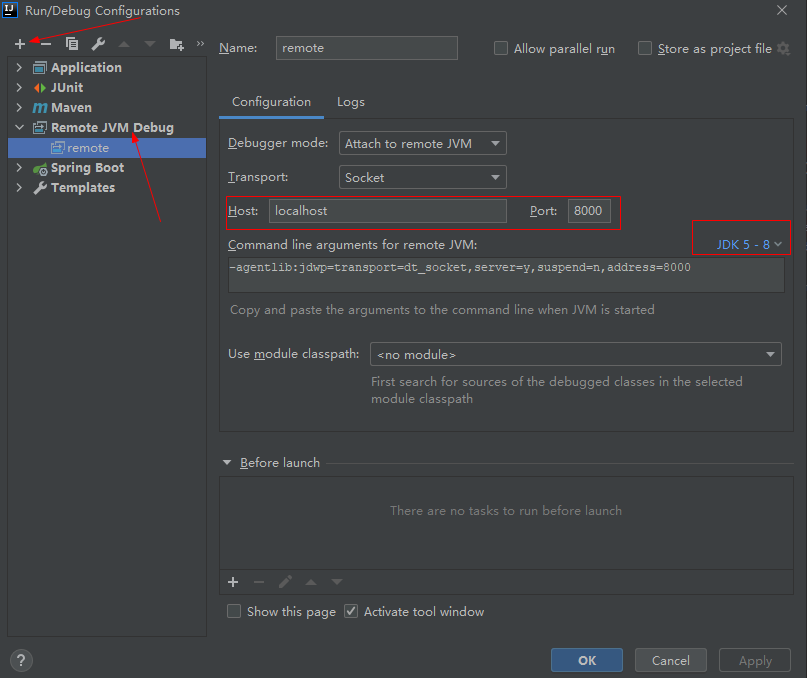

然后以 Debug 方式运行

### 4.编译流程分析

#### 4.1 解析与填充符号表

##### 4.1.1 词法分析

词法分析是将源代码的字符流转变为 Token 集合，单个字符是程序编写过程的最小元素，而 Token 则是编译过程的最小元素，关键字、变量名、字面量、运算符都可以成为 Token。

词法、语法分析的入口为 parseFiles：

```java
   public List<JCCompilationUnit> parseFiles(Iterable<JavaFileObject> fileObjects, boolean force) {
       if (!force && shouldStop(CompileState.PARSE))
           return List.nil();

        // 解析所有java源文件，然后转换成AST先后向语法树, JCCompilationUnit继承自JCTree，即为抽象语法树
        //parse all files
        ListBuffer<JCCompilationUnit> trees = new ListBuffer<>();
        Set<JavaFileObject> filesSoFar = new HashSet<>();
        for (JavaFileObject fileObject : fileObjects) {
            if (!filesSoFar.contains(fileObject)) {
                filesSoFar.add(fileObject);
                // 解析源文件
                trees.append(parse(fileObject));
            }
        }
        return trees.toList();
    }

    public JCTree.JCCompilationUnit parse(JavaFileObject filename) {
        JavaFileObject prev = log.useSource(filename);
        try {
            // 此处 readSource 会获取源文件的源码内容
            JCTree.JCCompilationUnit t = parse(filename, readSource(filename));
            if (t.endPositions != null)
                log.setEndPosTable(filename, t.endPositions);
            return t;
        } finally {
            log.useSource(prev);
        }
    }

    protected JCCompilationUnit parse(JavaFileObject filename, CharSequence content) {
        long msec = now();
        JCCompilationUnit tree = make.TopLevel(List.nil());
        if (content != null) {
            if (verbose) {
                log.printVerbose("parsing.started", filename);
            }
            if (!taskListener.isEmpty()) {
                TaskEvent e = new TaskEvent(TaskEvent.Kind.PARSE, filename);
                taskListener.started(e);
                keepComments = true;
                genEndPos = true;
            }
            // 在构造 JavacParser 的时候会通过 com.sun.tools.javac.parser.Scanner 进行词法分析
            Parser parser = parserFactory.newParser(content, keepComments(), genEndPos,
                                lineDebugInfo, filename.isNameCompatible("module-info", Kind.SOURCE));
            // 语法分析：通过JavacParser进行语法分析，得到AST抽象语法树
            tree = parser.parseCompilationUnit();
            if (verbose) {
                log.printVerbose("parsing.done", Long.toString(elapsed(msec)));
            }
        }

        tree.sourcefile = filename;

        if (content != null && !taskListener.isEmpty()) {
            TaskEvent e = new TaskEvent(TaskEvent.Kind.PARSE, tree);
            taskListener.finished(e);
        }

        return tree;
    }

```

在构造 Parser 的时候会进行词法分析：

```java

public class ParserFactory {

    public JavacParser newParser(CharSequence input, boolean keepDocComments, boolean keepEndPos, boolean keepLineMap, boolean parseModuleInfo) {
        // 构造一个词法分析器Lexer，其实现类为`com.sun.tools.javac.parser.Scanner`
        Lexer lexer = scannerFactory.newScanner(input, keepDocComments);
        // 在 JavacParser 的构造方法中会进行词法分析
        return new JavacParser(this, lexer, keepDocComments, keepLineMap, keepEndPos, parseModuleInfo);
    }
}

```

先构造一个词法分析器 Lexer，其实现类为`com.sun.tools.javac.parser.Scanner`，其结构如下：

```java

public class Scanner implements Lexer {

    private Tokens tokens;

    /** The token, set by nextToken().
     */
    private Token token;

    /** The previous token, set by nextToken().
     */
    private Token prevToken;

    /** Buffer of saved tokens (used during lookahead)
     */
    private List<Token> savedTokens = new ArrayList<>();

    private JavaTokenizer tokenizer;


    public void nextToken() {
        prevToken = token;
        if (!savedTokens.isEmpty()) {
            token = savedTokens.remove(0);
        } else {
            token = tokenizer.readToken();
        }
    }
}

// 通过
public static class Token {

    /** tags constants **/
    enum Tag {
        DEFAULT,
        NAMED,
        STRING,
        NUMERIC;
    }

    /** The token kind */
    public final TokenKind kind;

    /** The start position of this token */
    public final int pos;

    /** The end position of this token */
    public final int endPos;

    /** Comment reader associated with this token */
    public final List<Comment> comments;
}

public class Tokens {

    private final Names names;

    /**
     * Keyword array. Maps name indices to Token.
     */
    private final TokenKind[] key;

    /**  The number of the last entered keyword.
     */
    private int maxKey = 0;

    /** The names of all tokens.
     */
    private Name[] tokenName = new Name[TokenKind.values().length];
}


```

在 JavacParser 的构造方法中，会使用 JavaTokenizer 进行词法分析，从而得到 Token 集合

```java
public class JavacParser implements Parser {

    protected JavacParser(ParserFactory fac,
                     Lexer S,
                     boolean keepDocComments,
                     boolean keepLineMap,
                     boolean keepEndPositions,
                     boolean parseModuleInfo) {
        this.S = S;
        nextToken(); // prime the pump
        ...
    }

    public void nextToken() {
        S.nextToken();
        token = S.token();
    }
}


public class Scanner implements Lexer {

    private Tokens tokens;

    /** The token, set by nextToken().
     */
    private Token token;

    /** The previous token, set by nextToken().
     */
    private Token prevToken;

    /** Buffer of saved tokens (used during lookahead)
     */
    private List<Token> savedTokens = new ArrayList<>();

    private JavaTokenizer tokenizer;


    public void nextToken() {
        prevToken = token;
        if (!savedTokens.isEmpty()) {
            token = savedTokens.remove(0);
        } else {
            // 词法分析，获取token集合
            token = tokenizer.readToken();
        }
    }
}

```

JavaTokenizer 中存储了源码的字符流，会挨个读取字符，判断其属于哪种 Token，在枚举类 TokenKind 中可以看到所有 Token 种类

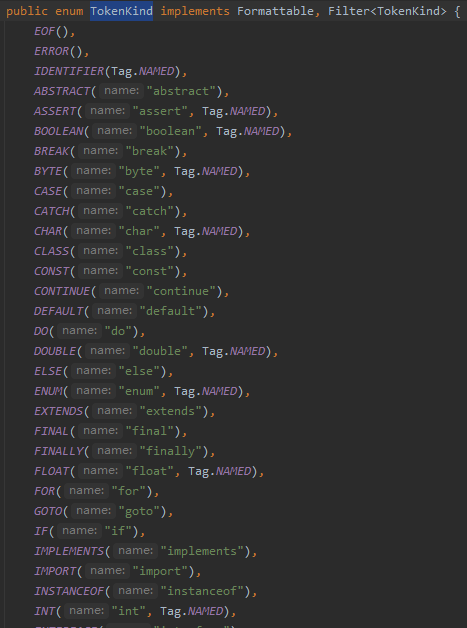

词法分析的具体细节可见 `JavaTokenizer#readToken()`

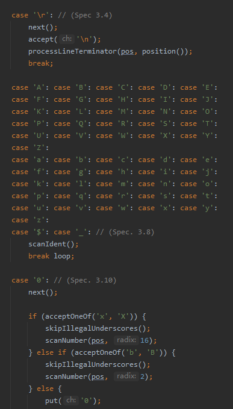

##### 4.1.2 Javac 抽象语法树

（1） 抽象语法树的结构

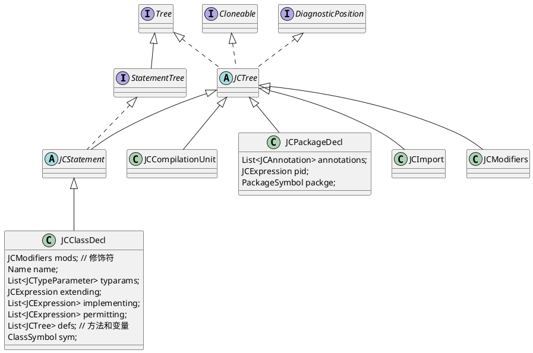

Java 源码在编译的时候，会被解析成一个语法树，这棵语法树就是 JCCompilationUnit，也就是一个编译单元。
其中这棵语法树根节点的子节点为包声明结点、Import 声明结点、类声明结点都是树的一级结点，例如：

```java
package com.ray.study.smaple.beanmap.mapstruct.dto; // 对应包声明结点 JCPackageDecl

import lombok.Data;  // 对应Import声明结点 JCImport

import java.util.List; // 对应Import声明结点 JCImport

/**
 * description
 *
 * @author r.shi 2021/5/26 15:37
 */

// 下面的所有代码对应JCClassDecl结点
@Data  // 注解 和 public 对应 修饰符结点 JCModifiers
public class UserDTO {
    private Long id;             // 对应变量声明结点 JCVariableDecl
    private String userName;     // 对应变量声明结点 JCVariableDecl
    private Boolean userStatus;  // 对应变量声明结点 JCVariableDecl
    private Long createTime;     // 对应变量声明结点 JCVariableDecl

    private List<RoleDTO> roles; // 对应变量声明结点 JCVariableDecl
}

```

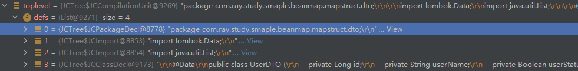

（2）抽象语法树是如何生成的？

可以通过 `JCTree` 的工厂类 `com.sun.tools.javac.tree.TreeMaker` 生成

```java

public class TreeMaker implements JCTree.Factory {

    public JCClassDecl ClassDef(JCModifiers mods,
                                Name name,
                                List<JCTypeParameter> typarams,
                                JCExpression extending,
                                List<JCExpression> implementing,
                                List<JCExpression> permitting,
                                List<JCTree> defs)
    {
        JCClassDecl tree = new JCClassDecl(mods,
                                     name,
                                     typarams,
                                     extending,
                                     implementing,
                                     permitting,
                                     defs,
                                     null);
        tree.pos = pos;
        return tree;
    }

    public JCMethodDecl MethodDef(JCModifiers mods,
                               Name name,
                               JCExpression restype,
                               List<JCTypeParameter> typarams,
                               List<JCVariableDecl> params,
                               List<JCExpression> thrown,
                               JCBlock body,
                               JCExpression defaultValue) {
        return MethodDef(
                mods, name, restype, typarams, null, params,
                thrown, body, defaultValue);
    }
}
```

##### 4.1.3 语法分析

然后根据 Token 序列构造抽象语法树

```java

// JavacParser
public JCTree.JCCompilationUnit parseCompilationUnit() {

    Token firstToken = token;
    JCModifiers mods = null;
    boolean consumedToplevelDoc = false;
    boolean seenImport = false;
    boolean seenPackage = false;
    ListBuffer<JCTree> defs = new ListBuffer<>();
    if (token.kind == MONKEYS_AT)
        mods = modifiersOpt();

    // 1.包声明语法分析
    // PackageDeclaration = PACKAGE Ident { DOT [Annotations] Ident } ;
    if (token.kind == PACKAGE) {
        // 若遇到的 token 是 PACKAGE类型，
        int packagePos = token.pos;
        List<JCAnnotation> annotations = List.nil();
        seenPackage = true;
        if (mods != null) {
            checkNoMods(mods.flags & ~Flags.DEPRECATED);
            annotations = mods.annotations;
            mods = null;
        }
        nextToken();
        // 得到具体包名
        JCExpression pid = qualident(false);
        // 判断是否以 `;` 结尾，accept通过说明是正确的包声明语句
        accept(SEMI);
        // 构造包声明
        JCPackageDecl pd = toP(F.at(packagePos).PackageDecl(annotations, pid));
        attach(pd, firstToken.comment(CommentStyle.JAVADOC));
        consumedToplevelDoc = true;
        defs.append(pd);
    }

    boolean checkForImports = true;
    boolean firstTypeDecl = true;
    while (token.kind != EOF) {
        if (token.pos <= endPosTable.errorEndPos) {
            // error recovery
            skip(checkForImports, false, false, false);
            if (token.kind == EOF)
                break;
        }
        if (checkForImports && mods == null && token.kind == IMPORT) {
            // 2.import 声明语法分析
            // ImportDeclaration = IMPORT [ STATIC ] Ident { "." Ident } [ "." "*" ] ";"
            seenImport = true;
            defs.append(importDeclaration());
        } else {
            Comment docComment = token.comment(CommentStyle.JAVADOC);
            if (firstTypeDecl && !seenImport && !seenPackage) {
                docComment = firstToken.comment(CommentStyle.JAVADOC);
                consumedToplevelDoc = true;
            }
            if (mods != null || token.kind != SEMI)
                // 3.修饰符
                mods = modifiersOpt(mods);
            if (firstTypeDecl && token.kind == IDENTIFIER) {
                ModuleKind kind = ModuleKind.STRONG;
                if (token.name() == names.open) {
                    kind = ModuleKind.OPEN;
                    nextToken();
                }
                if (token.kind == IDENTIFIER && token.name() == names.module) {
                    if (mods != null) {
                        checkNoMods(mods.flags & ~Flags.DEPRECATED);
                    }
                    defs.append(moduleDecl(mods, kind, docComment));
                    consumedToplevelDoc = true;
                    break;
                } else if (kind != ModuleKind.STRONG) {
                    reportSyntaxError(token.pos, Errors.ExpectedModule);
                }
            }
            // 4.类型声明语法分析
            JCTree def = typeDeclaration(mods, docComment);
            if (def instanceof JCExpressionStatement)
                def = ((JCExpressionStatement)def).expr;
            defs.append(def);
            if (def instanceof JCClassDecl)
                checkForImports = false;
            mods = null;
            firstTypeDecl = false;
        }
    }

    // 构建toplevel根结点，并将包声明结点、Import声明结点、类型声明结点作为其子结点
    JCTree.JCCompilationUnit toplevel = F.at(firstToken.pos).TopLevel(defs.toList());
    if (!consumedToplevelDoc)
        attach(toplevel, firstToken.comment(CommentStyle.JAVADOC));
    if (defs.isEmpty())
        storeEnd(toplevel, S.prevToken().endPos);
    if (keepDocComments)
        toplevel.docComments = docComments;
    if (keepLineMap)
        toplevel.lineMap = S.getLineMap();
    this.endPosTable.setParser(null); // remove reference to parser
    toplevel.endPositions = this.endPosTable;
    return toplevel;
}

/** ClassOrInterfaceOrEnumDeclaration = ModifiersOpt
    *           (ClassDeclaration | InterfaceDeclaration | EnumDeclaration)
    *  @param mods     Any modifiers starting the class or interface declaration
    *  @param dc       The documentation comment for the class, or null.
    */
protected JCStatement classOrRecordOrInterfaceOrEnumDeclaration(JCModifiers mods, Comment dc) {
    if (token.kind == CLASS) {
        // 类声明语法分析
        return classDeclaration(mods, dc);
    } if (isRecordStart()) {
        return recordDeclaration(mods, dc);
    } else if (token.kind == INTERFACE) {
        // 接口声明语法分析
        return interfaceDeclaration(mods, dc);
    } else if (token.kind == ENUM) {
        // 枚举声明语法分析
        return enumDeclaration(mods, dc);
    } else {
        int pos = token.pos;
        List<JCTree> errs;
        if (token.kind == IDENTIFIER && token.name() == names.record) {
            checkSourceLevel(Feature.RECORDS);
            JCErroneous erroneousTree = syntaxError(token.pos, List.of(mods), Errors.RecordHeaderExpected);
            return toP(F.Exec(erroneousTree));
        } else {
            if (LAX_IDENTIFIER.accepts(token.kind)) {
                errs = List.of(mods, toP(F.at(pos).Ident(ident())));
                setErrorEndPos(token.pos);
            } else {
                errs = List.of(mods);
            }
            final JCErroneous erroneousTree;
            if (parseModuleInfo) {
                erroneousTree = syntaxError(pos, errs, Errors.ExpectedModuleOrOpen);
            } else {
                if (allowRecords) {
                    erroneousTree = syntaxError(pos, errs, Errors.Expected4(CLASS, INTERFACE, ENUM, "record"));
                } else {
                    erroneousTree = syntaxError(pos, errs, Errors.Expected3(CLASS, INTERFACE, ENUM));
                }
            }
            return toP(F.Exec(erroneousTree));
        }
    }
}

/** ClassDeclaration = CLASS Ident TypeParametersOpt [EXTENDS Type]
    *                     [IMPLEMENTS TypeList] ClassBody
    *  @param mods    The modifiers starting the class declaration
    *  @param dc       The documentation comment for the class, or null.
    */
protected JCClassDecl classDeclaration(JCModifiers mods, Comment dc) {
    int pos = token.pos;
    accept(CLASS);
    Name name = typeName();

    List<JCTypeParameter> typarams = typeParametersOpt();

    JCExpression extending = null;
    if (token.kind == EXTENDS) {
        nextToken();
        extending = parseType();
    }
    List<JCExpression> implementing = List.nil();
    if (token.kind == IMPLEMENTS) {
        nextToken();
        implementing = typeList();
    }
    List<JCExpression> permitting = permitsClause(mods, "class");
    List<JCTree> defs = classInterfaceOrRecordBody(name, false, false);
    JCClassDecl result = toP(F.at(pos).ClassDef(
        mods, name, typarams, extending, implementing, permitting, defs));
    attach(result, dc);
    return result;
}

```

##### 4.1.4 填充符号表

###### 4.1.4.1 符号表的数据结构

Javac 在编译过程中需要频繁查找被引用的符号，因此需要一定的结构来组织这些符号，这就是符号表。

符号一般都是与作用域关联的，Java 的作用域是嵌套的，这样 Javac 在实现过程中，可以通过 Scope 类来实现作用域的嵌套，然后将每个作用域中定义的符号分别保存到对应作用域的相关变量中，这样就可以通过遍历作用域的方式查找唯一的符号引用了。

作用域（Scope）大部分都以花括号分隔，同一个符号在不同的作用域中可能指向不同的实体。

Scope 类图如下：

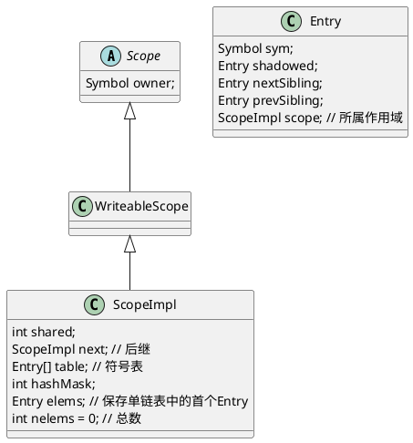

一个作用域内定义的多个符号存储在 table 数组中，由于 table 数组专门用来存储符号，因而也可以直接叫符号表。同一个作用域内定义的所有符号会形成单链表，elems 保存了这个单链表的首个 Entry 对象，nelems 保存了单链表中 Entry 对象的总数。

而符号的数据结构如下：

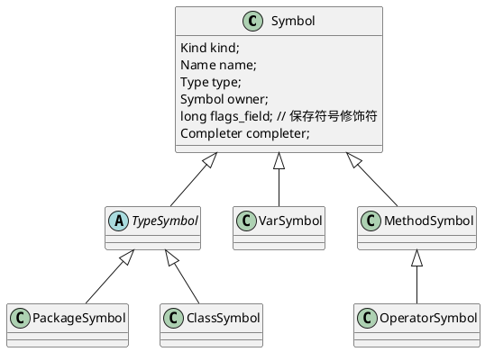

同时符号还会在`Symtab`中缓存起来：

```java
public class Symtab {
    ...
    private final Map<Name, Map<ModuleSymbol,ClassSymbol>> classes = new HashMap<>();
    private final Map<Name, Map<ModuleSymbol,PackageSymbol>> packages = new HashMap<>();
    ...

    /** Create a new toplevel or member class symbol with given name
     *  and owner and enter in `classes' unless already there.
     */
    public ClassSymbol enterClass(ModuleSymbol msym, Name name, TypeSymbol owner) {
        Assert.checkNonNull(msym);
        Name flatname = TypeSymbol.formFlatName(name, owner);
        ClassSymbol c = getClass(msym, flatname);
        if (c == null) {
            c = defineClass(name, owner);
            doEnterClass(msym, c);
        } else if ((c.name != name || c.owner != owner) && owner.kind == TYP && c.owner.kind == PCK) {
            // reassign fields of classes that might have been loaded with
            // their flat names.
            c.owner.members().remove(c);
            c.name = name;
            c.owner = owner;
            c.fullname = ClassSymbol.formFullName(name, owner);
        }
        return c;
    }
}


```

###### 4.1.4.2 符号表的填充过程

语法树除了包含前面已经填充好的语法树子节点 List，还包含作用域 Scope、包符号、Type 等属性，符号表的填充也就是填充语法树中的这些还未填充的属性

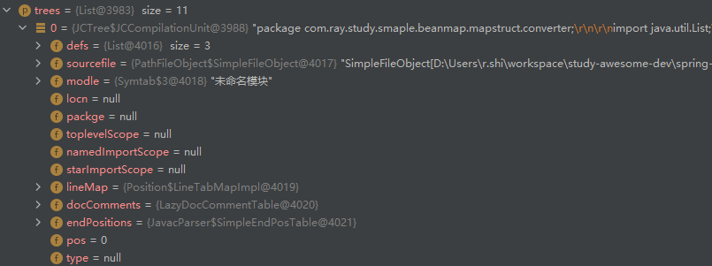

符号表填充的时序图如下：

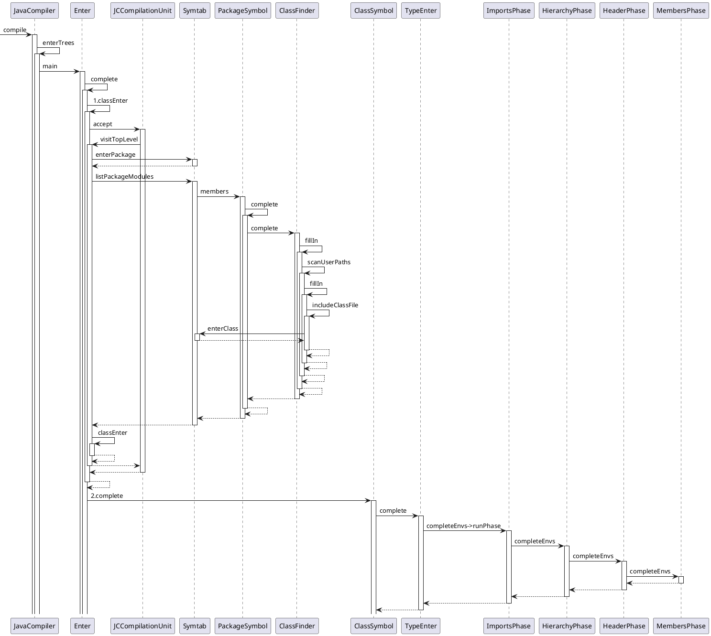

 两个阶段

符号表的填充主要分为两个过程：

> - 填充包符号，并创建类符号本身，对于类符号内部的方法、成员属性，会在下一个阶段填充
> - 填充 ImportScope、type 和父类型以及接口、成员属性、成员方法

这两个过程主要由 `com.sun.tools.javac.comp.Enter`、`com.sun.tools.javac.comp.TypeEnter`、`com.sun.tools.javac.comp.MemberEnter`类来完成。

程序首先会进入到 `Enter#complete()`

```java

    /** Main method: enter classes from the list of toplevel trees, possibly
     *  skipping TypeEnter for all but 'c' by placing them on the uncompleted
     *  list.
     *  @param trees      The list of trees to be processed.
     *  @param c          The class symbol to be processed or null to process all.
     */
    public void complete(List<JCCompilationUnit> trees, ClassSymbol c) {
        annotate.blockAnnotations();
        ListBuffer<ClassSymbol> prevUncompleted = uncompleted;
        if (typeEnter.completionEnabled) uncompleted = new ListBuffer<>();

        try {
            // enter all classes, and construct uncompleted list
            // 阶段1
            classEnter(trees, null);

            // complete all uncompleted classes in memberEnter
            if (typeEnter.completionEnabled) {
                while (uncompleted.nonEmpty()) {
                    ClassSymbol clazz = uncompleted.next();
                    if (c == null || c == clazz || prevUncompleted == null)
                        // 阶段2
                        clazz.complete();
                    else
                        // defer
                        prevUncompleted.append(clazz);
                }

                if (!modules.modulesInitialized()) {
                    for (JCCompilationUnit cut : trees) {
                        if (cut.getModuleDecl() != null) {
                            unfinishedModules.append(cut);
                        } else {
                            typeEnter.ensureImportsChecked(List.of(cut));
                        }
                    }
                } else {
                    typeEnter.ensureImportsChecked(unfinishedModules.toList());
                    unfinishedModules.clear();
                    typeEnter.ensureImportsChecked(trees);
                }
            }
        } finally {
            uncompleted = prevUncompleted;
            annotate.unblockAnnotations();
        }
    }

```

进行阶段 1 前，语法树填充情况如下：


进行阶段 2 前，语法树填充情况如下：

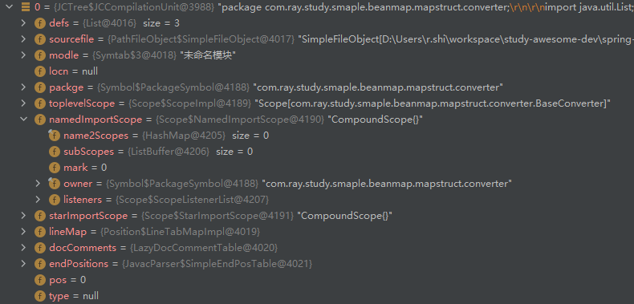

完成阶段 2 后，语法树填充情况如下：

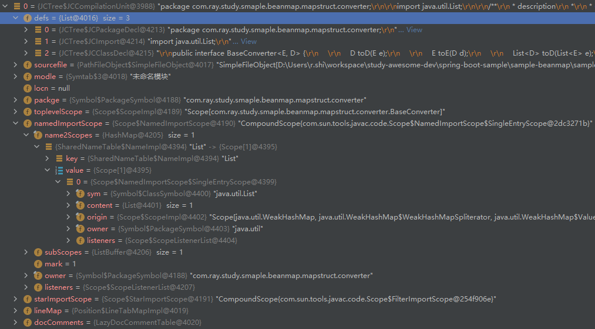


（1）阶段 1：创建包或类符号

```java
public class Enter extends JCTree.Visitor {
        @Override
    public void visitTopLevel(JCCompilationUnit tree) {
        // Assert.checkNonNull(tree.modle, tree.sourcefile.toString());

        JavaFileObject prev = log.useSource(tree.sourcefile);
        boolean addEnv = false;
        boolean isPkgInfo = tree.sourcefile.isNameCompatible("package-info",
                                                             JavaFileObject.Kind.SOURCE);
        if (TreeInfo.isModuleInfo(tree)) {
            JCPackageDecl pd = tree.getPackage();
            if (pd != null) {
                log.error(pd.pos(), Errors.NoPkgInModuleInfoJava);
            }
            tree.packge = syms.rootPackage;
            Env<AttrContext> topEnv = topLevelEnv(tree);
            classEnter(tree.defs, topEnv);
            tree.modle.usesProvidesCompleter = modules.getUsesProvidesCompleter();
        } else {
            JCPackageDecl pd = tree.getPackage();
            if (pd != null) {
                // 1.递归创建包符号
                tree.packge = pd.packge = syms.enterPackage(tree.modle, TreeInfo.fullName(pd.pid));
                if (   pd.annotations.nonEmpty()
                    || pkginfoOpt == PkgInfo.ALWAYS
                    || tree.docComments != null) {
                    if (isPkgInfo) {
                        addEnv = true;
                    } else if (pd.annotations.nonEmpty()) {
                        log.error(pd.annotations.head.pos(),
                                  Errors.PkgAnnotationsSbInPackageInfoJava);
                    }
                }
            } else {
                tree.packge = tree.modle.unnamedPackage;
            }

            Map<Name, PackageSymbol> visiblePackages = tree.modle.visiblePackages;
            Optional<ModuleSymbol> dependencyWithPackage =
                // 2.扫描包下的所有Java源文件，挨个创建类符号，并形成一个类符号列表作为包符号的成员属性(members_field)
                syms.listPackageModules(tree.packge.fullname)
                    .stream()
                    .filter(m -> m != tree.modle)
                    .filter(cand -> visiblePackages.get(tree.packge.fullname) == syms.getPackage(cand, tree.packge.fullname))
                    .findAny();

            if (dependencyWithPackage.isPresent()) {
                log.error(pd, Errors.PackageInOtherModule(dependencyWithPackage.get()));
            }

            tree.packge.complete(); // Find all classes in package.

            Env<AttrContext> topEnv = topLevelEnv(tree);
            Env<AttrContext> packageEnv = isPkgInfo ? topEnv.dup(pd) : null;

            // Save environment of package-info.java file.
            if (isPkgInfo) {
                Env<AttrContext> env0 = typeEnvs.get(tree.packge);
                if (env0 != null) {
                    JCCompilationUnit tree0 = env0.toplevel;
                    if (!fileManager.isSameFile(tree.sourcefile, tree0.sourcefile)) {
                        log.warning(pd != null ? pd.pid.pos() : null,
                                    Warnings.PkgInfoAlreadySeen(tree.packge));
                    }
                }
                typeEnvs.put(tree.packge, packageEnv);

                for (Symbol q = tree.packge; q != null && q.kind == PCK; q = q.owner)
                    q.flags_field |= EXISTS;

                Name name = names.package_info;
                ClassSymbol c = syms.enterClass(tree.modle, name, tree.packge);
                c.flatname = names.fromString(tree.packge + "." + name);
                c.sourcefile = tree.sourcefile;
            c.completer = Completer.NULL_COMPLETER;
                c.members_field = WriteableScope.create(c);
                tree.packge.package_info = c;
                tree.packge.sourcefile = tree.sourcefile;
            }
            classEnter(tree.defs, topEnv);
            if (addEnv) {
                todo.append(packageEnv);
            }
        }
        log.useSource(prev);
        result = null;
    }
}

```

创建包符号和类符号的创建都是由`Symtab`完成的:

```java
public class Symtab {
    private final Map<Name, Map<ModuleSymbol,ClassSymbol>> classes = new HashMap<>();
    private final Map<Name, Map<ModuleSymbol,PackageSymbol>> packages = new HashMap<>();

    /** Make a package, given its fully qualified name.
     */
    public PackageSymbol enterPackage(ModuleSymbol currModule, Name fullname) {
        Assert.checkNonNull(currModule);
        PackageSymbol p = getPackage(currModule, fullname);
        if (p == null) {
            // 若没有创建过，则创建并放入到缓存中
            Assert.check(!fullname.isEmpty(), () -> "rootPackage missing!; currModule: " + currModule);
            p = new PackageSymbol(
                    // shortName当前包简称， packagePart为当前包的父级包名，也就是说创建当前包符号的时候会递归创建其父包符号
                    // 当此包为一级包时，其父包为 rootPackage，packagePart值为空串
                    Convert.shortName(fullname),
                    enterPackage(currModule, Convert.packagePart(fullname)));
            p.completer = initialCompleter;
            p.modle = currModule;
            doEnterPackage(currModule, p);
        }
        return p;
    }

    private void doEnterPackage(ModuleSymbol msym, PackageSymbol pack) {
        packages.computeIfAbsent(pack.fullname, n -> new HashMap<>()).put(msym, pack);
        msym.enclosedPackages = msym.enclosedPackages.prepend(pack);
    }

    public PackageSymbol getPackage(ModuleSymbol module, Name fullname) {
        return packages.getOrDefault(fullname, Collections.emptyMap()).get(module);
    }


    /** Create a new toplevel or member class symbol with given name
     *  and owner and enter in `classes' unless already there.
     */
    public ClassSymbol enterClass(ModuleSymbol msym, Name name, TypeSymbol owner) {
        Assert.checkNonNull(msym);
        Name flatname = TypeSymbol.formFlatName(name, owner);
        ClassSymbol c = getClass(msym, flatname);
        if (c == null) {
            // 若没有创建过，则创建并放入到缓存中
            // 创建类符号的时候，此类符号的Owner为包符号
            c = defineClass(name, owner);
            doEnterClass(msym, c);
        } else if ((c.name != name || c.owner != owner) && owner.kind == TYP && c.owner.kind == PCK) {
            // reassign fields of classes that might have been loaded with
            // their flat names.
            c.owner.members().remove(c);
            c.name = name;
            c.owner = owner;
            c.fullname = ClassSymbol.formFullName(name, owner);
        }
        return c;
    }

    private void doEnterClass(ModuleSymbol msym, ClassSymbol cs) {
        classes.computeIfAbsent(cs.flatname, n -> new HashMap<>()).put(msym, cs);
    }

    public ClassSymbol defineClass(Name name, Symbol owner) {
        ClassSymbol c = new ClassSymbol(0, name, owner);
        c.completer = initialCompleter;
        return c;
    }

}
```

创建好包符号之后，会填充包符号的 `members_field` 属性，包符号的 Member 即为类符号。

```java
public class Symtab {
    public List<ModuleSymbol> listPackageModules(Name packageName) {
        if (packageName.isEmpty())
            return List.nil();

        List<ModuleSymbol> result = List.nil();
        Map<ModuleSymbol,PackageSymbol> map = packages.get(packageName);
        if (map != null) {
            for (Map.Entry<ModuleSymbol, PackageSymbol> e: map.entrySet()) {
                // 调用PackageSymbol#members() 会填充包符号的Member
                if (!e.getValue().members().isEmpty()) {
                    result = result.prepend(e.getKey());
                }
            }
        }
        return result;
    }

}

public abstract class Symbol extends AnnoConstruct implements PoolConstant, Element {

    public WriteableScope members() {
        complete();
        return members_field;
    }

    /** Complete the elaboration of this symbol's definition.
     */
    public void complete() throws CompletionFailure {
        if (completer != Completer.NULL_COMPLETER) {
            Completer c = completer;
            completer = Completer.NULL_COMPLETER;
            // completer 为 ClassFinder
            c.complete(this);
        }
    }
}
```

进入到`ClassFinder#complete()`之后，由于 sym 是 PackageSymbol，因此会进入到`ClassFinder#fillIn(PackageSymbol p)`，在此方法中，会在用户目录下扫描指定包下的 Java 源文件

```java
public class ClassFinder {
    /** Completion for classes to be loaded. Before a class is loaded
     *  we make sure its enclosing class (if any) is loaded.
     */
    private void complete(Symbol sym) throws CompletionFailure {
        if (sym.kind == TYP) {
            // 填充类符号
            try {
                ClassSymbol c = (ClassSymbol) sym;
                dependencies.push(c, CompletionCause.CLASS_READER);
                annotate.blockAnnotations();
                c.members_field = new Scope.ErrorScope(c); // make sure it's always defined
                completeOwners(c.owner);
                completeEnclosing(c);
                fillIn(c);
            } finally {
                annotate.unblockAnnotationsNoFlush();
                dependencies.pop();
            }
        } else if (sym.kind == PCK) {
            PackageSymbol p = (PackageSymbol)sym;
            try {
                fillIn(p);
            } catch (IOException ex) {
                throw new CompletionFailure(
                        sym,
                        () -> diagFactory.fragment(
                            Fragments.ExceptionMessage(ex.getLocalizedMessage())),
                        dcfh)
                    .initCause(ex);
            }
        }
        if (!reader.filling)
            annotate.flush(); // finish attaching annotations
    }

    /** Load directory of package into members scope.
     */
    private void fillIn(PackageSymbol p) throws IOException {
        if (p.members_field == null)
            p.members_field = WriteableScope.create(p);

        ModuleSymbol msym = p.modle;

        Assert.checkNonNull(msym, p::toString);

        msym.complete();

        if (msym == syms.noModule) {
            preferCurrent = false;
            if (userPathsFirst) {
                scanUserPaths(p, true);
                preferCurrent = true;
                scanPlatformPath(p);
            } else {
                scanPlatformPath(p);
                scanUserPaths(p, true);
            }
        } else if (msym.classLocation == StandardLocation.CLASS_PATH) {
            // 在用户目录下扫描指定包下的Java源文件
            scanUserPaths(p, msym.sourceLocation == StandardLocation.SOURCE_PATH);
        } else {
            scanModulePaths(p, msym);
        }
    }

        /**
     * Scans class path and source path for files in given package.
     */
    private void scanUserPaths(PackageSymbol p, boolean includeSourcePath) throws IOException {
        ...
        if (wantSourceFiles)
            // 根据源文件创建类符号并填充至包符号
            fillIn(p, SOURCE_PATH,
                    // 获取包路径下的所有Java源文件
                    list(SOURCE_PATH,
                        p,
                        packageName,
                        sourceKinds));
        ...
    }

    private void fillIn(PackageSymbol p,
                            Location location,
                            Iterable<JavaFileObject> files){
            currentLoc = location;
            for (JavaFileObject fo : files) {
                switch (fo.getKind()) {
                case OTHER:
                    extraFileActions(p, fo);
                    break;
                case CLASS:
                case SOURCE: {
                    // TODO pass binaryName to includeClassFile
                    String binaryName = fileManager.inferBinaryName(currentLoc, fo);
                    String simpleName = binaryName.substring(binaryName.lastIndexOf(".") + 1);
                    if (SourceVersion.isIdentifier(simpleName) ||
                        simpleName.equals("package-info"))
                        // 根据源文件创建类符号并填充至包符号
                        includeClassFile(p, fo);
                    break;
                }
                default:
                    extraFileActions(p, fo);
                    break;
                }
            }
    }

    protected void includeClassFile(PackageSymbol p, JavaFileObject file) {
        ...
        Name classname = names.fromString(binaryName.substring(lastDot + 1));
        boolean isPkgInfo = classname == names.package_info;
        ClassSymbol c = isPkgInfo
            ? p.package_info
            : (ClassSymbol) p.members_field.findFirst(classname);
        if (c == null) {
            // 创建类符号
            c = syms.enterClass(p.modle, classname, p);
            if (c.classfile == null) // only update the file if's it's newly created
                c.classfile = file;
            if (isPkgInfo) {
                p.package_info = c;
            } else {
                if (c.owner == p)  // it might be an inner class
                    // 将类符号填充进包符号的 members_field
                    p.members_field.enter(c);
            }
        }
        ...
    }
}
```

（2）阶段 2：填充类符号下的属性

给语法树填充好了包符号，和类符号本身之后，还需要继续填充类符号的属性
此阶段主要是由`TypeEnter#complete()`开始，并会经历一系列阶段

```java
// 进入类型作用域
public class TypeEnter implements Completer {
    private final ImportsPhase completeClass = new ImportsPhase();

    @Override
    public void complete(Symbol sym) throws CompletionFailure {
        ...
        List<Env<AttrContext>> queue;

        dependencies.push((ClassSymbol) sym, CompletionCause.MEMBER_ENTER);
        try {
            // 开始分阶段填充类符号的 extend/implement/typeParam/member 等属性
            queue = completeClass.completeEnvs(List.of(typeEnvs.get((ClassSymbol) sym)));
        } finally {
            dependencies.pop();
        }
        ...
    }
}

```

TypeEnter 的阶段由`Phase`表示，使用单链表作为其数据结构即可将一系列阶段串联起来：

```java
abstract class Phase {
    private final ListBuffer<Env<AttrContext>> queue = new ListBuffer<>();
    private final Phase next;
    private final CompletionCause phaseName;

    Phase(CompletionCause phaseName, Phase next) {
        this.phaseName = phaseName;
        this.next = next;
    }

    public final List<Env<AttrContext>> completeEnvs(List<Env<AttrContext>> envs) {
        boolean firstToComplete = queue.isEmpty();

        Phase prevTopLevelPhase = topLevelPhase;
        boolean success = false;

        try {
            topLevelPhase = this;
            // 执行当前节点代表的阶段
            doCompleteEnvs(envs);
            success = true;
        } finally {
            topLevelPhase = prevTopLevelPhase;
            if (!success && firstToComplete) {
                //an exception was thrown, e.g. BreakAttr:
                //the queue would become stale, clear it:
                queue.clear();
            }
        }

        if (firstToComplete) {
            List<Env<AttrContext>> out = queue.toList();

            queue.clear();
            // 执行后继节点代表的阶段，也即下一个阶段
            return next != null ? next.completeEnvs(out) : out;
        } else {
            return List.nil();
        }
    }

    protected void doCompleteEnvs(List<Env<AttrContext>> envs) {
        for (Env<AttrContext> env : envs) {
            JCClassDecl tree = (JCClassDecl)env.tree;

            queue.add(env);

            JavaFileObject prev = log.useSource(env.toplevel.sourcefile);
            DiagnosticPosition prevLintPos = deferredLintHandler.setPos(tree.pos());
            try {
                dependencies.push(env.enclClass.sym, phaseName);
                // 执行此阶段的具体任务
                runPhase(env);
            } catch (CompletionFailure ex) {
                chk.completionError(tree.pos(), ex);
            } finally {
                dependencies.pop();
                deferredLintHandler.setPos(prevLintPos);
                log.useSource(prev);
            }
        }
    }

    protected abstract void runPhase(Env<AttrContext> env);
}
```

主要的阶段有：

> - ImportsPhase: 补充import信息，填充编译单元的 namedImportScope 和 starImportScope 属性，同时填充子节点 JCImport 的 importScope 属性
> - HierarchyPhase: 补充类层级信息，填充JCClassDecl的extending和implementing 以及sym属性的supertype_field（父类）、interfaces_field（接口）
> - HeaderPhase: 填充 JCModifiers 下的注解
> - MembersPhase: 填充 JCVariableDecl下的

ImportsPhase：

```java
private final class ImportsPhase extends Phase {
    @Override
    protected void runPhase(Env<AttrContext> env) {
        ...
        resolveImports(env.toplevel, env.enclosing(TOPLEVEL));
        ...
    }

    private void resolveImports(JCCompilationUnit tree, Env<AttrContext> env) {
        ....
        // 使用 java.Lang 包来填充编译单元的startImportScope
        importAll(make.at(tree.pos()).Import(make.QualIdent(javaLang), false), javaLang, env);

        JCModuleDecl decl = tree.getModuleDecl();

        // Process the package def and all import clauses.
        if (tree.getPackage() != null && decl == null)
            checkClassPackageClash(tree.getPackage());

        for (JCImport imp : tree.getImports()) {
            // 使用类中的Import语句来填充编译单元的namedImport，同时也会填充其子节点JCImport的ImportScope
            doImport(imp);
        }
        ...
    }

    private void doImport(JCImport tree) {
        ...
        // Named type import.
        if (tree.staticImport) {
            importNamedStatic(tree, p, name, localEnv);
            chk.checkCanonical(imp.selected);
        } else {
            Type importedType = attribImportType(imp, localEnv);
            Type originalType = importedType.getOriginalType();
            TypeSymbol c = originalType.hasTag(CLASS) ? originalType.tsym : importedType.tsym;
            chk.checkCanonical(imp);
            importNamed(tree.pos(), c, env, tree);
        }
        ...
    }

    // 向语法树中填充import信息
    private void importNamed(DiagnosticPosition pos, final Symbol tsym, Env<AttrContext> env, JCImport imp) {
        if (tsym.kind == TYP)
            imp.importScope = env.toplevel.namedImportScope.importType(tsym.owner.members(), tsym.owner.members(), tsym);
    }
}
```

如下图：

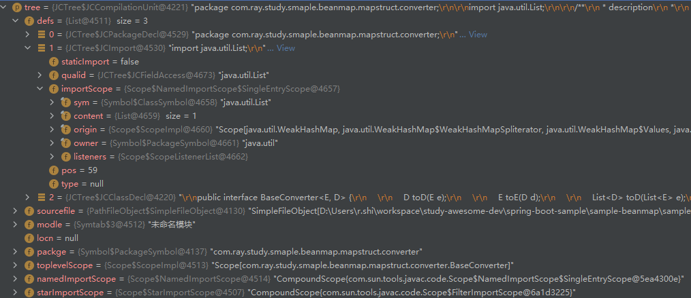

HierarchyPhase：

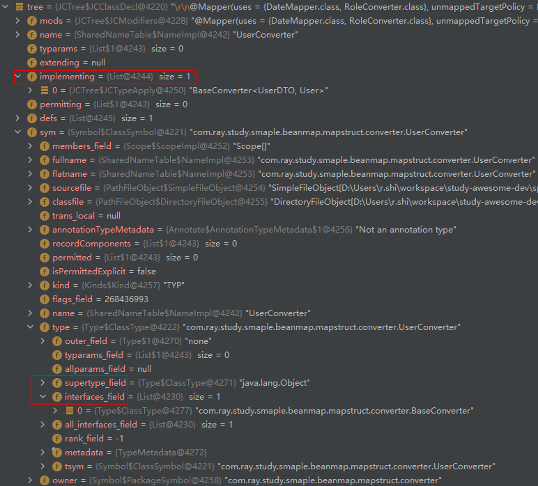

HeaderPhase：

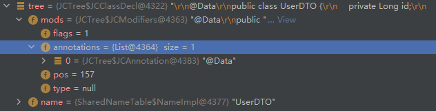


MembersPhase：填充成员属性：

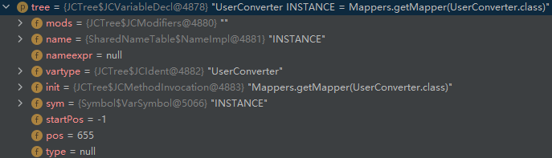

#### 4.2 注解处理

##### 4.2.1 注解处理时序图


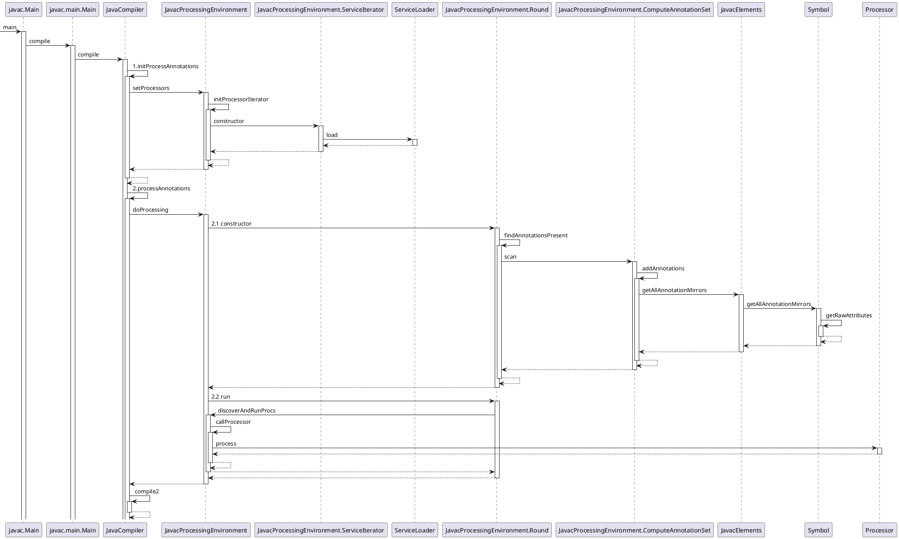


注解处理的入口：

```java
public class JavaCompiler { 
	/**
     * Main method: compile a list of files, return all compiled classes
     *
     * @param sourceFileObjects file objects to be compiled
     * @param classnames class names to process for annotations
     * @param processors user provided annotation processors to bypass
     * discovery, {@code null} means that no processors were provided
     * @param addModules additional root modules to be used during
     * module resolution.
     */
    public void compile(Collection<JavaFileObject> sourceFileObjects,
                        Collection<String> classnames,
                        Iterable<? extends Processor> processors,
                        Collection<String> addModules)
    {
        ...
        // 准备过程：初始化插入式注解处理器，最终是通过ServiceLoader获取所有Processor.class的实现类
        initProcessAnnotations(processors, sourceFileObjects, classnames);

        // These method calls must be chained to avoid memory leaks
        // 2. 执行注解处理
        processAnnotations(
            // 1.2 填充符号表
            enterTrees(
                    stopIfError(CompileState.ENTER,
                            initModules(stopIfError(CompileState.ENTER,
                                // 1.1 词法分析、语法分析，从而构建出一棵AST抽象语法树，sourceFileObjects即为Java源文件在内存中的表示
                                parseFiles(sourceFileObjects))))
            ),
            classnames
        );
        ...

        if (!CompileState.ATTR.isAfter(shouldStopPolicyIfNoError)) {
            switch (compilePolicy) {
            ...
            case BY_TODO:
                while (!todo.isEmpty())
                    // 3.语义分析及字节码生成
                    generate(desugar(flow(attribute(todo.remove()))));
                break;
            ...
        }
}
```


##### 4.2.2 获取注解处理器

（1）通过 ServiceLoader 来加载 Processor.class 的实现类

如上述流程图所示，在`JavacProcessingEnvironment.ServiceIterator`的构造方法中，会通过 ServiceLoader 来加载 Processor.class 的实现类，这样就可以获取到所有的注解处理器。

```java
private class ServiceIterator implements Iterator<Processor> {
    private Iterator<Processor> iterator;
    private Log log;
    private ServiceLoader<Processor> loader;

    ServiceIterator(ClassLoader var2, Log var3) {
        this.log = var3;

        try {
            try {
                // 通过 ServiceLoader 来加载 Processor.class 的实现类
                this.loader = ServiceLoader.load(Processor.class, var2);
                this.iterator = this.loader.iterator();
            } catch (Exception var5) {
                this.iterator = JavacProcessingEnvironment.this.handleServiceLoaderUnavailability("proc.no.service", (Exception)null);
            }

        } catch (Throwable var6) {
            var3.error("proc.service.problem", new Object[0]);
            throw new Abort(var6);
        }
    }
}

```

（2）`ServiceLoader.load` 根据`resources/META-INF/services/`目录下的接口文件来反射创建具体的实现类列表

##### 4.2.3 获取注解与处理注解

获取注解：

> - 首先会从语法树中获取所有的类符号
> - 然后挨个获取每个类符号里的所有的注解
> - 获取注解的时候是从  ClassSymbol.metadata.attributes 中获取

处理注解：

> - 遍历注解处理器，对于每一个注解处理器，遍历注解列表，若有注解匹配此注解处理器，则注解处理器来处理注解


```java
public class JavacProcessingEnvironment implements ProcessingEnvironment, Closeable {
    
    public boolean doProcessing(List<JCCompilationUnit> roots,
                                List<ClassSymbol> classSymbols,
                                Iterable<? extends PackageSymbol> pckSymbols,
                                Log.DeferredDiagnosticHandler deferredDiagnosticHandler) {
        // 1.root 即为语法树列表，这里会根据JCTree 列表中的所有的类符号获取所有注解
        Round round = new Round(roots, classSymbols, treesToClean, deferredDiagnosticHandler);
        boolean errorStatus;
        boolean moreToDo;
        do {
            // Run processors for round n
            // 2.获取到注解之后，就可以执行注解处理器
            round.run(false, false);
            
            // Processors for round n have run to completion.
            // Check for errors and whether there is more work to do.
            errorStatus = round.unrecoverableError();
            moreToDo = moreToDo();
        } while (moreToDo && !errorStatus);
        
        
    }
    
    class Round {
        List<JCCompilationUnit> roots;
        Set<TypeElement> annotationsPresent;
        List<ClassSymbol> topLevelClasses;
        
        /** Create the first round. */
        Round(List<JCCompilationUnit> roots,
              List<ClassSymbol> classSymbols,
              Set<JCCompilationUnit> treesToClean,
              Log.DeferredDiagnosticHandler deferredDiagnosticHandler) {
            this(1, treesToClean, deferredDiagnosticHandler);
            this.roots = roots;
            genClassFiles = new HashMap<>();

            // The reverse() in the following line is to maintain behavioural
            // compatibility with the previous revision of the code. Strictly speaking,
            // it should not be necessary, but a javah golden file test fails without it.
             // 通过语法树获取所有的类符号
            topLevelClasses =
                getTopLevelClasses(roots).prependList(classSymbols.reverse());

            packageInfoFiles = getPackageInfoFiles(roots);

            moduleInfoFiles = getModuleInfoFiles(roots);
		    // 获取所有注解
            findAnnotationsPresent();
        }
        
        /** Find the set of annotations present in the set of top level
         *  classes and package info files to be processed this round. */
        void findAnnotationsPresent() {
            ComputeAnnotationSet annotationComputer = new ComputeAnnotationSet(elementUtils);
            // Use annotation processing to compute the set of annotations present
            annotationsPresent = new LinkedHashSet<>();
            for (ClassSymbol classSym : topLevelClasses)
                 // 挨个扫描每个类符号，找出其中的注解，最终是获取了 ClassSymbol.metadata.attributes, 这就是注解，这也就从侧面说明了注解是一种元数据
                annotationComputer.scan(classSym, annotationsPresent);
            for (PackageSymbol pkgSym : packageInfoFiles)
                // 遍历每一个 package-info.java 文件，解析所有的包注释
                annotationComputer.scan(pkgSym, annotationsPresent);
            for (ModuleSymbol mdlSym : moduleInfoFiles)
                annotationComputer.scan(mdlSym, annotationsPresent);
        }
        
        /** Run a processing round. */
        void run(boolean lastRound, boolean errorStatus) {
            ...
            // 获取并运行注解处理器
            // annotationsPresent 中包含了所有注解
            discoverAndRunProcs(annotationsPresent, topLevelClasses, packageInfoFiles, moduleInfoFiles);
            ...
        }
    }
    
    private void discoverAndRunProcs(Set<TypeElement> annotationsPresent,
                                     List<ClassSymbol> topLevelClasses,
                                     List<PackageSymbol> packageInfoFiles,
                                     List<ModuleSymbol> moduleInfoFiles) {
        // 待匹配的注解列表
        Map<String, TypeElement> unmatchedAnnotations = new HashMap<>(annotationsPresent.size());
        // 注解处理器的迭代器
        DiscoveredProcessors.ProcessorStateIterator psi = discoveredProcs.iterator();
        ...
        // 遍历注解处理器
        while(unmatchedAnnotations.size() > 0 && psi.hasNext() ) {
            ProcessorState ps = psi.next();
            Set<String>  matchedNames = new HashSet<>();
            Set<TypeElement> typeElements = new LinkedHashSet<>();

             // 遍历注解列表
            for (Map.Entry<String, TypeElement> entry: unmatchedAnnotations.entrySet()) {
                String unmatchedAnnotationName = entry.getKey();
                // 判断注解处理器是否支持此注解
                if (ps.annotationSupported(unmatchedAnnotationName) ) {
                    matchedNames.add(unmatchedAnnotationName);
                    TypeElement te = entry.getValue();
                    if (te != null)
                        typeElements.add(te);
                }
             } 
            
             if (matchedNames.size() > 0 || ps.contributed) {
                 // 若有匹配的注解，则调用注解处理器去处理注解
                boolean processingResult = callProcessor(ps.processor, typeElements, renv);
                ps.contributed = true;
                ps.removeSupportedOptions(unmatchedProcessorOptions);
                ...
             }
        }
    }
    
    private boolean callProcessor(Processor proc,
                                         Set<? extends TypeElement> tes,
                                         RoundEnvironment renv) {
        ...
        return proc.process(tes, renv);
        ...
    }
    
}
```


#### 4.3 语义分析与字节码生成

```java
                    case BY_FILE: {
                        Queue<Queue<Env<AttrContext>>> q = todo.groupByFile();
                        while (!q.isEmpty() && !shouldStop(CompileState.ATTR)) {
                            generate(desugar(flow(attribute(q.remove()))));
                        }
                    }
                    break;
```


### 5.相应的数据结构


## 六、MapStruct 源码解析

### 1.如何 Debug

MapStruct 生成实现类的过程是在编译器发生的，那么如何进行编译期的 Debug 呢？可以借助 Maven 实现，如下所示：

（1）在使用了 Processor 的项目下，执行 `mvnDebug clean compile`

```bash
$ mvnDebug clean compile
Preparing to execute Maven in debug mode
Listening for transport dt_socket at address: 8000
```

可以看到程序正在监听 8000 端口，并且一直处于阻塞状态，直到另一个进程连接 8000 端口，程序才会往下走

(2) 然后在 Idea 中, 创建一个 `Remote JVM Debug`, 并指定端口为前面的 `8000`


然后以 Debug 方式运行，即可进行 AnnotationProcesser 的 Debug


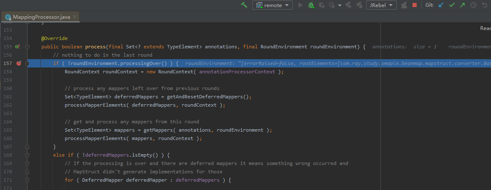

### 2.注解处理的流程

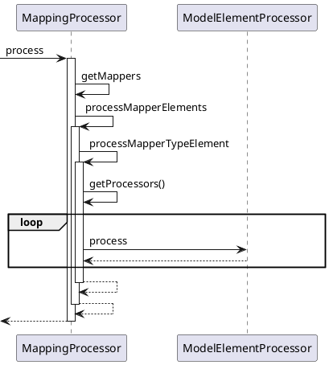

#### 2.1 注解处理的入口

对于如下 Mapper，根据 JSR269 规范，在编译期会进行`@Mapper`注解的处理

```java
@Mapper(uses = {DateMapper.class, RoleConverter.class}, unmappedTargetPolicy = ReportingPolicy.IGNORE, unmappedSourcePolicy =ReportingPolicy.IGNORE)
public interface UserConverter extends BaseConverter<UserDTO, User> {

    UserConverter INSTANCE = Mappers.getMapper(UserConverter.class);

}
```

在编译时，会通过ServiceLoader来加载注解处理器，其注解处理器是配置在`resource/META-INF/services/javax.annotation.processing.Processor`文件中的

```java
org.mapstruct.ap.MappingProcessor
```

因此可以找到编译期`@Mapper`注解处理的入口：`MappingProcessor`

```java
@SupportedAnnotationTypes("org.mapstruct.Mapper")
public class MappingProcessor extends AbstractProcessor {

    @Override
    public boolean process(final Set<? extends TypeElement> annotations, final RoundEnvironment roundEnvironment) {

        RoundContext roundContext = new RoundContext( annotationProcessorContext );

        // process any mappers left over from previous rounds
        Set<TypeElement> deferredMappers = getAndResetDeferredMappers();
        processMapperElements( deferredMappers, roundContext );

        // get and process any mappers from this round
        // 获取被@Mapper修饰的类元素
        Set<TypeElement> mappers = getMappers( annotations, roundEnvironment );
        // 处理这些元素
        processMapperElements( mappers, roundContext );

        return ANNOTATIONS_CLAIMED_EXCLUSIVELY;
    }
}
```


#### 2.2 使用`ModelElementProcessor`链去处理

然后会遍历 Mapper 类，并挨个处理

```java
 private void processMapperElements(Set<TypeElement> mapperElements, RoundContext roundContext) {
        for ( TypeElement mapperElement : mapperElements ) {
            try {
                List<? extends Element> tst = mapperElement.getEnclosedElements();
                ProcessorContext context = new DefaultModelElementProcessorContext(
                        processingEnv, options, roundContext, getDeclaredTypesNotToBeImported( mapperElement )
                );
                // 挨个Mapper类
                processMapperTypeElement( context, mapperElement );
            }

        }
    }
```

处理主要是借助一个`ModelElementProcessor`链来处理的

```java

    private void processMapperTypeElement(ProcessorContext context, TypeElement mapperTypeElement) {
        Object model = null;

        for ( ModelElementProcessor<?, ?> processor : getProcessors() ) {
            try {
                // 使用model来存储每个processor处理的结果，同时又会将model作为参数传入下一个processor
                model = process( context, processor, mapperTypeElement, model );
            }
            catch ( AnnotationProcessingException e ) {
                processingEnv.getMessager()
                    .printMessage(
                        Kind.ERROR,
                        e.getMessage(),
                        e.getElement(),
                        e.getAnnotationMirror(),
                        e.getAnnotationValue()
                    );
                break;
            }
        }
    }

    private Iterable<ModelElementProcessor<?, ?>> getProcessors() {
        // TODO Re-consider which class loader to use in case processors are
        // loaded from other modules, too
        // 加载实现类
        @SuppressWarnings("rawtypes")
        Iterator<ModelElementProcessor> processorIterator = ServiceLoader.load(
            ModelElementProcessor.class,
            MappingProcessor.class.getClassLoader()
        )
            .iterator();
        List<ModelElementProcessor<?, ?>> processors = new ArrayList<>();

        while ( processorIterator.hasNext() ) {
            processors.add( processorIterator.next() );
        }

        // 排序
        Collections.sort( processors, new ProcessorComparator() );

        return processors;
    }
```

`ModelElementProcessor`链是以 SPI 的形式加载的，内容来自于`resource/META-INF/services/org.mapstruct.ap.internal.processor.ModelElementProcessor`文件，如下所示：

```java
org.mapstruct.ap.internal.processor.CdiComponentProcessor
org.mapstruct.ap.internal.processor.Jsr330ComponentProcessor
org.mapstruct.ap.internal.processor.MapperCreationProcessor
org.mapstruct.ap.internal.processor.MapperRenderingProcessor
org.mapstruct.ap.internal.processor.MethodRetrievalProcessor
org.mapstruct.ap.internal.processor.SpringComponentProcessor
org.mapstruct.ap.internal.processor.MapperServiceProcessor
```

排序后为如下列表：

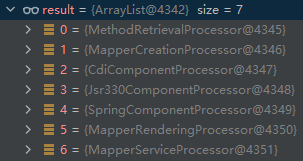

##### 2.1 MethodRetrievalProcessor

获取 Mapping 方法，包括 Mapper 自身的方法和 `@Mapper#uses`属性指定的方法

```java
    @Override
    public List<SourceMethod> process(ProcessorContext context, TypeElement mapperTypeElement, Void sourceModel) {
        ...
        return retrieveMethods( mapperTypeElement, mapperTypeElement, mapperOptions, prototypeMethods );
    }


    /**
     * Retrieves the mapping methods declared by the given mapper type.
     *
     * @param usedMapper The type of interest (either the mapper to implement or a used mapper via @uses annotation)
     * @param mapperToImplement the top level type (mapper) that requires implementation
     * @param mapperOptions the mapper config
     * @param prototypeMethods prototype methods defined in mapper config type
     * @return All mapping methods declared by the given type
     */
    private List<SourceMethod> retrieveMethods(TypeElement usedMapper, TypeElement mapperToImplement,
                                               MapperOptions mapperOptions, List<SourceMethod> prototypeMethods) {
        List<SourceMethod> methods = new ArrayList<>();

        for ( ExecutableElement executable : getAllEnclosedExecutableElements( elementUtils, usedMapper ) ) {
            SourceMethod method = getMethod(
                usedMapper,
                executable,
                mapperToImplement,
                mapperOptions,
                prototypeMethods );

            if ( method != null ) {
                methods.add( method );
            }
        }

        //Add all methods of used mappers in order to reference them in the aggregated model
        if ( usedMapper.equals( mapperToImplement ) ) {
            for ( DeclaredType mapper : mapperOptions.uses() ) {
                  // 处理通过 @Mapper#uses 导入的Mapper
                TypeElement usesMapperElement = asTypeElement( mapper );
                if ( !mapperToImplement.equals( usesMapperElement ) ) {
                    methods.addAll( retrieveMethods(
                        usesMapperElement,
                        mapperToImplement,
                        mapperOptions,
                        prototypeMethods ) );
                }
                else {
                    messager.printMessage(
                        mapperToImplement,
                        mapperOptions.getAnnotationMirror(),
                        Message.RETRIEVAL_MAPPER_USES_CYCLE,
                        mapperToImplement
                    );
                }
            }
        }

        return methods;
    }
```

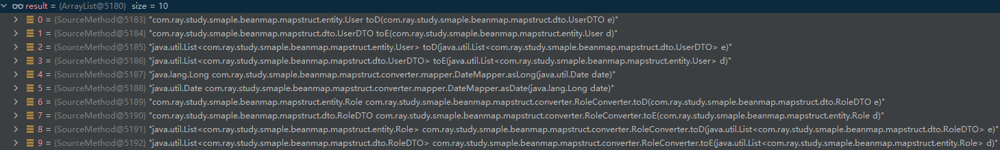

##### 2.2 MapperCreationProcessor

主要是创建 Mapper 对象，为后续生成 Mapper 实现类做好准备

```java
@Override
public Mapper process(ProcessorContext context, TypeElement mapperTypeElement, List<SourceMethod> sourceModel) {
    ...
    this.mappingContext = ctx;
    return getMapper( mapperTypeElement, mapperOptions, sourceModel );
}
  private Mapper getMapper(TypeElement element, MapperOptions mapperOptions, List<SourceMethod> methods) {

        List<MappingMethod> mappingMethods = getMappingMethods( mapperOptions, methods );
        mappingMethods.addAll( mappingContext.getUsedSupportedMappings() );
        mappingMethods.addAll( mappingContext.getMappingsToGenerate() );

        // handle fields
        List<Field> fields = new ArrayList<>( mappingContext.getMapperReferences() );
        Set<Field> supportingFieldSet = new LinkedHashSet<>();
        addAllFieldsIn( mappingContext.getUsedSupportedMappings(), supportingFieldSet );
        fields.addAll( supportingFieldSet );

        // handle constructorfragments
        Set<SupportingConstructorFragment> constructorFragments = new LinkedHashSet<>();
        addAllFragmentsIn( mappingContext.getUsedSupportedMappings(), constructorFragments );

        Mapper mapper = new Mapper.Builder()
            .element( element )
            .methods( mappingMethods )
            .fields( fields )
            .constructorFragments(  constructorFragments )
            .options( options )
            .versionInformation( versionInformation )
            .decorator( getDecorator( element, methods, mapperOptions.implementationName(),
                mapperOptions.implementationPackage(), getExtraImports( element, mapperOptions ) ) )
            .typeFactory( typeFactory )
            .elementUtils( elementUtils )
            .extraImports( getExtraImports( element, mapperOptions ) )
            .implName( mapperOptions.implementationName() )
            .implPackage( mapperOptions.implementationPackage() )
            .build();

        if ( !mappingContext.getForgedMethodsUnderCreation().isEmpty() ) {
            messager.printMessage( element, Message.GENERAL_NOT_ALL_FORGED_CREATED,
                mappingContext.getForgedMethodsUnderCreation().keySet() );
        }

        return mapper;
    }
```

##### 2.3 ComponentProcessor

主要给前面创建好的 Mapper 填充相关注解。

`@Mapper` 的 `componentModel`属性可取如下值：

> - `default`：映射器不使用组件模型，通常通过`Mappers#getMapper(Class)`来检索实例
> - `cdi`：生成的映射器是一个应用程序范围的 CDI bean，可以通过它检索 `@Inject`
> - `spring`：生成的映射器是一个单例范围的 Spring bean，可以通过它检索 `@Autowired`
> - `jsr330`：生成的映射器使用{@code @Named}进行注释，并且可以通过`@Inject`（例如使用 Spring）进行检索

然后被 CdiComponentProcessor、Jsr330ComponentProcessor、SpringComponentProcessor 处理

##### 2.4 MapperRenderingProcessor

根据前面创建好的 Mapper 来创建 Mapper 实现类的`.class` 文件

```java
public class MapperRenderingProcessor implements ModelElementProcessor<Mapper, Mapper> {

    @Override
    public Mapper process(ProcessorContext context, TypeElement mapperTypeElement, Mapper mapper) {
        if ( !context.isErroneous() ) {
            writeToSourceFile( context.getFiler(), mapper, mapperTypeElement );
            return mapper;
        }

        return null;
    }

    private void writeToSourceFile(Filer filer, Mapper model, TypeElement originatingElement) {
        ModelWriter modelWriter = new ModelWriter();

        createSourceFile( model, modelWriter, filer, originatingElement );

        if ( model.getDecorator() != null ) {
            createSourceFile( model.getDecorator(), modelWriter, filer, originatingElement );
        }
    }

    private void createSourceFile(GeneratedType model, ModelWriter modelWriter, Filer filer,
                                  TypeElement originatingElement) {
        // 解析文件名
        String fileName = "";
        if ( model.hasPackageName() ) {
            fileName += model.getPackageName() + ".";
        }
        fileName += model.getName();

        // 获取 JavaFileObject
        JavaFileObject sourceFile;
        try {
            sourceFile = filer.createSourceFile( fileName, originatingElement );
        }
        catch ( IOException e ) {
            throw new RuntimeException( e );
        }
	    // 写实现类.class文件
        modelWriter.writeModel( sourceFile, model );
    }

    @Override
    public int getPriority() {
        return 9999;
    }
}
```

然后进入 `ModelWriter#writeModel` 方法，主要是根据前面创建的 sourceFile 打开一个写文件的 writer，然后使用 FreeMarkerWritable 来跟根据定义好的模板来生成实现类.class 文件

```java
//  ModelWriter
public void writeModel(FileObject sourceFile, Writable model) {
    try {
        // 打开writer
        BufferedWriter writer = new BufferedWriter(new IndentationCorrectingWriter(sourceFile.openWriter()));
        Map<Class<?>, Object> values = new HashMap();
        values.put(Configuration.class, CONFIGURATION);
        // model 的类型为 FreeMarkerWritable
        model.write(new ModelWriter.DefaultModelElementWriterContext(values), writer);
        writer.flush();
}
```

然后进入 `FreeMarkerWritable#write` 方法

```java
public abstract class FreeMarkerWritable implements Writable {

    @Override
    public void write(Context context, Writer writer) throws Exception {
        new FreeMarkerModelElementWriter().write( this, context, writer );
    }
}
```

最终进入 `FreeMarkerModelElementWriter#write` 方法，这里就是调用 FreeMarker 模板生成实现类内容的代码

```java
//  FreeMarkerModelElementWriter
public void write(FreeMarkerWritable writable, Context context, Writer writer) throws Exception {
        Configuration configuration = (Configuration)context.get(Configuration.class);
    	// 模板为 `org/mapstruct/ap/internal/model/GeneratedType.ftl`
        Template template = configuration.getTemplate(writable.getTemplateName());
        template.process(new FreeMarkerModelElementWriter.ExternalParamsTemplateModel(new BeanModel(writable, BeansWrapper.getDefaultInstance()), new SimpleMapModel((Map)context.get(Map.class), BeansWrapper.getDefaultInstance())), writer);
    }
```

模板文件为 `org/mapstruct/ap/internal/model/GeneratedType.ftl`，内容如下：

```xml
<#--

    Copyright MapStruct Authors.

    Licensed under the Apache License version 2.0, available at http://www.apache.org/licenses/LICENSE-2.0

-->
<#-- @ftlvariable name="" type="org.mapstruct.ap.internal.model.GeneratedType" -->
<#if hasPackageName()>
package ${packageName};
</#if>

<#list importTypeNames as importedType>
import ${importedType};
</#list>

<#if !generatedTypeAvailable>/*</#if>
@Generated(
    value = "org.mapstruct.ap.MappingProcessor"<#if suppressGeneratorTimestamp == false>,
    date = "${.now?string("yyyy-MM-dd'T'HH:mm:ssZ")}"</#if><#if suppressGeneratorVersionComment == false>,
    comments = "version: ${versionInformation.mapStructVersion}, compiler: ${versionInformation.compiler}, environment: Java ${versionInformation.runtimeVersion} (${versionInformation.runtimeVendor})"</#if>
)<#if !generatedTypeAvailable>
*/</#if>
<#list annotations as annotation>
<#nt><@includeModel object=annotation/>
</#list>
<#lt>${accessibility.keyword} class ${name}<#if superClassName??> extends ${superClassName}</#if><#if interfaceName??> implements ${interfaceName}</#if> {

<#list fields as field><#if field.used><#nt>    <@includeModel object=field/>
</#if></#list>

<#if constructor??><#nt>    <@includeModel object=constructor/></#if>

<#list methods as method>
<#nt>    <@includeModel object=method/>
</#list>
}

```

##### 2.5 MapperServiceProcessor

当 Mapper 的 componentMode 为 default，且设置了 mapstruct.alwaysGenerateServicesFile 属性时，会在 `META-INF/services`目录下生成 Service 文件。

> - https://www.jianshu.com/p/4f7b4f4bf689)


