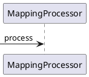

[[toc]]

[toc]

## 推荐阅读

常见的 Bean 映射框架：

> - [DTO/DO 等 POJO 对象的使用场景和 orika-mapper 框架的使用](https://www.cnblogs.com/harrychinese/p/SpringBoot_DTO_Orika.html)
> - [https://www.baeldung.com/java-performance-mapping-frameworks](https://www.baeldung.com/java-performance-mapping-frameworks)
> - [面试官：你知道几种对象属性拷贝方式，说来看看？](https://zhuanlan.zhihu.com/p/135270403)
> - [Orika 对象复制教程（完美笔记）](https://www.cnblogs.com/fuzongle/p/12609063.html)
> - [打开 orika 的正确方式](https://www.cnkirito.moe/orika/)

MapStruct:

> - [mapstruct/mapstruct](https://github.com/mapstruct/mapstruct)
> - https://mapstruct.org/documentation/reference-guide/
> - [MapStruct 1.3.0.Final 参考指南](http://www.kailing.pub/MapStruct1.3/index.html#Preface)

JSR 269 与 MapStruct：

> - [JSR269 插件化注解 API](http://www.cyblogs.com/2020/05/13/2020/05/JSR269%E6%8F%92%E4%BB%B6%E5%8C%96%E6%B3%A8%E8%A7%A3API/)
> - [由 lombok 说起，浅析 JSR-269 原理及应用](https://blog.csdn.net/weixin_43983762/article/details/105867398)
> - [Mapstruct 源码解析- 框架实现原理](https://juejin.cn/post/6844904199755415559)

## 一、常见的 Bean 映射框架

## 二、MapStruct 使用入门

### 1. 引入依赖

```xml
    <properties>
        <mapstruct.version>1.4.1.Final</mapstruct.version>
    </properties>

    <dependencies>
        <dependency>
            <groupId>org.mapstruct</groupId>
            <artifactId>mapstruct</artifactId>
            <version>${mapstruct.version}</version>
            <scope>compile</scope>
        </dependency>
        <dependency>
            <groupId>org.mapstruct</groupId>
            <artifactId>mapstruct-processor</artifactId>
            <version>${mapstruct.version}</version>
            <scope>compile</scope>
        </dependency>
    </dependencies>
```

### 2. 类型转换规则

> - 对于类型相同且是基本类型的同名属性，可以自动转换
> - 对于类型不同且是基本类型的同名属性，可以隐式地自动转换
> - 对于类型相同且是基本类型的不同名属性，可以在借助 `@Mapping` 注解进行转换
> - 对于类型不同的同名属性，可以使用 `@Mapper#use`来自定义类型转换器去进行转换
> - 对于类型不同且属性名也不相同的属性，可以结合 `@Mapper#use` 和 `@Mapping` 注解来实现类型转换

### 3. 用法示例

#### 3.1 基本类型转换

（1）先定义两个实体类

对于 Bean 映射的场景，我们可以假设有个 Dto 用来映射前端请求参数，然后转成业务实体，然后进行业务逻辑的处理。

```java
// 数据传输对象,用来接收前端请求参数
@Data
public class ResourceDTO {
    private Integer id;
    private String code;
    private Boolean resourceStatus;
}

// 业务实体,用于系统内部业务逻辑处理
@Data
public class Resource {
    private Long id;
    private String resourceCode;
    private Boolean resourceStatus;
}
```

然后我们需要对这两个类进行相互转换。

（2）定义一个 Mapper 用于这两个类型的相互转换。

此时只需要定义如下接口，即可实现这两个类型的相互转换。

```java
@Mapper
public interface ResourceConverter {

    ResourceConverter INSTANCE = Mappers.getMapper(ResourceConverter.class);

    @Mapping(source = "resourceCode", target = "code")
    ResourceDTO toD(Resource entity);

    @Mapping(source = "code", target = "resourceCode")
    Resource toE(ResourceDTO dto);

}
```

（3）测试用例

```java
public class ResourceConverterTest {

    @Test
    public void toD() {
        Resource resource = mockResource();
        ResourceDTO resourceDTO = ResourceConverter.INSTANCE.toD(resource);
        System.out.println(resourceDTO); // ResourceDTO(id=1, code=/api/user/list, resourceStatus=true)
        Assert.assertNotNull(resourceDTO.getCode());
    }

    @Test
    public void toE() {
        Resource resource = mockResource();
        ResourceDTO resourceDTO = ResourceConverter.INSTANCE.toD(resource);

        resource = ResourceConverter.INSTANCE.toE(resourceDTO);
        System.out.println(resource); // Resource(id=1, resourceCode=/api/user/list, resourceStatus=true)
        Assert.assertNotNull(resource.getResourceCode());
    }

    private static Resource mockResource() {
        Resource resource = new Resource();
        resource.setId(1L);
        resource.setResourceCode("/api/user/list");
        resource.setResourceStatus(Boolean.TRUE);
        return resource;
    }
}
```

（4）分析

> - `resourceStatus` ：类型相同且是基本类型，属性名相同，可以自动转换
> - `id`：类型不同且是基本类型，属性名相同，可以自动隐式转换
> - `resourceCode`：类型相同且是基本类型，但是属性名不相同，可以借助 `@Mapping` 注解进行转换

#### 3.2 不同类型转换

（1）先来看一个简单的同名属性且是基本类型的例子

```java

@Data
public class RoleDTO {
    private Long roleId;
    private String roleCode;
}

@Data
public class Role {
    private Long roleId;
    private String roleCode;
}
```

先通过 BaseConverter 接口来定义两个类型之间的相互转换：

```java
public interface BaseConverter<E, D> {

    D toD(E e);

    E toE(D d);

    List<D> toD(List<E> e);

    List<E> toE(List<D> d);

}
```

然后通过 `RoleConverter` 即可实现 RoleDto 和 Role 的相互转换

```java
@Mapper(uses = {}, unmappedTargetPolicy = ReportingPolicy.IGNORE)
public interface RoleConverter extends BaseConverter<RoleDTO, Role> {

    RoleConverter INSTANCE = Mappers.getMapper(RoleConverter.class);

}
```

编译时，会生成接口 RoleConverter 的实现类，如下所示：

```java
@Generated(
    value = "org.mapstruct.ap.MappingProcessor",
    date = "2021-05-26T17:24:27+0800",
    comments = "version: 1.4.1.Final, compiler: javac, environment: Java 1.8.0_181 (Oracle Corporation)"
)
public class RoleConverterImpl implements RoleConverter {

    @Override
    public Role toD(RoleDTO e) {
        if ( e == null ) {
            return null;
        }

        Role role = new Role();

        role.setRoleId( e.getRoleId() );
        role.setRoleCode( e.getRoleCode() );

        return role;
    }

    @Override
    public RoleDTO toE(Role d) {
        if ( d == null ) {
            return null;
        }

        RoleDTO roleDTO = new RoleDTO();

        roleDTO.setRoleId( d.getRoleId() );
        roleDTO.setRoleCode( d.getRoleCode() );

        return roleDTO;
    }

    @Override
    public List<Role> toD(List<RoleDTO> e) {
        if ( e == null ) {
            return null;
        }

        List<Role> list = new ArrayList<Role>( e.size() );
        for ( RoleDTO roleDTO : e ) {
            list.add( toD( roleDTO ) );
        }

        return list;
    }

    @Override
    public List<RoleDTO> toE(List<Role> d) {
        if ( d == null ) {
            return null;
        }

        List<RoleDTO> list = new ArrayList<RoleDTO>( d.size() );
        for ( Role role : d ) {
            list.add( toE( role ) );
        }

        return list;
    }
}

```

测试用例如下：

```java
public class RoleConverterTest {

    @Test
    public void toD() {
        Role role = mockRole();
        RoleDTO roleDTO = RoleConverter.INSTANCE.toE(role);
        System.out.println(roleDTO); // RoleDTO(roleId=1, roleCode=ADMIN)
        Assert.assertNotNull(roleDTO.getRoleId());
    }

    @Test
    public void toE() {
    }

    @Test
    public void testToD() {
        List<Role> roles = mockRoleList();
        List<RoleDTO> roleDTOS = RoleConverter.INSTANCE.toE(roles);
        System.out.println(roleDTOS); // [RoleDTO(roleId=1, roleCode=ADMIN)]
        Assert.assertNotEquals(0, roleDTOS.size());
    }

    @Test
    public void testToE() {
    }

    private static List<Role> mockRoleList() {
        List<Role> roles = new ArrayList<>();
        roles.add(mockRole());
        return roles;
    }


    private static Role mockRole() {
        Role role = new Role();
        role.setRoleId(1L);
        role.setRoleCode("ADMIN");
        return role;
    }
}
```

（2）然后对于复杂类型和不同类型的转换示例如下：

```java
@Data
public class UserDTO {
    private Long id;
    private String userName;
    private Boolean userStatus;
    private Long createTime;

    private List<RoleDTO> roles;
}

@Data
public class User {
    private Long id;
    private String userName;
    private Boolean userStatus;
    private Date createTime;
    private List<Role> roles;
}
```

然后定义一个 Date 和 Long 的类型转换器来帮助 createTime 进行类型转换

```java
public class DateMapper {

    public Long asLong(Date date) {
        return date == null ? null : date.getTime();
    }

    public Date asDate(Long date) {
        return date == null ? null : new Date(date);
    }

}
```

然后对于 RoleDTO 和 Role ，可以借助前面定义的 `RoleConverter` 去进行转换，因此我们得到 UserDTO 和 User 的转换器：

```java
@Mapper(uses = {DateMapper.class, RoleConverter.class}, unmappedTargetPolicy = ReportingPolicy.IGNORE)
public interface UserConverter extends BaseConverter<UserDTO, User> {

    UserConverter INSTANCE = Mappers.getMapper(UserConverter.class);

}
```

可以看到编译会生成如下实现类：

```java
@Generated(
    value = "org.mapstruct.ap.MappingProcessor",
    date = "2021-05-26T17:24:27+0800",
    comments = "version: 1.4.1.Final, compiler: javac, environment: Java 1.8.0_181 (Oracle Corporation)"
)
public class UserConverterImpl implements UserConverter {

    private final DateMapper dateMapper = new DateMapper();
    private final RoleConverter roleConverter = Mappers.getMapper( RoleConverter.class );

    @Override
    public User toD(UserDTO e) {
        if ( e == null ) {
            return null;
        }

        User user = new User();

        user.setId( e.getId() );
        user.setUserName( e.getUserName() );
        user.setUserStatus( e.getUserStatus() );
        user.setCreateTime( dateMapper.asDate( e.getCreateTime() ) );
        user.setRoles( roleConverter.toD( e.getRoles() ) );

        return user;
    }

    @Override
    public UserDTO toE(User d) {
        if ( d == null ) {
            return null;
        }

        UserDTO userDTO = new UserDTO();

        userDTO.setId( d.getId() );
        userDTO.setUserName( d.getUserName() );
        userDTO.setUserStatus( d.getUserStatus() );
        userDTO.setCreateTime( dateMapper.asLong( d.getCreateTime() ) );
        userDTO.setRoles( roleConverter.toE( d.getRoles() ) );

        return userDTO;
    }

    @Override
    public List<User> toD(List<UserDTO> e) {
        if ( e == null ) {
            return null;
        }

        List<User> list = new ArrayList<User>( e.size() );
        for ( UserDTO userDTO : e ) {
            list.add( toD( userDTO ) );
        }

        return list;
    }

    @Override
    public List<UserDTO> toE(List<User> d) {
        if ( d == null ) {
            return null;
        }

        List<UserDTO> list = new ArrayList<UserDTO>( d.size() );
        for ( User user : d ) {
            list.add( toE( user ) );
        }

        return list;
    }
}
```

测试用例如下：

```java
public class UserConverterTest {

    @Test
    public void toD() {
        User user = mockUser();
        UserDTO userDTO = UserConverter.INSTANCE.toE(user);
        System.out.println(userDTO); // UserDTO(id=1, userName=tom, userStatus=true, createTime=1622030464158, roles=[RoleDTO(roleId=1, roleCode=ADMIN)])
        Assert.assertNotNull(user.getId());
    }

    @Test
    public void toE() {
    }

    @Test
    public void testToD() {
    }

    @Test
    public void testToE() {
    }


    private static User mockUser() {
        List<Role> roles = new ArrayList<>();
        roles.add(mockRole());

        User user = new User();
        user.setId(1L);
        user.setUserName("tom");
        user.setUserStatus(Boolean.TRUE);
        user.setCreateTime(new Date());
        user.setRoles(roles);
        return user;
    }

    private static Role mockRole() {
        Role role = new Role();
        role.setRoleId(1L);
        role.setRoleCode("ADMIN");
        return role;
    }
}
```

分析：

> - `createTime`：类型不同的同名属性，可以使用 `@Mapper#use`来自定义类型转换器去进行转换
> - `roles`：类型不同的同名属性，可以使用 `@Mapper#use`来自定义类型转换器去进行转换

## 三、JSR 269 入门示例

推荐阅读：

> - [动手实现 Lombok](https://lilu.org.cn/2020/12/19/javaee/lombok/impl-simple-lombok/)
> - [Java-JSR-269-插入式注解处理器](https://liuyehcf.github.io/2018/02/02/Java-JSR-269-%E6%8F%92%E5%85%A5%E5%BC%8F%E6%B3%A8%E8%A7%A3%E5%A4%84%E7%90%86%E5%99%A8/)
> -
> - [基于 APT(注解处理器)实现 Lombok 的@getter @setter @toString 功能](https://nicky-chin.cn/2019/05/03/apt_lombok_implement/)
> - [插入式注解处理 API（JSR269）介绍](https://mouse0w0.github.io/2018/11/28/Introduce-to-Pluggable-Annotation-Processing-API/)
> - https://jcp.org/en/jsr/detail?id=269
> - [【JSR269 实战】之编译时操作 AST，修改字节码文件，以实现和 lombok 类似的功能](https://blog.csdn.net/justry_deng/article/details/106176181)
> - [动态的 Java - 无废话 JavaCompilerAPI 中文指南](http://pfmiles.github.io/blog/dynamic-java/)
> - [Javac 早期(编译期)](https://www.cnblogs.com/wade-luffy/p/6050331.html)

## 四、MapStruct 源码解析

### 1.如何 Debug

MapStruct 生成实现类的过程是在编译器发生的，那么如何进行编译期的 Debug 呢？可以借助 Maven 实现，如下所示：

（1）在使用了 Processor 的项目下，执行 `mvnDebug clean compile`

```bash
$ mvnDebug clean compile
Preparing to execute Maven in debug mode
Listening for transport dt_socket at address: 8000
```

可以看到程序正在监听 8000 端口，并且一直处于阻塞状态，直到另一个进程连接 8000 端口，程序才会往下走

(2) 然后在 Idea 中, 创建一个 `Remote JVM Debug`, 并指定端口为前面的 `8000`


然后以 Debug 方式运行，即可进行 AnnotationProcesser 的 Debug


### 2.流程图




## 二、JSR 269 与 MapStruct

### 1.JSR 实战

#### 1.1 JSR 背景

从 Java

### 参考资料

> - [mapstruct 实体转换及 List 转换，@Mapper 注解转换](https://www.cnblogs.com/junzhu-bye/p/12900950.html)

### 注意事项

> - [Mapstruct 中使用 lombok@Builder 的坑](https://www.jianshu.com/p/4f7b4f4bf689)
