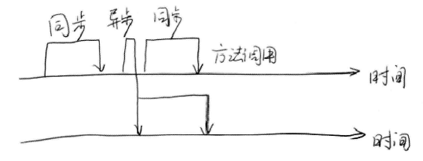
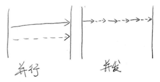
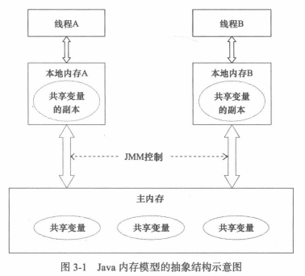
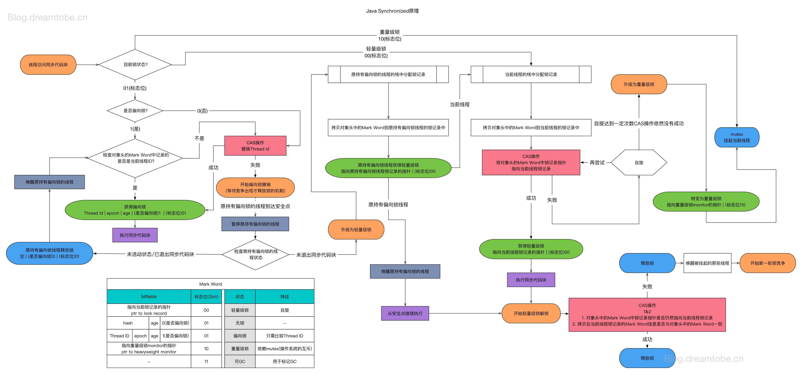

[[toc]]

## 推荐书籍

- 《Java 并发编程的艺术》

## 推荐阅读

## 一、并发基础

### 1.一些基本概念

#### 1.1 进程与线程

一个线程就是一个程序执行流，而进程就是多个程序执行流。

> - 进程是程序的一次执行过程，是系统运行程序的基本单位，因此进程是动态的。系统运行一个程序即是一个进程从创建，运行到消亡的过程。
>
> - 线程也被称为轻量级进程，在大多数现代操作系统中，都是以线程为基本的调度单位。

#### 1.2 同步与异步

同步（Synchronous）和异步（Asynchronous）通常用来形容一次方法调用：

> - 同步方法调用一旦开始，调用者必须等待方法返回后，才能继续后续操作。
> - 异步方法调用更像一个消息传递，一旦开始，方法调用就会立即返回，调用者就可以继续后续的操作。



#### 1.2 串行、并行与并发

> - 串行表示多个任务顺序执行。
> - 并发表示有多个任务一起执行，但**可能在同一时间点只有一个任务在执行**，也就是说这些任务是交替执行的，例如，单核 CPU 中多个线程通过线程上下文切换来轮流执行任务。
> - 并行表示有多个任务一起执行，并且在**同一时间点一定有多个任务在执行**，例如多核 CPU 下同时执行多个任务。



#### 1.3 临界区

临界区用来表示一种公共资源或者说是共享数据，可以被多个线程使用。但是每一次，只能有一个线程使用它，一旦临界区资源被占用，其他线程要想使用这个资源，就必须等待。

#### 1.4 阻塞与非阻塞

阻塞和非阻塞通常用来形容多线程间的相互影响：

> - 比如一个线程占用了临界区资源，那么其他所有需要这个资源的线程就必须在这个临界区中进行等待。等待会导致线程挂起，这种情况就是阻塞。
> - 非阻塞的意思与之相反，它强调没有一个线程可以妨碍其他线程执行。所有的线程都会尝试不断前向执行。

### 2.线程的优势

多线程的优势：

> - 发挥多处理器的强大能力
> - 建模的简单性
> - 异步事件的简化处理
> - 响应更灵敏的用户界面

### 3.线程的风险

多线程带来的风险：

> - 安全性问题
> - 活跃性问题：死锁、饥饿、活锁
> - 性能问题

### 4.CPU 多级缓存

参见：[CPU 多级缓存](https://blinkfox.github.io/2018/11/18/ruan-jian-gong-ju/cpu-duo-ji-huan-cun/)

## 二、Java 内存模型

### 1.Java 内存模型的抽象结构

Java 线程之间的通信由 Java 内存模型（本文简称为 JMM）控制，JMM 决定一个线程对共享变量的写入何时对另一个线程可见。

从抽象的角度来看，JMM 定义了线程和主内存之间的抽象关系：线程之间的共享变量存储在主内存（Main Memory）中，每个线程都有一个私有的本地内存（Local Memory），本地内存中存储了该线程以读/写共享变量的副本。本地内存是 JMM 的一个抽象概念，并不真实存在。它涵盖了存、写缓冲区、寄存器以及其他的硬件和编译器优化。



### 2.指令重排序

在执行程序时，为了提高性能，编译器和处理器常常会对指令做重排序：

（1）编译器优化的重排序

> 编译器在不改变单线程程序语义的前提下，可以重新安排语句的执行顺序。

（2）指令级并行的重排序

> 现代处理器采用了指令级并行技术（Instruction-Level Parallelism，ILP）来将多条指令重叠执行。如果不存在数据依赖性，处理器可以改变语句对应机器指令的执行顺序。

（3）内存系统的重排序

> 由于处理器使用缓存和读/写缓冲区，这使得加载和存储操作看上去可能是在乱序执行。

这些重排序可能会导致多线程程序出现内存可见性问题。

> - 对于编译器，JMM 的编译器重排序规则会禁止特定类型的编译器重排序（不是所有的编译器重排序都要禁止）。
> - 对于处理器重排序，JMM 的处理器重排序规则会要求 Java 编译器在生成指令序列时，插入特定类型的**内存屏障**（Memory Barriers，Intel 称之为 Memory Fence）**指令**，通过内存屏障指令来禁止特定类型的处理器重排序。

这些重排序，可能会导致多线程程序出现可见性问题，而 **JMM 则会通过禁止特定类型的编译器重排序和处理器重排序，为程序员提供一致的内存可见性保证**。

### 3.happens-before

从 JDK 5 开始，Java 使用新的**JSR-133 内存模型**（除非特别说明，本文针对的都是 JSR-133 内存模型）。JSR-133 **使用 happens-before 的概念来阐述操作之间的内存可见性**。在 JMM 中，如果一个操作执行的结果需要对另一个操作可见，那么这两个操作之间必须要存在 happens-before 关系。这里提到的两个操作既可以是在一个线程之内，也可以是在不同线程之间。

与程序员密切相关的 happens-before 规则如下：

- **程序顺序规则**：一个线程中的每个操作，happens-before 于该线程中的任意后续操作
- **监视器锁规则**：对一个锁的解锁，happens-before 于随后对这个锁的加锁
- **volatile 变量规则**：对一个 volatile 域的写，happens-before 于任意后续对这个 volatile 域的读
- **传递性**：如果 A happens-before B ，且 B happens-before C，那么 A happens-before C
- **start()规则**：如果线程 A 执行操作 ThreadB.start()（启动线程 B），那么 A 线程的 ThreadB.start()操作 happens-before 于线程 B 中的任意操作。
- **join()规则**：如果线程 A 执行操作 ThreadB.join() 并成功返回，那么线程 B 中的任意操作 happens-before 于线程 A 从 ThreadB.join() 操作成功返回。

注意：

> 两个操作之间具有 happens-before 关系，并不意味着前一个操作必须要在后一个操作之前执行！**happens-before 仅仅要求前一个操作**（执行的结果）**对后一个操作可见，且前一个操作按顺序排在第二个操作之前**（the first is visible to and ordered before the second）。

### 4.关键字的内存语义

#### 4.1 volatile 的内存语义

对 volatile 变量的单个读/写，可以看作是使用同一个锁对这些单个读/写操作做了同步

锁的 happens-before 规则保证释放锁和获取锁的两个线程之间的内存可见性，这意味着对一个 volatile 变量的读，总是能看到（任意线程）对这个 volatile 变量最后的写入。

锁的内存语义决定了临界区代码的执行具有原子性

volatile 写的内存语义

> 当写一个 volatile 变量时，JMM 会把该线程对应的本地内存中的共享变量值刷新到主内存

volatile 读的内存语义

> 当读一个 volatile 变量时，JMM 会把该线程对应的本地内存置为无效。线程接下来将从主内存中读取共享变量。

#### 4.2 锁的内存语义

锁释放的内存语义

> 当线程释放锁时，JMM 会把该线程对应的本地内存中的共享变量刷新到主内存中

锁获取的内存语义

> 当线程获取锁时，JMM 会把该线程对应的本地内存置为无效。从而使得被监视器保护的临界区代码必须从主内存中读取共享变量。

#### 4.3 final 域的重排序规则

对于 final 域，编译器和处理器要遵守两个重排序规则。

> （1）在构造函数内对一个 final 域的写入，与随后把这个被构造对象的引用赋值给一个引用变量，这两个操作之间不能重排序。
> （2）初次读一个包含 final 域的对象的引用，与随后初次读这个 final 域，这两个操作之间不能重排序。

### 5.双重检查锁定与延迟初始化

在 Java 多线程程序中，有时候需要采用延迟初始化来降低初始化类和创建对象的开销。**双重检查锁定是常见的延迟初始化技术**，但它是一个错误的用法。

#### 5.1 问题的根源

```java
public class DoubleCheckedLocking {
    private static Instance instance;

    public static Instance getInstance() {
        if (instance == null) { //1:第一次检查
            synchronized (DoubleCheckedLocking.class) { //2:加锁
                if (instance == null) //3:第二次检查
                    instance = new Instance(); //4:问题的根源出在这里
            }
        }
        return instance;
    }

    static class Instance {
    }
}
```

双重检查锁定存在的问题：

> 在线程执行到 1 处，代码读取到 instance 不为 null 时， instance 引用的对象有可能还没有完成初始化。

发生这种问题的原因在于：虚拟机创建对象的过程是一个复合操作，伪代码如下:

```java
memory = allocate();    // 4.1:分配对象的内存空间
ctorInstance(memory);   // 4.2:初始化对象
instance = memory;      // 4.3.设置instance指向刚分配的内存地址
```

**这个复合操作中，4.2 和 4.3 可能会被重排序**。

也就是说，在重排序的情况下，线程 A 访问成功获取锁，执行到 4.3 （由于重排序，4.2 还没有执行），这时线程 B 执行到 1 处，发现 instance 不为 null 时，这时线程 B 将访问到一个还未初始化的对象

有两种方法可以实现线程安全的延迟初始化：

> （1）不允许 2 和 3 重排序
>
> （2）允许 2 和 3 重排序，但不允许其他线程 “看到” 这个重排序

#### 5.3 基于 volatile 的解决方案

当声明对象的引用为 volatile 后，4.2 和 4.3 之间的重排序，在多线程环境中将会被禁止

```java
public class SafeDoubleCheckedLocking {
    private volatile static Instance instance;

    public static Instance getInstance() {
        if (instance == null) {
            synchronized (SafeDoubleCheckedLocking.class) {
                if (instance == null)
                    instance = new Instance(); //instance为volatile，现在没问题了
            }
        }
        return instance;
    }

    static class Instance {
    }
}
```

#### 5.3 基于类初始化的解决方案

对于每一个类或接口 C，都有一个唯一的初始化锁 LC 与之对应。**JVM 在类初始化期间会获取这个初始化锁，并且每个线程至少获取一次锁来确保这个类已经被初始化过了**

```java
public class InstanceFactory {

    public static Instance getInstance() {
        return InstanceHolder.instance;    //这里将导致InstanceHolder类被初始化
    }

    private static class InstanceHolder {
        public static Instance instance = new Instance();
    }

    static class Instance {
    }
}

```

## 三、Java 并发机制底层实现原理

### 1.volatile

volatile 是轻量级的 synchronized，它保证了共享变量的 “可见性”

> - 可见性：当一个线程修改一个共享变量时，另外一个线程能读到这个修改的值
> - 轻量：如果 volatile 变量修饰符使用恰当的话，它比 synchronized 的使用和执行成本更低，因为它不会引起线程上下文的切换和调度

Java 代码：

```java
instance = new Singleton(); // instance是volatile变量
```

转变成汇编代码，如下：

```java
0x01a3de1d: movb $0×0,0×1104800(%esi);0x01a3de24: lock addl $0×0,(%esp);
```

volatile 修饰的共享变量进行写操作时会多出第二行汇编代码，通过查 IA-32 架构软件开发者手册可知，Lock 前缀的指令在多核处理器下会引发了两件事：

> （1）**将当前处理器缓存行的数据写回到系统内存**。
>
> （2）**这个写回内存的操作会使在其他 CPU 里缓存了该内存地址的数据无效**。

为了提高处理速度，处理器不直接和内存进行通信，而是先将系统内存的数据读到内部缓存（L1，L2 或其他）后再进行操作，但操作完不知道何时会写到内存。**如果对声明了 volatile 的变量进行写操作，JVM 就会向处理器发送一条 Lock 前缀的指令，将这个变量所在缓存行的数据写回到系统内存**。但是，就算写回到内存，如果其他处理器缓存的值还是旧的，再执行计算操作就会有问题。所以，**在多处理器下，为了保证各个处理器的缓存是一致的，就会实现缓存一致性协议，每个处理器通过嗅探在总线上传播的数据来检查自己缓存的值是不是过期了，当处理器发现自己缓存行对应的内存地址被修改，就会将当前处理器的缓存行设置成无效状态，当处理器对这个数据进行修改操作的时候，会重新从系统内存中把数据读到处理器缓存里**。 （可参见： Javan 内存模型定义的 8 种内存间交互操作）

### 2.Synchronized

> 参见：[啃碎并发（七）：深入分析 Synchronized 原理](https://www.jianshu.com/p/e62fa839aa41)



在 JDK1.5 之前 synchronized 是一个重量级锁，但是，随着 Java SE 1.6 对 synchronized 进行了各种优化之后，有些情况下它就并不那么重了

#### 2.1 Synchronized 的用法

> - 对于静态同步方法，锁是当前类的 Class 对象。
> - 对于普通同步方法，锁是当前实例对象。
> - 对于同步方法块，锁是 Synchonized 括号里配置的对象。

#### 2.2 Synchronized 的底层原理

（1）同步代码块

访问同步代码块时，synchronized 会被编译为 `monitorenter` 、 `monitorexit` 指令

```java
package com.paddx.test.concurrent;

public class SynchronizedDemo {
   public void method() {
       synchronized (this) {
           System.out.println("Method 1 start");
       }
   }
}
```


> monitorenter 指令是在编译后插入到同步代码块的开始位置，而 monitorexit 是插入到方法结束处和异常处，JVM 要保证每个 monitorenter 必须有对应的 monitorexit 与之配对。任何对象都有一个 monitor 与之关联，当一个 monitor 被持有后，它将处于锁定状态。线程执行到 monitorenter 指令时，将会尝试获取对象所对应的 monitor 的所有权，即尝试获得对象的锁。

（2）同步方法

访问同步方法时， synchronized 会被翻译成 **ACC_SYNCHRONIZED** 标志

```java
package com.paddx.test.concurrent;

public class SynchronizedMethod {
    public synchronized void method() {
        System.out.println("Hello World!");
    }
}
```


> 当方法调用时，**调用指令将会检查方法的 ACC_SYNCHRONIZED 访问标志是否被设置**，如果设置了，**执行线程将先获取 monitor**，获取成功之后才能执行方法体，**方法执行完后再释放 monitor**。在方法执行期间，其他任何线程都无法再获得同一个 monitor 对象。

两种同步方式本质上没有区别，只是方法的同步是一种隐式的方式来实现，无需通过字节码来完成。**两个指令的执行是 JVM 通过调用操作系统的互斥原语 mutex 来实现，被阻塞的线程会被挂起、等待重新调度**，会导致“用户态和内核态”两个态之间来回切换，对性能有较大影响。

#### 2.3 锁升级

##### 2.3.1 对象头结构

- Java SE 1.6 为了减少获得锁和释放锁带来的性能消耗，对 synchronized 进行优化，引入了“偏向锁”和“轻量级锁”。

- 在 Java SE 1.6 中，锁一共有 4 种状态，级别从低到高依次是：无锁状态、偏向锁状态、轻量级锁状态和重量级锁状态。

- 锁可以升级，但不能降级：

  > （1）最开始，监视器锁为无锁状态
  >
  > （2）此时线程 A 进入，监视器锁升级为偏向锁（当只有一个线程时，为偏向锁）
  >
  > （3）接着线程 B 过来竞争锁，偏向锁升级为轻量级锁状态（再来一个线程就升级为偏向锁）
  >
  > （4）然后当线程 B 自旋次数达到 10 次，线程 B 就会挂起，进入阻塞状态，此时轻量级锁升级为重量级锁（自旋次数达到阈值，就会升级为重量级锁）

## 参考资料

（1）CPU 多级缓存

> - [《大话处理器》Cache 一致性协议之 MESI](https://blog.csdn.net/muxiqingyang/article/details/6615199)
> - [CPU 多级缓存](https://blinkfox.github.io/2018/11/18/ruan-jian-gong-ju/cpu-duo-ji-huan-cun/)

（2）Java 并发机制底层实现原理

> - [啃碎并发（七）：深入分析 Synchronized 原理](https://www.jianshu.com/p/e62fa839aa41)