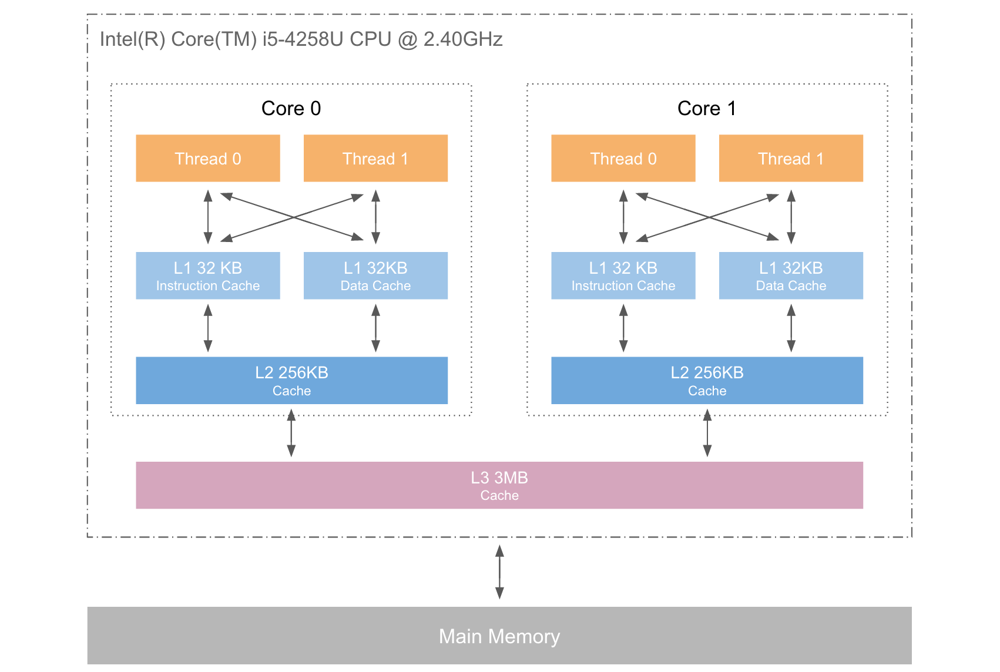
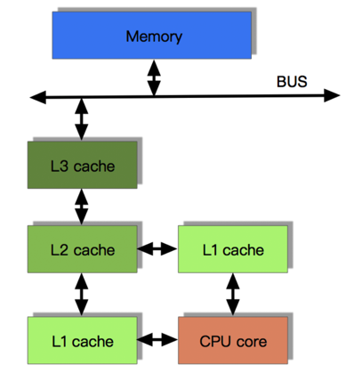
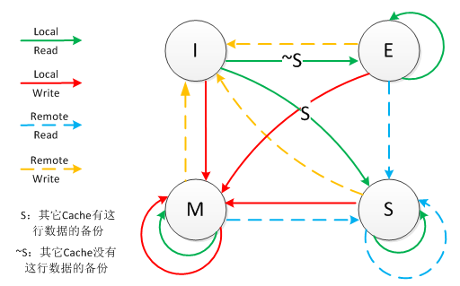
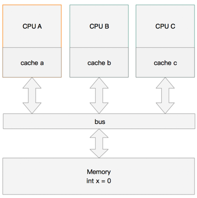
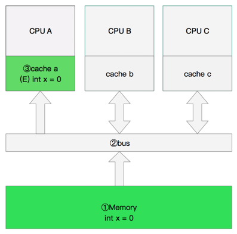
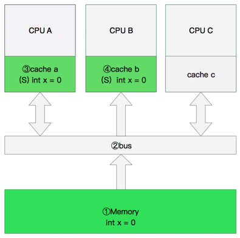
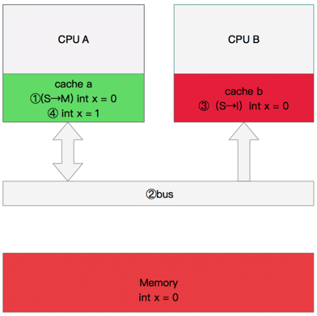
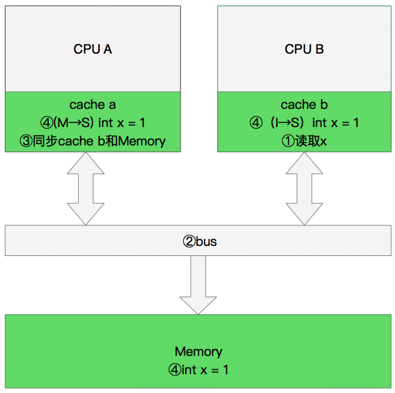

[[toc]]

[toc]

## 前言

本文转自：[CPU 多级缓存](https://blinkfox.github.io/2018/11/18/ruan-jian-gong-ju/cpu-duo-ji-huan-cun/)

## 一、什么是 CPU 缓存

### 1. CPU 缓存的来历

> 众所周知,CPU 是计算机的大脑，它负责执行程序的指令，而内存负责存数据, 包括程序自身的数据。在很多年前，CPU 的频率与内存总线的频率在同一层面上。内存的访问速度仅比寄存器慢一些。
>
> 但是，这一局面在上世纪 90 年代被打破了。CPU 的频率大大提升，但内存总线的频率与内存芯片的性能却没有得到成比例的提升。并不是因为造不出更快的内存，只是因为太贵了。内存如果要达到目前 CPU 那样的速度，那么它的造价恐怕要贵上好几个数量级。
>
> 所以，CPU 的运算速度要比内存读写速度快很多，这样会使 CPU 花费很长的时间等待数据的到来或把数据写入到内存中。所以，**为了解决 CPU 运算速度与内存读写速度不匹配的矛盾**，就出现了 CPU 缓存。

### 2. CPU 缓存的概念

**CPU 缓存是位于 CPU 与内存之间的临时数据交换器，它的容量比内存小的多但是交换速度却比内存要快得多。CPU 缓存一般直接跟 CPU 芯片集成或位于主板总线互连的独立芯片上**。

为了简化与内存之间的通信，高速缓存控制器是针对数据块，而不是字节进行操作的。高速缓存其实就是一组称之为**缓存行**(Cache Line)的固定大小的数据块组成的，典型的一行是`64`字节。

### 3. CPU 缓存的意义

CPU 往往需要重复处理相同的数据、重复执行相同的指令，如果这部分数据、指令 CPU 能在 CPU 缓存中找到，CPU 就不需要从内存或硬盘中再读取数据、指令，从而减少了整机的响应时间。所以，缓存的意义满足以下两种**局部性原理**：

> - **时间局部性（Temporal Locality）**：如果一个信息项正在被访问，那么在近期它很可能还会被再次访问。
> - **空间局部性（Spatial Locality）**：如果一个存储器的位置被引用，那么将来他附近的位置也会被引用。

## 二、CPU 的三级缓存

### 1. CPU 的三级缓存

随着多核 CPU 的发展，CPU 缓存通常分成了三个级别：`L1`，`L2`，`L3`。级别越小越接近 CPU，所以速度也更快，同时也代表着容量越小。L1 是最接近 CPU 的, 它容量最小（例如：`32K`），速度最快，每个核上都有一个 L1 缓存，L1 缓存每个核上其实有两个 L1 缓存, 一个用于存数据的 L1d Cache（Data Cache），一个用于存指令的 L1i Cache（Instruction Cache）。L2 缓存 更大一些（例如：`256K`），速度要慢一些, 一般情况下每个核上都有一个独立的 L2 缓存; L3 缓存是三级缓存中最大的一级（例如 3MB），同时也是最慢的一级, 在同一个 CPU 插槽之间的核共享一个 L3 缓存。

下面是三级缓存的处理速度参考表：

| 从 CPU 到 | 大约需要的 CPU 周期 | 大约需要的时间(单位 ns) |
| :-------- | :------------------ | :---------------------- |
| 寄存器    | 1 cycle             |                         |
| L1 Cache  | ~3-4 cycles         | ~0.5-1 ns               |
| L2 Cache  | ~10-20 cycles       | ~3-7 ns                 |
| L3 Cache  | ~40-45 cycles       | ~15 ns                  |
| 跨槽传输  |                     | ~20 ns                  |
| 内存      | ~120-240 cycles     | ~60-120ns               |

下图是 `Intel Core i5-4285U` 的 **CPU 三级缓存示意图**：

就像数据库缓存一样，获取数据时首先会在最快的缓存中找数据，如果缓存没有命中(Cache miss) 则往下一级找, 直到三级缓存都找不到时，那只有向内存要数据了。一次次地未命中，代表取数据消耗的时间越长。

### 2. 带有高速缓存 CPU 执行计算的流程

> 1. 程序以及数据被加载到主内存
> 2. 指令和数据被加载到 CPU 的高速缓存
> 3. CPU 执行指令，把结果写到高速缓存
> 4. 高速缓存中的数据写回主内存

目前流行的多级缓存结构如下图：

**多级缓存结构**

## 三、CPU 缓存一致性协议(MESI)

**MESI**（`Modified Exclusive Shared Or Invalid`）(也称为**伊利诺斯协议**，是因为该协议由伊利诺斯州立大学提出的）是一种广泛使用的支持写回策略的缓存一致性协议。为了保证多个 CPU 缓存中共享数据的一致性，定义了缓存行(Cache Line)的四种状态，而 CPU 对缓存行的四种操作可能会产生不一致的状态，因此缓存控制器监听到本地操作和远程操作的时候，需要对地址一致的缓存行的状态进行一致性修改，从而保证数据在多个缓存之间保持一致性。

### 1. MESI 协议中的状态

CPU 中每个缓存行（Caceh line)使用`4`种状态进行标记，使用`2bit`来表示:

| 状态                     | 描述                                                                              | 监听任务                                                                                                                             | 状态转换                                                                             |
| :----------------------- | :-------------------------------------------------------------------------------- | :----------------------------------------------------------------------------------------------------------------------------------- | :----------------------------------------------------------------------------------- |
| M 修改 (Modified)        | 该 Cache line 有效，数据被修改了，和内存中的数据不一致，数据只存在于本 Cache 中。 | 缓存行必须时刻监听所有试图读该缓存行相对就主存的操作，这种操作必须在缓存将该缓存行写回主存并将状态变成 S（共享）状态之前被延迟执行。 | 当被写回主存之后，该缓存行的状态会变成独享（exclusive)状态。                         |
| E 独享、互斥 (Exclusive) | 该 Cache line 有效，数据和内存中的数据一致，数据只存在于本 Cache 中。             | 缓存行也必须监听其它缓存读主存中该缓存行的操作，一旦有这种操作，该缓存行需要变成 S（共享）状态。                                     | 当 CPU 修改该缓存行中内容时，该状态可以变成 Modified 状态                            |
| S 共享 (Shared)          | 该 Cache line 有效，数据和内存中的数据一致，数据存在于很多 Cache 中。             | 缓存行也必须监听其它缓存使该缓存行无效或者独享该缓存行的请求，并将该缓存行变成无效（Invalid）。                                      | 当有一个 CPU 修改该缓存行时，其它 CPU 中该缓存行可以被作废（变成无效状态 Invalid）。 |
| I 无效 (Invalid)         | 该 Cache line 无效。                                                              | 无                                                                                                                                   | 无                                                                                   |

> **注意**：
> **对于 M 和 E 状态而言总是精确的，他们在和该缓存行的真正状态是一致的，而 S 状态可能是非一致的**。如果一个缓存将处于 S 状态的缓存行作废了，而另一个缓存实际上可能已经独享了该缓存行，但是该缓存却不会将该缓存行升迁为 E 状态，这是因为其它缓存不会广播他们作废掉该缓存行的通知，同样由于缓存并没有保存该缓存行的 copy 的数量，因此（即使有这种通知）也没有办法确定自己是否已经独享了该缓存行。

从上面的意义看来 E 状态是一种投机性的优化：如果一个 CPU 想修改一个处于 S 状态的缓存行，总线事务需要将所有该缓存行的 copy 变成 invalid 状态，而修改 E 状态的缓存不需要使用总线事务。

**MESI 状态转换图**：

下图表示了当一个缓存行(Cache line)的调整的状态的时候，另外一个缓存行(Cache line)需要调整的状态。

| 状态  | M   | E   | S   | **I** |
| :---- | :-- | :-- | :-- | :---- |
| **M** | ×   | ×   | ×   | √     |
| **E** | ×   | ×   | ×   | √     |
| **S** | ×   | ×   | √   | √     |
| **I** | √   | √   | √   | √     |

举个示例：

> 假设 cache 1 中有一个变量`x = 0`的 Cache line 处于 S 状态(共享)。
> 那么其他拥有 x 变量的 cache 2、cache 3 等`x`的 Cache line 调整为`S`状态（共享）或者调整为`I`状态（无效）。

### 2. 多核缓存协同操作

#### (1) 内存变量

假设有三个 CPU A、B、C，对应三个缓存分别是 cache a、b、c。在主内存中定义了`x`的引用值为 0。

#### (2) 单核读取

执行流程是：

- CPU A 发出了一条指令，从主内存中读取`x`。
- 从主内存通过 bus 读取到 CPU A 的缓存中（远端读取 Remote read）,这时该 Cache line 修改为 E 状态（独享）。

#### (3) 双核读取

执行流程是：

- CPU A 发出了一条指令，从主内存中读取`x`。
- CPU A 从主内存通过 bus 读取到 cache a 中并将该 Cache line 设置为 E 状态。
- CPU B 发出了一条指令，从主内存中读取`x`。
- CPU B 试图从主内存中读取`x`时，CPU A 检测到了地址冲突。这时 CPU A 对相关数据做出响应。此时`x`存储于 cache a 和 cache b 中，`x`在 chche a 和 cache b 中都被设置为 S 状态(共享)。

#### (4) 修改数据

执行流程是：

- CPU A 计算完成后发指令需要修改`x`.
- CPU A 将`x`设置为 M 状态（修改）并通知缓存了`x`的 CPU B, CPU B 将本地 cache b 中的`x`设置为`I`状态(无效)
- CPU A 对`x`进行赋值。

#### (5) 同步数据

那么执行流程是：

- CPU B 发出了要读取 x 的指令。
- CPU B 通知 CPU A,CPU A 将修改后的数据同步到主内存时 cache a 修改为 E（独享）
- CPU A 同步 CPU B 的 x,将 cache a 和同步后 cache b 中的 x 设置为 S 状态（共享）。

### 3. CPU 存储模型简介

MESI 协议为了保证多个 CPU cache 中共享数据的一致性，定义了 Cache line 的四种状态，而 CPU 对 cache 的`4`种操作可能会产生不一致状态，因此 cache 控制器监听到本地操作和远程操作的时候，需要对地址一致的 Cache line 状态做出一定的修改，从而保证数据在多个 cache 之间流转的一致性。

但是，缓存的一致性消息传递是要时间的，这就使得状态切换会有更多的延迟。某些状态的切换需要特殊的处理，可能会阻塞处理器。这些都将会导致各种各样的稳定性和性能问题。比如你需要修改本地缓存中的一条信息，那么你必须将`I`（无效）状态通知到其他拥有该缓存数据的 CPU 缓存中，并且等待确认。等待确认的过程会阻塞处理器，这会降低处理器的性能。因为这个等待远远比一个指令的执行时间长的多。所以，为了为了避免这种阻塞导致时间的浪费，引入了存储缓存(`Store Buffer`)和无效队列(`Invalidate Queue`)。

#### (1) 存储缓存

在没有存储缓存时，CPU 要写入一个量，有以下情况：

- 量不在该 CPU 缓存中，则需要发送 Read Invalidate 信号，再等待此信号返回，之后再写入量到缓存中。
- 量在该 CPU 缓存中，如果该量的状态是 Exclusive 则直接更改。而如果是 Shared 则需要发送 Invalidate 消息让其它 CPU 感知到这一更改后再更改。

这些情况中，很有可能会触发该 CPU 与其它 CPU 进行通讯，接着需要等待它们回复。这会浪费大量的时钟周期！为了提高效率，可以使用**异步**的方式去处理：先将值写入到一个 Buffer 中，再发送通讯的信号，等到信号被响应，再应用到 cache 中。并且此 Buffer 能够接受该 CPU 读值。这个 Buffer 就是 Store Buffer。而不须要等待对某个量的赋值指令的完成才继续执行下一条指令，直接去 Store Buffer 中读该量的值，这种优化叫**Store Forwarding**。

#### (2) 无效队列

同理，解决了主动发送信号端的效率问题，那么，接受端 CPU 接受到 Invalidate 信号后如果立即采取相应行动(去其它 CPU 同步值)，再返回响应信号，则时钟周期也太长了，此处也可优化。接受端 CPU 接受到信号后不是立即采取行动，而是将 Invalidate 信号插入到一个队列 Queue 中，立即作出响应。等到合适的时机，再去处理这个 Queue 中的 Invalidate 信号，并作相应处理。这个 Queue 就是**Invalidate Queue**。

## 四、乱序执行

**乱序执行（`out-of-orderexecution`）**：是指 CPU 允许将多条指令不按程序规定的顺序分开发送给各相应电路单元处理的技术。这样将根据各电路单元的状态和各指令能否提前执行的具体情况分析后，将能提前执行的指令立即发送给相应电路。

这好比请 A、B、C 三个名人为晚会题写横幅“春节联欢晚会”六个大字，每人各写两个字。如果这时在一张大纸上按顺序由 A 写好”春节”后再交给 B 写”联欢”，然后再由 C 写”晚会”，那么这样在 A 写的时候，B 和 C 必须等待，而在 B 写的时候 C 仍然要等待而 A 已经没事了。

但如果采用三个人分别用三张纸同时写的做法， 那么 B 和 C 都不必须等待就可以同时各写各的了，甚至 C 和 B 还可以比 A 先写好也没关系（就象乱序执行），但当他们都写完后就必须重新在横幅上（自然可以由别人做，就象 CPU 中乱序执行后的重新排列单元）按”春节联欢晚会”的顺序排好才能挂出去。

所以，CPU 为什么会有乱序执行优化？本质原因是**CPU 为了效率**，将长费时的操作“异步”执行，排在后面的指令不等前面的指令执行完毕就开始执行后面的指令。而且允许排在前面的长费时指令后于排在后面的指令执行完。

CPU 执行乱序主要有以下几种：

- **写写乱序(store store)**：`a=1;b=2; -> b=2;a=1;`
- **写读乱序(store load)**：`a=1;load(b); -> load(b);a=1;`
- **读读乱序(load load)**：`load(a);load(b); -> load(b);load(a);`
- **读写乱序(load store)**：`load(a);b=2; -> b=2;load(a);`

总而言之，**CPU 的乱序执行优化指的是处理器为提高运算速度而做出违背代码原有顺序的优化**。
