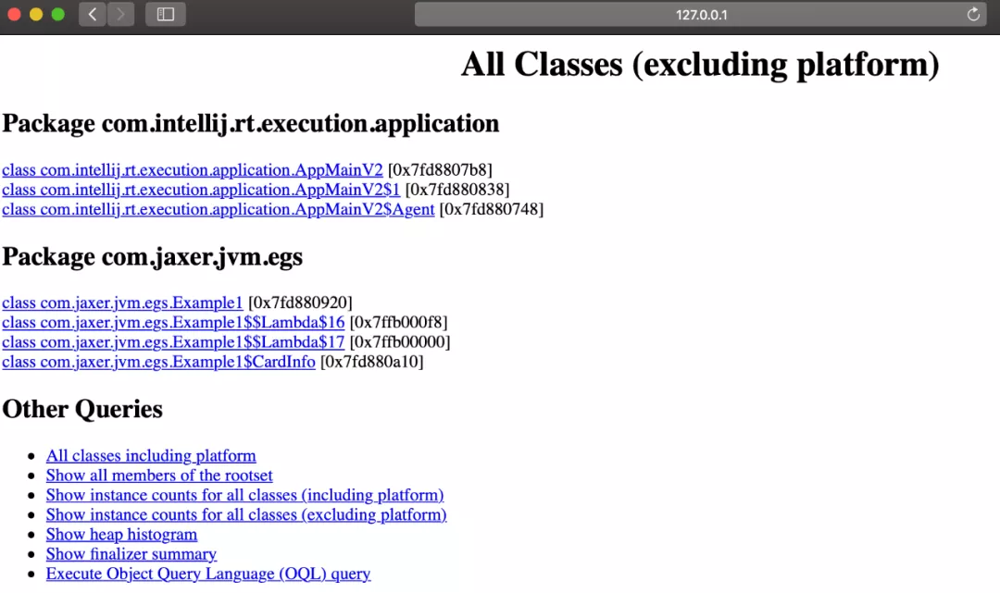
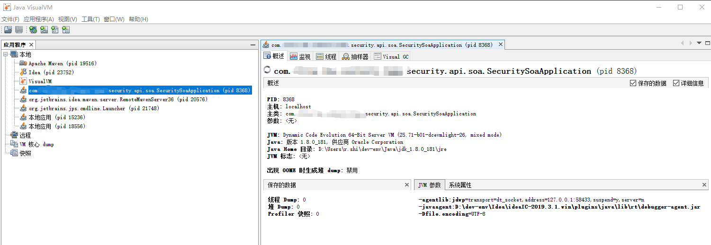
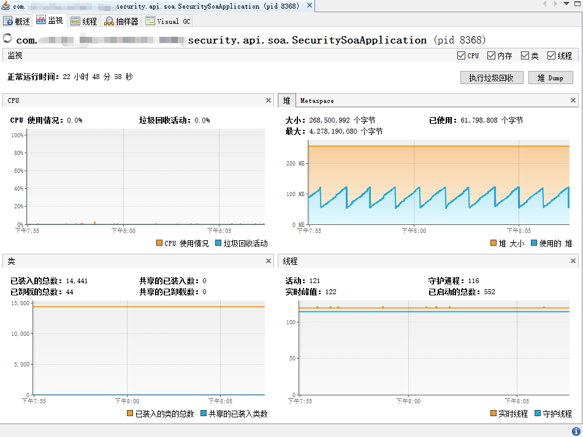
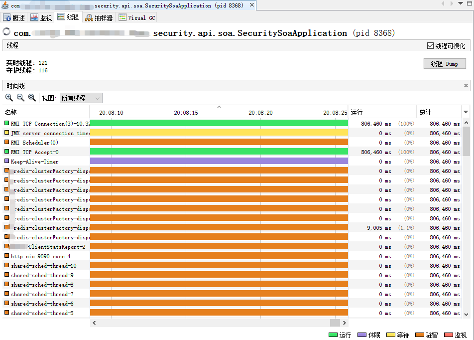
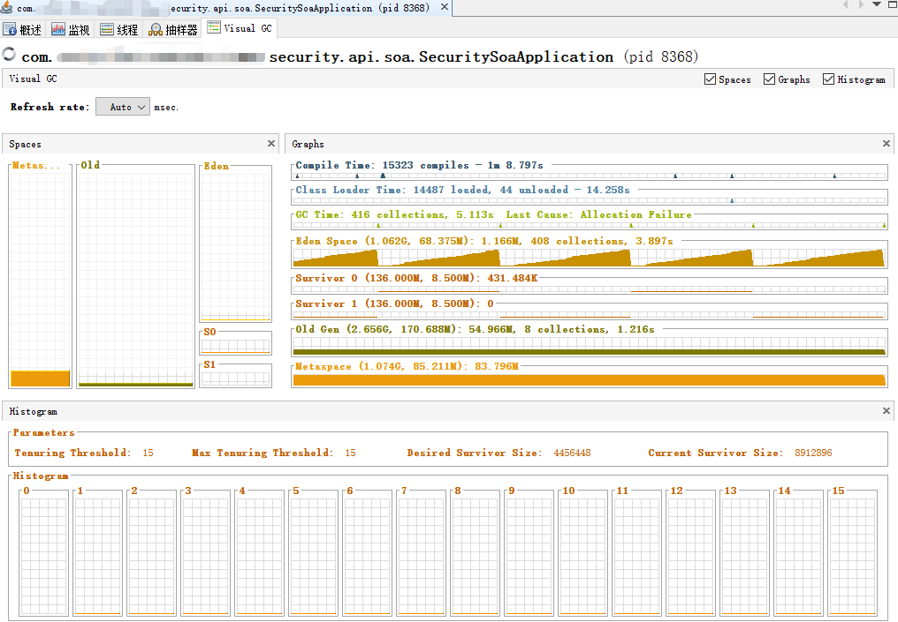
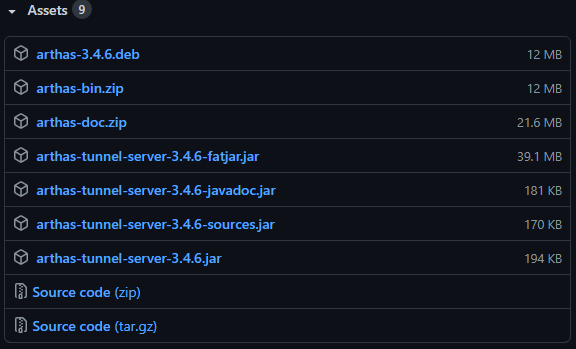
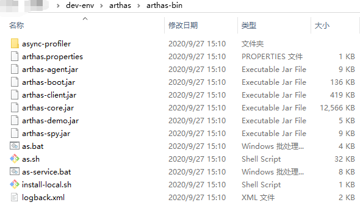

[[toc]]

[toc]

## 推荐阅读

> - [JVM 性能调优及监控工具.md](https://gist.github.com/iamsixer/e7c1b1d459f52effd1c345870387a2c3)
> - [JVM 性能调优（4） —— 性能调优工具](https://www.cnblogs.com/chiangchou/p/jvm-4.html)
> - [JVM 性能监控与分析工具，我只用这几个！](https://mp.weixin.qq.com/s/iqlzfq_niGBBGeDz7iNTDg)
> - [jvm 调优工具分析指南](https://juejin.cn/post/6844903501269729288)

## 一、JDK 命令行工具

> 参考官方文档：https://docs.oracle.com/javase/8/docs/technotes/tools/unix/toc.html

JDK 自带了很多性能监控工具，我们可以用这些工具来监测系统和排查内存性能问题。

命令行工具：

| 名称   | 主要作用                                                                                                          |
| :----- | :---------------------------------------------------------------------------------------------------------------- |
| jps    | JVM 进程状态工具，查看系统上的 JVM 进程信息                                                                       |
| jstat  | JVM 统计信息监控工具，附加到一个 JVM 进程上收集和记录 JVM 的各种性能指标数据                                      |
| jinfo  | JVM 配置信息工具，查看 JVM 配置参数                                                                               |
| jmap   | JVM 堆内存分析工具，可以打印 JVM 进程对象直方图，类加载统计，以及做堆转储操作                                     |
| jhat   | JVM Heap Analysis Tool, 用于分析 heapdump 文件（它会建立一个 HTTP/HTML 服务器，让用户可以在浏览器上查看分析结果） |
| jstack | Stack Trace for Java, 显示虚拟机的线程快照                                                                        |

### 1.jps

> 见官方文档：[jps_java8](https://docs.oracle.com/javase/8/docs/technotes/tools/unix/jps.html#CHDCGECD)

JVM Process Status Tool （虚拟机进程状况工具）：

> 查看本机当前登录用户的 java 进程，显示当前所有正在运行的虚拟机进程 ID、执行的主类名称、JVM 启动参数

（1）命令格式

```bash
jps [ options ] [ hostid ]
```

options：

| option | description                                                                                                                                                          |
| ------ | -------------------------------------------------------------------------------------------------------------------------------------------------------------------- |
| -q     | 只显示 pid，忽略 class 名称、jar 文件名和传递给 main 方法的参数                                                                                                      |
| -m     | 输出传递给 main 方法的参数，如果是内嵌的 JVM 则输出为 null                                                                                                           |
| -l     | 输出应用程序主类的完整包名，或者是应用程序 JAR 文件的完整路径                                                                                                        |
| -v     | 输出传递给 JVM 的参数                                                                                                                                                |
| -V     | 输出通过标记的文件传递给 JVM 的参数（.hotspotrc 文件，或者是通过参数-XX:Flags=`<filename>`指定的文件）                                                               |
| -J     | 用于传递 jvm 选项到由 javac 调用的 java 加载器中，例如，“-J-Xms48m”将把启动内存设置为 48M，使用-J 选项可以非常方便的向基于 Java 的开发的底层虚拟机应用程序传递参数。 |

（2）示例

```bash
$ jps
15236 Jps
14966 Example1

$ jps -l
15249 sun.tools.jps.Jps
14966 com.jaxer.jvm.egs.Example1

$ jps -v
14966 Example1 -Dvisualvm.id=44321340563858 -Xmx50m -Xms50m -XX:+PrintGCDetails -javaagent:/Applications/IntelliJ IDEA.app/Contents/lib/idea_rt.jar=61849:/Applications/IntelliJ IDEA.app/Contents/bin -Dfile.encoding=UTF-8
15278 Jps -Dapplication.home=/Library/Java/JavaVirtualMachines/jdk1.8.0_191.jdk/Contents/Home -Xms8m
```

### 2.jstat

> 见官方文档：[jstat_java8](https://docs.oracle.com/javase/8/docs/technotes/tools/unix/jstat.html)

JVM Statistics Monitoring Tool （JVM 统计信息监控工具），Jstat 用于监控基于 HotSpot 的 JVM，对其堆的使用情况进行实时的命令行的统计，使用 jstat 我们可以对指定的 JVM 做如下监控：

> - 类的加载及卸载情况
>
> - 查看新生代、老生代及持久代的容量及使用情况
>
> - 查看新生代、老生代及持久代的垃圾收集情况，包括垃圾回收的次数及垃圾回收所占用的时间
>
> - 查看新生代中 Eden 区及 Survior 区中容量及分配情况等

（1）命令格式

```bash
jstat [ generalOption | outputOptions vmid [ interval[s|ms] [ count ] ]
```

**generalOption**：单个的常用的命令行选项，如-help, -options, 或 -version。

**outputOptions**：一个或多个输出选项，由单个的 statOption 选项组成，可以和-t, -h, and -J 等选项配合使用。

**statOption**：根据 jstat 统计的维度不同，可以使用如下表中的选项进行不同维度的统计，不同的操作系统支持的选项可能会不一样，可以通过-options 选项，查看不同操作系统所支持选项，如：

| Option                                                                                                         | Description                                                                                                                |
| :------------------------------------------------------------------------------------------------------------- | :------------------------------------------------------------------------------------------------------------------------- |
| [class](http://docs.oracle.com/javase/1.5.0/docs/tooldocs/share/jstat.html#class_option)                       | 用于查看类加载情况的统计                                                                                                   |
| [compiler](http://docs.oracle.com/javase/1.5.0/docs/tooldocs/share/jstat.html#compiler_option)                 | 用于查看 HotSpot 中即时编译器编译情况的统计                                                                                |
| [gc](http://docs.oracle.com/javase/1.5.0/docs/tooldocs/share/jstat.html#gc_option)                             | 用于查看 JVM 中堆的垃圾收集情况的统计                                                                                      |
| [gccapacity](http://docs.oracle.com/javase/1.5.0/docs/tooldocs/share/jstat.html#gccapacity_option)             | 用于查看新生代、老生代及持久代的存储容量情况                                                                               |
| [gccause](http://docs.oracle.com/javase/1.5.0/docs/tooldocs/share/jstat.html#gccause_option)                   | 用于查看垃圾收集的统计情况（这个和-gcutil 选项一样），如果有发生垃圾收集，它还会显示最后一次及当前正在发生垃圾收集的原因。 |
| [gcnew](http://docs.oracle.com/javase/1.5.0/docs/tooldocs/share/jstat.html#gcnew_option)                       | 用于查看新生代垃圾收集的情况                                                                                               |
| [gcnewcapacity](http://docs.oracle.com/javase/1.5.0/docs/tooldocs/share/jstat.html#gcnewcapacity_option)       | 用于查看新生代的存储容量情况                                                                                               |
| [gcold](http://docs.oracle.com/javase/1.5.0/docs/tooldocs/share/jstat.html#gcold_option)                       | 用于查看老生代及持久代发生 GC 的情况                                                                                       |
| [gcoldcapacity](http://docs.oracle.com/javase/1.5.0/docs/tooldocs/share/jstat.html#gcoldcapacity_option)       | 用于查看老生代的容量                                                                                                       |
| [gcpermcapacity](http://docs.oracle.com/javase/1.5.0/docs/tooldocs/share/jstat.html#gcpermcapacity_option)     | 用于查看持久代的容量                                                                                                       |
| [gcutil](http://docs.oracle.com/javase/1.5.0/docs/tooldocs/share/jstat.html#gcutil_option)                     | 用于查看新生代、老生代及持代垃圾收集的情况                                                                                 |
| [printcompilation](http://docs.oracle.com/javase/1.5.0/docs/tooldocs/share/jstat.html#printcompilation_option) | HotSpot 编译方法的统计                                                                                                     |

**-h** n：用于指定每隔几行就输出列头，如果不指定，默认是只在第一行出现列头。

**-J** javaOption：用于将给定的*javaOption*传给 java 应用程序加载器，例如，“-J-Xms48m”将把启动内存设置为 48M。如果想查看可以传递哪些选项到应用程序加载器中，可以相看如下的文档：

> - Linux and Solaris：http://docs.oracle.com/javase/1.5.0/docs/tooldocs/solaris/java.html
> - Windows： http://docs.oracle.com/javase/1.5.0/docs/tooldocs/windows/java.html

**-t** n ：用于在输出内容的第一列显示时间戳，这个时间戳代表的时 JVM 开始启动到现在的时间（注：在 IBM JDK5 中是没有这个选项的）

**vmid** ： VM 的进程号，即当前运行的 java 进程号 pid。

**interval** ：间隔时间，单位可以是秒或者毫秒，通过指定 s 或 ms 确定，默认单位为毫秒。

**count**：打印次数，如果缺省则打印无数次。

（2）不同的统计维度（statOption）及输出说明

- **-class**：类加载情况的统计

| 列名     | 说明                      |
| :------- | :------------------------ |
| Loaded   | 加载了的类的数量          |
| Bytes    | 加载了的类的大小，单为 Kb |
| Unloaded | 卸载了的类的数量          |
| Bytes    | 卸载了的类的大小，单为 Kb |
| Time     | 花在类的加载及卸载的时间  |

- **-compiler**：HotSpot 中即时编译器编译情况的统计

| 列名         | 说明                           |
| :----------- | :----------------------------- |
| Compiled     | 编译任务执行的次数             |
| Failed       | 编译任务执行失败的次数         |
| Invalid      | 编译任务非法执行的次数         |
| Time         | 执行编译花费的时间             |
| FailedType   | 最后一次编译失败的编译类型     |
| FailedMethod | 最后一次编译失败的类名及方法名 |

- **-gc**：JVM 中堆的垃圾收集情况的统计

| 列名 | 说明                                                                     |
| :--- | :----------------------------------------------------------------------- |
| S0C  | 新生代中 Survivor space 中 S0 当前容量的大小（KB）                       |
| S1C  | 新生代中 Survivor space 中 S1 当前容量的大小（KB）                       |
| S0U  | 新生代中 Survivor space 中 S0 容量使用的大小（KB）                       |
| S1U  | 新生代中 Survivor space 中 S1 容量使用的大小（KB）                       |
| EC   | Eden space 当前容量的大小（KB）                                          |
| EU   | Eden space 容量使用的大小（KB）                                          |
| OC   | Old space 当前容量的大小（KB）                                           |
| OU   | Old space 使用容量的大小（KB）                                           |
| MC   | 元空间当前容量大小(KB)                                                   |
| MU   | 元空间已使用容量的大小（KB）                                             |
| YGC  | 从应用程序启动到采样时发生 Young GC 的次数                               |
| YGCT | 从应用程序启动到采样时 Young GC 所用的时间(秒)                           |
| FGC  | 从应用程序启动到采样时发生 Full GC 的次数                                |
| FGCT | 从应用程序启动到采样时 Full GC 所用的时间(秒)                            |
| GCT  | T 从应用程序启动到采样时用于垃圾回收的总时间(单位秒)，它的值等于 YGC+FGC |

- **-gccapacity**：新生代、老生代及持久代的存储容量情况

| 列名  | 说明                                           |
| :---- | :--------------------------------------------- |
| NGCMN | 新生代的最小容量大小（KB）                     |
| NGCMX | 新生代的最大容量大小（KB）                     |
| NGC   | 当前新生代的容量大小（KB）                     |
| S0C   | 当前新生代中 survivor space 0 的容量大小（KB） |
| S1C   | 当前新生代中 survivor space 1 的容量大小（KB） |
| EC    | Eden space 当前容量的大小（KB）                |
| OGCMN | 老生代的最小容量大小（KB）                     |
| OGCMX | 老生代的最大容量大小（KB）                     |
| OGC   | 当前老生代的容量大小（KB）                     |
| OC    | 当前老生代的空间容量大小（KB）                 |
| PGCMN | 持久代的最小容量大小（KB）                     |
| PGCMX | 持久代的最大容量大小（KB）                     |
| PGC   | 当前持久代的容量大小（KB）                     |
| PC    | 当前持久代的空间容量大小（KB）                 |
| YGC   | 从应用程序启动到采样时发生 Young GC 的次数     |
| FGC   | 从应用程序启动到采样时发生 Full GC 的次数      |

- **-gccause** ：用于查看垃圾收集的统计情况，包括最近发生垃圾的原因

  这个选项用于查看垃圾收集的统计情况（这个和-gcutil 选项一样），如果有发生垃圾收集，它还会显示最后一次及当前正在发生垃圾收集的原因，它比**-gcutil**会多出最后一次垃圾收集原因以及当前正在发生的垃圾收集的原因。

| 列名 | 说明                                                             |
| :--- | :--------------------------------------------------------------- |
| LGCC | 最后一次垃圾收集的原因，可能为“unknown GCCause”、“System.gc()”等 |
| GCC  | 当前垃圾收集的原因                                               |

- **-gcnew**：新生代垃圾收集的情况

| 列名 | 说明                                                                                                                                                                                                                                                                                                                                                                                                                                                                                                                                                                                                                                                    |
| :--- | :------------------------------------------------------------------------------------------------------------------------------------------------------------------------------------------------------------------------------------------------------------------------------------------------------------------------------------------------------------------------------------------------------------------------------------------------------------------------------------------------------------------------------------------------------------------------------------------------------------------------------------------------------ |
| S0C  | 当前新生代中 survivor space 0 的容量大小（KB）                                                                                                                                                                                                                                                                                                                                                                                                                                                                                                                                                                                                          |
| S1C  | 当前新生代中 survivor space 1 的容量大小（KB）                                                                                                                                                                                                                                                                                                                                                                                                                                                                                                                                                                                                          |
| S0U  | S0 已经使用的大小（KB）                                                                                                                                                                                                                                                                                                                                                                                                                                                                                                                                                                                                                                 |
| S1U  | S1 已经使用的大小（KB）                                                                                                                                                                                                                                                                                                                                                                                                                                                                                                                                                                                                                                 |
| TT   | Tenuring threshold，要了解这个参数，我们需要了解一点 Java 内存对象的结构，在 Sun JVM 中，（除了数组之外的）对象都有两个机器字（words）的头部。第一个字中包含这个对象的标示哈希码以及其他一些类似锁状态和等标识信息，第二个字中包含一个指向对象的类的引用，其中第二个字节就会被垃圾收集算法使用到。 在新生代中做垃圾收集的时候，每次复制一个对象后，将增加这个对象的收集计数，当一个对象在新生代中被复制了一定次数后，该算法即判定该对象是长周期的对象，把他移动到老生代，这个阈值叫着 tenuring threshold。这个阈值用于表示某个/些在执行批定次数 youngGC 后还活着的对象，即使此时新生的的 Survior 没有满，也同样被认为是长周期对象，将会被移到老生代中。 |
| MTT  | Maximum tenuring threshold，用于表示 TT 的最大值。                                                                                                                                                                                                                                                                                                                                                                                                                                                                                                                                                                                                      |
| DSS  | Desired survivor size (KB).可以参与这里：http://blog.csdn.net/yangjun2/article/details/6542357                                                                                                                                                                                                                                                                                                                                                                                                                                                                                                                                                          |
| EC   | Eden space 当前容量的大小（KB）                                                                                                                                                                                                                                                                                                                                                                                                                                                                                                                                                                                                                         |
| EU   | Eden space 已经使用的大小（KB）                                                                                                                                                                                                                                                                                                                                                                                                                                                                                                                                                                                                                         |
| YGC  | 从应用程序启动到采样时发生 Young GC 的次数                                                                                                                                                                                                                                                                                                                                                                                                                                                                                                                                                                                                              |
| YGCT | 从应用程序启动到采样时 Young GC 所用的时间(单位秒)                                                                                                                                                                                                                                                                                                                                                                                                                                                                                                                                                                                                      |

- **-gcnewcapacity**：新生代的存储容量情况

| 列名  | 说明                                       |
| :---- | :----------------------------------------- |
| NGCMN | 新生代的最小容量大小（KB）                 |
| NGCMX | 新生代的最大容量大小（KB）                 |
| NGC   | 当前新生代的容量大小（KB）                 |
| S0CMX | 新生代中 SO 的最大容量大小（KB）           |
| S0C   | 当前新生代中 SO 的容量大小（KB）           |
| S1CMX | 新生代中 S1 的最大容量大小（KB）           |
| S1C   | 当前新生代中 S1 的容量大小（KB）           |
| ECMX  | 新生代中 Eden 的最大容量大小（KB）         |
| EC    | 当前新生代中 Eden 的容量大小（KB）         |
| YGC   | 从应用程序启动到采样时发生 Young GC 的次数 |
| FGC   | 从应用程序启动到采样时发生 Full GC 的次数  |

- **-gcold**：老生代及持久代发生 GC 的情况

| 列名 | 说明                                                                   |
| :--- | :--------------------------------------------------------------------- |
| PC   | 当前持久代容量的大小（KB）                                             |
| PU   | 持久代使用容量的大小（KB）                                             |
| OC   | 当前老年代容量的大小（KB）                                             |
| OU   | 老年代使用容量的大小（KB）                                             |
| YGC  | 从应用程序启动到采样时发生 Young GC 的次数                             |
| FGC  | 从应用程序启动到采样时发生 Full GC 的次数                              |
| FGCT | 从应用程序启动到采样时 Full GC 所用的时间(单位秒)                      |
| GCT  | 从应用程序启动到采样时用于垃圾回收的总时间(单位秒)，它的值等于 YGC+FGC |

- **-gcoldcapacity**： 老生代的存储容量情况

| 列名  | 说明                                                                   |
| :---- | :--------------------------------------------------------------------- |
| OGCMN | 老生代的最小容量大小（KB）                                             |
| OGCMX | 老生代的最大容量大小（KB）                                             |
| OGC   | 当前老生代的容量大小（KB）                                             |
| OC    | 当前新生代的空间容量大小（KB）                                         |
| YGC   | 从应用程序启动到采样时发生 Young GC 的次数                             |
| FGC   | 从应用程序启动到采样时发生 Full GC 的次数                              |
| FGCT  | 从应用程序启动到采样时 Full GC 所用的时间(单位秒)                      |
| GCT   | 从应用程序启动到采样时用于垃圾回收的总时间(单位秒)，它的值等于 YGC+FGC |

- **-gcpermcapacity**： 持久代的存储容量情况

  从应用程序启动到采样时发生 Full GC 的次数

| 列名  | 说明                                                                   |
| :---- | :--------------------------------------------------------------------- |
| PGCMN | 持久代的最小容量大小（KB）                                             |
| PGCMX | 持久代的最大容量大小（KB）                                             |
| PGC   | 当前持久代的容量大小（KB）                                             |
| PC    | 当前持久代的空间容量大小（KB）                                         |
| YGC   | 从应用程序启动到采样时发生 Young GC 的次数                             |
| FGC   |                                                                        |
| FGCT  | 从应用程序启动到采样时 Full GC 所用的时间(单位秒)                      |
| GCT   | 从应用程序启动到采样时用于垃圾回收的总时间(单位秒)，它的值等于 YGC+FGC |

- **-gcutil**：新生代、老生代及持代垃圾收集的情况

| 列名 | 说明                                                                   |
| :--- | :--------------------------------------------------------------------- |
| S0   | Heap 上的 Survivor space 0 区已使用空间的百分比                        |
| S1   | Heap 上的 Survivor space 1 区已使用空间的百分比                        |
| E    | Heap 上的 Eden space 区已使用空间的百分比                              |
| O    | Heap 上的 Old space 区已使用空间的百分比                               |
| M    | 元空间利用率占空间当前容量的百分比。                                   |
| YGC  | 从应用程序启动到采样时发生 Young GC 的次数                             |
| YGCT | 从应用程序启动到采样时 Young GC 所用的时间(单位秒)                     |
| FGC  | 从应用程序启动到采样时发生 Full GC 的次数                              |
| FGCT | 从应用程序启动到采样时 Full GC 所用的时间(单位秒)                      |
| GCT  | 从应用程序启动到采样时用于垃圾回收的总时间(单位秒)，它的值等于 YGC+FGC |

- **-printcompilation**： HotSpot 编译方法的统计

| 列名     | 说明                                                                                                                                                                        |
| :------- | :-------------------------------------------------------------------------------------------------------------------------------------------------------------------------- |
| Compiled | 编译任务执行的次数                                                                                                                                                          |
| Size     | 方法的字节码所占的字节数                                                                                                                                                    |
| Type     | 编译类型                                                                                                                                                                    |
| Method   | 指定确定被编译方法的类名及方法名，类名中使名“/”而不是“.”做为命名分隔符，方法名是被指定的类中的方法，这两个字段的格式是由 HotSpot 中的“-**XX:+PrintComplation**”选项确定的。 |

（3）示例

```bash
$ jstat -gcutil 8368
  S0     S1     E      O      M     CCS    YGC     YGCT    FGC    FGCT     GCT
  0.00   6.50  27.48  40.87  98.43  97.68    297    2.930     3    0.187    3.117

## 每个100秒打印堆中垃圾收集情况,打印 10 次
$ jstat -gc 8368 100 5
 S0C    S1C    S0U    S1U      EC       EU        OC         OU       MC     MU    CCSC   CCSU   YGC     YGCT    FGC    FGCT     GCT
8704.0 8704.0  0.0   637.5  70016.0  33414.7   174784.0   71446.8   85464.0 84121.9 10240.0 10001.9    301    2.969   3      0.187    3.156
8704.0 8704.0  0.0   637.5  70016.0  33414.7   174784.0   71446.8   85464.0 84121.9 10240.0 10001.9    301    2.969   3      0.187    3.156
8704.0 8704.0  0.0   637.5  70016.0  33414.7   174784.0   71446.8   85464.0 84121.9 10240.0 10001.9    301    2.969   3      0.187    3.156
8704.0 8704.0  0.0   637.5  70016.0  33414.7   174784.0   71446.8   85464.0 84121.9 10240.0 10001.9    301    2.969   3      0.187    3.156
8704.0 8704.0  0.0   637.5  70016.0  33416.7   174784.0   71446.8   85464.0 84121.9 10240.0 10001.9    301    2.969   3      0.187    3.156


$ jstat -gc 8368
 S0C    S1C    S0U    S1U      EC       EU        OC         OU       MC     MU    CCSC   CCSU   YGC     YGCT    FGC    FGCT     GCT
8704.0 8704.0 601.2   0.0   70016.0   9267.2   174784.0   71445.0   85464.0 84121.9 10240.0 10001.9    300    2.962   3      0.187    3.148
```

### 3.jinfo

> 参见官网 [jinfo_java8](https://docs.oracle.com/javase/8/docs/technotes/tools/unix/jinfo.html#BCGEBFDD)

可查看和设置 JVM 配置信息。

（1）命令格式

```bash
jinfo [ option ] pid

jinfo [ option ] executable core

jinfo [ option ] [ servier-id ] remote-hostname-or-IP
```

（2）示例

此命令用法简单，暂时只看几个示例

```bash
## 查看某个JVM参数的配置
$ jinfo -flag MaxHeapSize 8368
-XX:MaxHeapSize=4278190080


## 设置某个JVM参数的值
$ jinfo -flag MaxHeapSize=5278190080  8368


## 查看全部JVM启动参数或系统变量的配置
$ jinfo 8368
```

### 4.jmap

> 参见官方文档 [jmap_java8](https://docs.oracle.com/javase/8/docs/technotes/tools/unix/jmap.html#CEGCECJB)

Java 内存映像工具，可以使用 jmap 查看内存中的对象数量及内存空间占用：

（1）命令格式

```bash
jmap [ options ] pid

jmap [ options ] executable core

jmap [ options ] [ pid ] server-id@ ] remote-hostname-or-IP
```

options：

> - `<no option>`：如果不使用任何选项，则 jmap 命令将打印共享对象映射。 对于目标 JVM 中加载的每个共享库，将打印共享库文件的开始地址，映射大小和完整路径。
> - `-heap`：打印堆的配置信息，堆各分代的内存情况
> - `-histo[:live]`：打印堆的直方图。 对于每个 Java 类，都将打印对象数，以字节为单位的内存大小以及完全限定的类名。 JVM 内部类名称打印有星号（\*）前缀。 如果指定了 live 子选项，则仅对活动对象进行计数。
> - `-dump:[live,] format=b, file=filename`：将 Java 堆转储到 hprof 格式的二进制文件中。如果指定了可选的 live 子选项，则仅转储堆中的活动对象。要浏览堆转储，可以使用 jhat 命令来读取堆转储文件。

（2）示例

```bash
## 1.查看堆内存配置及占用情况
$ jmap -heap 8368
Attaching to process ID 8368, please wait...
WARNING: Hotspot VM version 25.71-b01-dcevmlight-26 does not match with SA version 25.181-b13. You may see unexpected results.
Debugger attached successfully.
Server compiler detected.
JVM version is 25.71-b01-dcevmlight-26

using thread-local object allocation.
Mark Sweep Compact GC

Heap Configuration:
   MinHeapFreeRatio         = 40
   MaxHeapFreeRatio         = 70
   MaxHeapSize              = 4278190080 (4080.0MB)
   NewSize                  = 89456640 (85.3125MB)
   MaxNewSize               = 1426063360 (1360.0MB)
   OldSize                  = 178978816 (170.6875MB)
   NewRatio                 = 2
   SurvivorRatio            = 8
   MetaspaceSize            = 21807104 (20.796875MB)
   CompressedClassSpaceSize = 1073741824 (1024.0MB)
   MaxMetaspaceSize         = 17592186044415 MB
   G1HeapRegionSize         = 0 (0.0MB)

Heap Usage:
New Generation (Eden + 1 Survivor Space):
   capacity = 80609280 (76.875MB)
   used     = 65884512 (62.832366943359375MB)
   free     = 14724768 (14.042633056640625MB)
   81.7331602515244% used
Eden Space:
   capacity = 71696384 (68.375MB)
   used     = 64944720 (61.93611145019531MB)
   free     = 6751664 (6.4388885498046875MB)
   90.58297835494744% used
From Space:
   capacity = 8912896 (8.5MB)
   used     = 939792 (0.8962554931640625MB)
   free     = 7973104 (7.6037445068359375MB)
   10.544182272518382% used
To Space:
   capacity = 8912896 (8.5MB)
   used     = 0 (0.0MB)
   free     = 8912896 (8.5MB)
   0.0% used
tenured generation:
   capacity = 178978816 (170.6875MB)
   used     = 57622840 (54.95342254638672MB)
   free     = 121355976 (115.73407745361328MB)
   32.19534092794535% used

29343 interned Strings occupying 3477648 bytes.

## 2.打印堆的直方图
$ jmap -histo:live 8368 | head -20

 num     #instances         #bytes  class name
----------------------------------------------
   1:          2332       27377816  [B
   2:         86691       11906496  [C
   3:         15551        2320904  [Ljava.lang.Object;
   4:         84932        2038368  java.lang.String
   5:          7070        1860064  [I
   6:         15124        1686600  java.lang.Class
   7:         42697        1366304  java.util.concurrent.ConcurrentHashMap$Node
   8:         10507         924616  java.lang.reflect.Method
   9:         19729         631328  java.util.HashMap$Node
  10:          5983         499968  [Ljava.util.HashMap$Node;
  11:         11158         446320  java.util.LinkedHashMap$Entry
  12:         24496         391936  java.lang.Object
  13:           404         362728  [Ljava.util.concurrent.ConcurrentHashMap$Node;
  14:          5236         293216  java.util.LinkedHashMap
  15:          6539         209248  java.lang.ref.WeakReference
  16:          9579         207760  [Ljava.lang.Class;
  17:          3442         165216  java.util.HashMap


## 3.导出堆转储快照
$ jmap -dump:live,format=b,file=./dump.hprof 8368
Dumping heap to C:\Users\ray\mess\dump.hprof ...
Heap dump file created

```

### 5.jhat

分析 jmap 生成的快照文件

（1）示例：

```bash
$ jhat dump.hprof
Reading from dump.hprof...
Dump file created Wed Jan 20 18:57:27 CST 2021
Snapshot read, resolving...
Resolving 521526 objects...
Chasing references, expect 104 dots........................................................................................................
Eliminating duplicate references........................................................................................................
Snapshot resolved.
Started HTTP server on port 7000
Server is ready.

```

Server 启动后，在浏览器打开 http://localhost:7000/，可以看到如下信息：



> 实际工作中，一般不会直接使用 jhat 命令来分析 dump 文件，主要原因：
>
> 1. 一般不会在部署应用程序的服务器上直接分析 dump 文件（分析工作一般比较耗时，而且消耗硬件资源，在其他机器上进行时则没必要受到命令行工具的限制）；
> 2. jhat 分析功能相对简陋，VisualVM 等更工具功能强大。

### 6.jstack

参见官方文档 [jstack_java8](https://docs.oracle.com/javase/8/docs/technotes/tools/unix/jstack.html#BABGJDIF)

Java 堆栈跟踪工具

> - jstack (Stack Trace for Java) 命令用于生成虚拟机当前时刻的线程快照（一般称为 threaddump 或 javacore 文件）
> - 线程快照就是当前虚拟机内每一条线程正在执行的方法堆栈的集合，生成堆栈快照的主要目的是定位线程出现长时间停顿的原因，如线程死锁、死循环、请求外部资源导致的长时间等待等都是导致线程长时间停顿的常见原因

示例：

```bash
$ jstack -l 8368 | head -20
2021-01-20 19:34:14
Full thread dump Dynamic Code Evolution 64-Bit Server VM (25.71-b01-dcevmlight-26 mixed mode):

"Keep-Alive-Timer" #517 daemon prio=8 os_prio=1 tid=0x000000001b453000 nid=0x2fb0 waiting on condition [0x0000000044a0e000]
   java.lang.Thread.State: TIMED_WAITING (sleeping)
        at java.lang.Thread.sleep(Native Method)
        at sun.net.www.http.KeepAliveCache.run(KeepAliveCache.java:172)
        at java.lang.Thread.run(Thread.java:748)

   Locked ownable synchronizers:
        - None

"dredis-clusterFactory-dispatcher-thread-8" #157 daemon prio=5 os_prio=0 tid=0x000000001b450000 nid=0x2210 waiting on condition [0x0000000029c0e000]
   java.lang.Thread.State: WAITING (parking)
        at sun.misc.Unsafe.park(Native Method)
        - parking to wait for  <0x0000000718e6f608> (a java.util.concurrent.locks.AbstractQueuedSynchronizer$ConditionObject)
        at java.util.concurrent.locks.LockSupport.park(LockSupport.java:175)
        at java.util.concurrent.locks.AbstractQueuedSynchronizer$ConditionObject.await(AbstractQueuedSynchronizer.java:2039)
        at java.util.concurrent.LinkedBlockingQueue.take(LinkedBlockingQueue.java:442)
        at java.util.concurrent.ThreadPoolExecutor.getTask(ThreadPoolExecutor.java:1074)

```

## 二、Linux 命令行工具

## 三、可视化工具

### 1. jvisualvm

VisualVM 是一个 JVM 监控工具，也是一体化 Java 故障排除工具，能够监控线程、内存、CPU、GC 等情况，支持堆转储快照分析，并且可以根据需要安装不同的插件以扩展相应的功能。

> - jvisualvm 是 JDK 自带的命令，虽然后面独立发展了。这两种方式都可以使用。
>
> - VisualVM 链接：https://visualvm.github.io/

（1）概述、监视、线程页

打开 VisualVM 后，会在左侧栏列出本地，正在运行的进程的 pid 和名称，选择一个后会打开应用程序的概述页面：



在监视页面能看到 CPU、内存、线程、类的使用情况



在线程页面，可以看到所有线程的运行情况



（2）安装插件来扩展功能

通过 `工具` -> `插件` -> `可用插件` -> `勾选目标插件` -> `安装` 的方式来安装需要的插件，可扩展 VisualVM 的功能，比如安装 VisualVM GC 之后，Tab 页会出现 Visual GC 页面，打开后可显示各分代的的内存使用情况：



（3）dump 文件分析

通过 `文件` -> `装入` -> `然后选择前面通过 jmap 导出的dump文件` ，即可对 dump 文件进行分析

在概要页可查看 dump 文件的基本信息、jvm 参数与系统变量、线程运行情况


在类的 Tab 页，可以查看类的相关信息


### 2.MAT

## 四、Arthas

> - 官方文档：https://alibaba.github.io/arthas/
> - 阿里云在线教程：[https://start.aliyun.com/handson-lab/#%21category=arthas](https://start.aliyun.com/handson-lab/#!category=arthas)

### 1.下载 Arthas

打开 Athas Github 的版本发布页，选择 `arthas-bin.zip`进行下载

> https://github.com/alibaba/arthas/releases



解压后目录如下：



注意：

> 也可通过 curl 直接下载 `arthas-demo.jar`、`arthas-boot.jar`
>
> ```bash
> curl -O https://arthas.aliyun.com/arthas-demo.jar
> curl -O https://arthas.aliyun.com/arthas-boot.jar
> ```

### 2.启动 Demo

```bash
java -jar arthas-demo.jar
```

`arthas-demo`是一个简单的程序，每隔一秒生成一个随机数，再执行质因数分解，并打印出分解结果。

源码如下：

```java
package demo;

import java.util.ArrayList;
import java.util.List;
import java.util.Random;
import java.util.concurrent.TimeUnit;

public class MathGame {
    private static Random random = new Random();

    private int illegalArgumentCount = 0;

    public static void main(String[] args) throws InterruptedException {
        MathGame game = new MathGame();
        while (true) {
            game.run();
            TimeUnit.SECONDS.sleep(1);
        }
    }

    public void run() throws InterruptedException {
        try {
            int number = random.nextInt()/10000;
            List<Integer> primeFactors = primeFactors(number);
            print(number, primeFactors);

        } catch (Exception e) {
            System.out.println(String.format("illegalArgumentCount:%3d, ", illegalArgumentCount) + e.getMessage());
        }
    }

    public static void print(int number, List<Integer> primeFactors) {
        StringBuffer sb = new StringBuffer(number + "=");
        for (int factor : primeFactors) {
            sb.append(factor).append('*');
        }
        if (sb.charAt(sb.length() - 1) == '*') {
            sb.deleteCharAt(sb.length() - 1);
        }
        System.out.println(sb);
    }

    public List<Integer> primeFactors(int number) {
        if (number < 2) {
            illegalArgumentCount++;
            throw new IllegalArgumentException("number is: " + number + ", need >= 2");
        }

        List<Integer> result = new ArrayList<Integer>();
        int i = 2;
        while (i <= number) {
            if (number % i == 0) {
                result.add(i);
                number = number / i;
                i = 2;
            } else {
                i++;
            }
        }

        return result;
    }
}
```

### 3.启动 Arthas

启动 Arthas

```bash
$ $ java -jar arthas-boot.jar
* [1]: 35542
  [2]: 71560 arthas-demo.jar
```

接着输入 2 然后回车，arthas 就会 attach 到目标进程上，并输出日志：

```bash
[INFO] Try to attach process 71560
[INFO] Attach process 71560 success.
[INFO] arthas-client connect 127.0.0.1 3658
  ,---.  ,------. ,--------.,--.  ,--.  ,---.   ,---.
 /  O  \ |  .--. ''--.  .--'|  '--'  | /  O  \ '   .-'
|  .-.  ||  '--'.'   |  |   |  .--.  ||  .-.  |`.  `-.
|  | |  ||  |\  \    |  |   |  |  |  ||  | |  |.-'    |
`--' `--'`--' '--'   `--'   `--'  `--'`--' `--'`-----'

wiki: https://arthas.aliyun.com/doc
version: 3.0.5.20181127201536
pid: 71560
time: 2018-11-28 19:16:24
```

### 4.dashboard

输入[dashboard](https://arthas.aliyun.com/doc/dashboard.html)，按`回车/enter`，会展示当前进程的信息，按`ctrl+c`可以中断执行。

```bash
$ dashboard
ID     NAME                   GROUP          PRIORI STATE  %CPU    TIME   INTERRU DAEMON
17     pool-2-thread-1        system         5      WAITIN 67      0:0    false   false
27     Timer-for-arthas-dashb system         10     RUNNAB 32      0:0    false   true
11     AsyncAppender-Worker-a system         9      WAITIN 0       0:0    false   true
9      Attach Listener        system         9      RUNNAB 0       0:0    false   true
3      Finalizer              system         8      WAITIN 0       0:0    false   true
2      Reference Handler      system         10     WAITIN 0       0:0    false   true
4      Signal Dispatcher      system         9      RUNNAB 0       0:0    false   true
26     as-command-execute-dae system         10     TIMED_ 0       0:0    false   true
13     job-timeout            system         9      TIMED_ 0       0:0    false   true
1      main                   main           5      TIMED_ 0       0:0    false   false
14     nioEventLoopGroup-2-1  system         10     RUNNAB 0       0:0    false   false
18     nioEventLoopGroup-2-2  system         10     RUNNAB 0       0:0    false   false
23     nioEventLoopGroup-2-3  system         10     RUNNAB 0       0:0    false   false
15     nioEventLoopGroup-3-1  system         10     RUNNAB 0       0:0    false   false
Memory             used   total max    usage GC
heap               32M    155M  1820M  1.77% gc.ps_scavenge.count  4
ps_eden_space      14M    65M   672M   2.21% gc.ps_scavenge.time(m 166
ps_survivor_space  4M     5M    5M           s)
ps_old_gen         12M    85M   1365M  0.91% gc.ps_marksweep.count 0
nonheap            20M    23M   -1           gc.ps_marksweep.time( 0
code_cache         3M     5M    240M   1.32% ms)
Runtime
os.name                Mac OS X
os.version             10.13.4
java.version           1.8.0_162
java.home              /Library/Java/JavaVir
                       tualMachines/jdk1.8.0
                       _162.jdk/Contents/Hom
                       e/jre
```

### 5.thread

`thread 1`会打印线程 ID 1 的栈，通常是 main 函数的线程。

```bash
$ thread 1 | grep 'main('
    at demo.MathGame.main(MathGame.java:17)
```

### 6.jad

通过 jad 可反编译 Class

```bash
$ jad demo.MathGame

ClassLoader:
+-sun.misc.Launcher$AppClassLoader@3d4eac69
  +-sun.misc.Launcher$ExtClassLoader@66350f69

Location:
/tmp/arthas-demo.jar

/*
 * Decompiled with CFR 0_132.
 */
package demo;

import java.io.PrintStream;
import java.util.ArrayList;
import java.util.Iterator;
import java.util.List;
import java.util.Random;
import java.util.concurrent.TimeUnit;

public class MathGame {
    private static Random random = new Random();
    private int illegalArgumentCount = 0;

    public static void main(String[] args) throws InterruptedException {
        MathGame game = new MathGame();
        do {
            game.run();
            TimeUnit.SECONDS.sleep(1L);
        } while (true);
    }

    public void run() throws InterruptedException {
        try {
            int number = random.nextInt();
            List<Integer> primeFactors = this.primeFactors(number);
            MathGame.print(number, primeFactors);
        }
        catch (Exception e) {
            System.out.println(String.format("illegalArgumentCount:%3d, ", this.illegalArgumentCount) + e.getMessage());
        }
    }

    public static void print(int number, List<Integer> primeFactors) {
        StringBuffer sb = new StringBuffer("" + number + "=");
        Iterator<Integer> iterator = primeFactors.iterator();
        while (iterator.hasNext()) {
            int factor = iterator.next();
            sb.append(factor).append('*');
        }
        if (sb.charAt(sb.length() - 1) == '*') {
            sb.deleteCharAt(sb.length() - 1);
        }
        System.out.println(sb);
    }

    public List<Integer> primeFactors(int number) {
        if (number < 2) {
            ++this.illegalArgumentCount;
            throw new IllegalArgumentException("number is: " + number + ", need >= 2");
        }
        ArrayList<Integer> result = new ArrayList<Integer>();
        int i = 2;
        while (i <= number) {
            if (number % i == 0) {
                result.add(i);
                number /= i;
                i = 2;
                continue;
            }
            ++i;
        }
        return result;
    }
}

Affect(row-cnt:1) cost in 970 ms.
```

### 7.watch

通过[watch](https://arthas.aliyun.com/doc/watch.html)命令来查看`demo.MathGame#primeFactors`函数的返回值：

```bash
$ watch demo.MathGame primeFactors returnObj
Press Ctrl+C to abort.
Affect(class-cnt:1 , method-cnt:1) cost in 107 ms.
ts=2018-11-28 19:22:30; [cost=1.715367ms] result=null
ts=2018-11-28 19:22:31; [cost=0.185203ms] result=null
ts=2018-11-28 19:22:32; [cost=19.012416ms] result=@ArrayList[
    @Integer[5],
    @Integer[47],
    @Integer[2675531],
]
ts=2018-11-28 19:22:33; [cost=0.311395ms] result=@ArrayList[
    @Integer[2],
    @Integer[5],
    @Integer[317],
    @Integer[503],
    @Integer[887],
]
ts=2018-11-28 19:22:34; [cost=10.136007ms] result=@ArrayList[
    @Integer[2],
    @Integer[2],
    @Integer[3],
    @Integer[3],
    @Integer[31],
    @Integer[717593],
]
ts=2018-11-28 19:22:35; [cost=29.969732ms] result=@ArrayList[
    @Integer[5],
    @Integer[29],
    @Integer[7651739],
]
```

### 8.退出 arthas

如果只是退出当前的连接，可以用`quit`或者`exit`命令。Attach 到目标进程上的 arthas 还会继续运行，端口会保持开放，下次连接时可以直接连接上。

如果想完全退出 arthas，可以执行`stop`命令。
