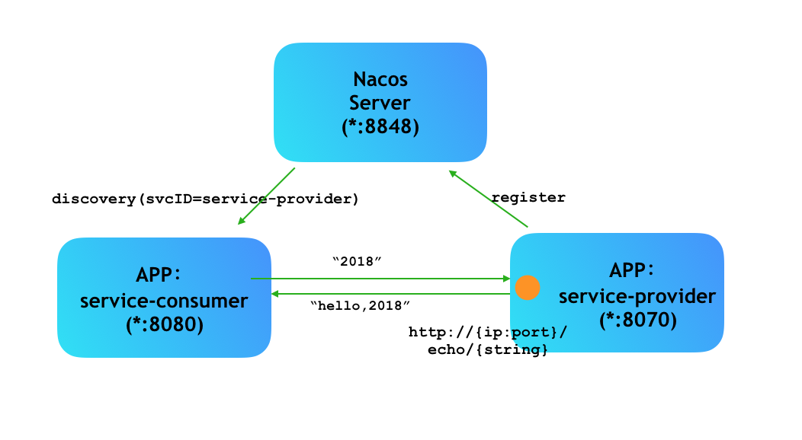

# Nacos 入门实例

[toc]

## 官方文档

> - [Nacos 文档](https://nacos.io/zh-cn/docs/quick-start-spring-cloud.html)


## 推荐阅读

> - [Nacos 快速开始](https://nacos.io/zh-cn/docs/quick-start.html)
> - [nacos-group/nacos-examples](https://github.com/nacos-group/nacos-examples)
> - [Nacos 中文文档](https://www.bookstack.cn/books/Nacos)


## 前言

nacos，一个更易于构建云原生应用的动态**服务发现**、**配置管理**和服务管理平台。


# 一、Nacos 快速开始

### 1.启动 Nacos Server


#### 1.1 预备环境准备

Nacos 依赖 [Java](https://docs.oracle.com/cd/E19182-01/820-7851/inst_cli_jdk_javahome_t/) 环境来运行。如果您是从代码开始构建并运行Nacos，还需要为此配置 [Maven](https://maven.apache.org/index.html)环境，请确保是在以下版本环境中安装使用:

> 1. 64 bit OS，支持 Linux/Unix/Mac/Windows，推荐选用 Linux/Unix/Mac。
> 2. 64 bit JDK 1.8+；[下载](http://www.oracle.com/technetwork/java/javase/downloads/jdk8-downloads-2133151.html) & [配置](https://docs.oracle.com/cd/E19182-01/820-7851/inst_cli_jdk_javahome_t/)。
> 3. Maven 3.2.x+；[下载](https://maven.apache.org/download.cgi) & [配置](https://maven.apache.org/settings.html)。


#### 1.2 下载源码并安装

```bash
# 克隆源码
git clone https://github.com/alibaba/nacos.git --depth=1

# 进入nacos主目录
cd nacos/

# 编译打包安装 ancos
mvn -Prelease-nacos -Dmaven.test.skip=true clean install  -U  

```


#### 1.3 启动 Nacos Server

```bash
# 进入bin目录
cd distribution/target/nacos-server-$version/nacos/bin

# Linux/Unix/Mac： 单机启动 nacos 
sh startup.sh -m standalone

# Windows 
cmd startup.cmd
```


然后浏览器访问 http://localhost:8848/nacos ，用户名密码：`nacos/nacos`


### 2.Nacos 注册中心





#### 2.1 服务提供者

##### 2.1.1 添加依赖

项目依赖：

```xml
<?xml version="1.0" encoding="UTF-8"?>
<project xmlns="http://maven.apache.org/POM/4.0.0"
         xmlns:xsi="http://www.w3.org/2001/XMLSchema-instance"
         xsi:schemaLocation="http://maven.apache.org/POM/4.0.0 http://maven.apache.org/xsd/maven-4.0.0.xsd">
    <parent>
        <artifactId>sample-discovery-nacos</artifactId>
        <groupId>com.ray.study.sample</groupId>
        <version>1.0-SNAPSHOT</version>
    </parent>
    <modelVersion>4.0.0</modelVersion>

    <artifactId>nacos-provider</artifactId>

    <properties>
        <project.build.sourceEncoding>UTF-8</project.build.sourceEncoding>
        <project.reporting.outputEncoding>UTF-8</project.reporting.outputEncoding>
        <java.version>1.8</java.version>
        <maven.compiler.source>${java.version}</maven.compiler.source>
        <maven.compiler.target>${java.version}</maven.compiler.target>
        <spring-cloud-alibaba.version>2.2.1.RELEASE</spring-cloud-alibaba.version>
    </properties>

    <dependencies>
        <dependency>
            <groupId>org.springframework.boot</groupId>
            <artifactId>spring-boot-starter-web</artifactId>
        </dependency>
        <!-- nacos-discovery -->
        <dependency>
            <groupId>com.alibaba.cloud</groupId>
            <artifactId>spring-cloud-starter-alibaba-nacos-discovery</artifactId>
        </dependency>
    </dependencies>
    
    <dependencyManagement>
        <dependencies>
            <dependency>
                <groupId>com.alibaba.cloud</groupId>
                <artifactId>spring-cloud-alibaba-dependencies</artifactId>
                <version>${spring-cloud-alibaba.version}</version>
                <type>pom</type>
                <scope>import</scope>
            </dependency>
        </dependencies>
    </dependencyManagement>

</project>
```


##### 2.1.2 启动类

```java
@SpringBootApplication
@EnableDiscoveryClient
public class ProviderApplication {

    public static void main(String[] args) {
        SpringApplication.run(ProviderApplication.class, args);
    }

}
```


##### 2.1.3 `application.properties` 

```yml
server:
  port: 18081
spring:
  application:
    name: service-provider
  cloud:
    nacos:
      discovery:
        server-addr: 127.0.0.1:8848
```


##### 2.1.4 ProviderController

```java
@RestController
public class ProviderController {

    @Value("${server.port}")
    private String port;

    @GetMapping("hello")
    public String hello(){
        return "server.port: " + port;
    }

}
```


#### 2.2 服务消费者

##### 2.2.1 添加依赖

```xml
<?xml version="1.0" encoding="UTF-8"?>
<project xmlns="http://maven.apache.org/POM/4.0.0"
         xmlns:xsi="http://www.w3.org/2001/XMLSchema-instance"
         xsi:schemaLocation="http://maven.apache.org/POM/4.0.0 http://maven.apache.org/xsd/maven-4.0.0.xsd">
    <parent>
        <artifactId>sample-discovery-nacos</artifactId>
        <groupId>com.ray.study.sample</groupId>
        <version>1.0-SNAPSHOT</version>
    </parent>
    <modelVersion>4.0.0</modelVersion>

    <artifactId>nacos-consumer</artifactId>

    <properties>
        <project.build.sourceEncoding>UTF-8</project.build.sourceEncoding>
        <project.reporting.outputEncoding>UTF-8</project.reporting.outputEncoding>
        <java.version>1.8</java.version>
        <maven.compiler.source>${java.version}</maven.compiler.source>
        <maven.compiler.target>${java.version}</maven.compiler.target>
        <spring-cloud-alibaba.version>2.2.1.RELEASE</spring-cloud-alibaba.version>
    </properties>

    <dependencies>
        <dependency>
            <groupId>org.springframework.boot</groupId>
            <artifactId>spring-boot-starter-web</artifactId>
        </dependency>
        <!-- nacos-discovery -->
        <dependency>
            <groupId>com.alibaba.cloud</groupId>
            <artifactId>spring-cloud-starter-alibaba-nacos-discovery</artifactId>
        </dependency>
    </dependencies>

    <dependencyManagement>
        <dependencies>
            <dependency>
                <groupId>com.alibaba.cloud</groupId>
                <artifactId>spring-cloud-alibaba-dependencies</artifactId>
                <version>${spring-cloud-alibaba.version}</version>
                <type>pom</type>
                <scope>import</scope>
            </dependency>
        </dependencies>
    </dependencyManagement>

</project>
```


##### 2.2.2 启动类

```java
@SpringBootApplication
@EnableDiscoveryClient
public class ConsumerApplication {

    @LoadBalanced
    @Bean
    RestTemplate loadBalanced() {
        return new RestTemplate();
    }

    @Primary
    @Bean
    RestTemplate restTemplate() {
        return new RestTemplate();
    }

    public static void main(String[] args) {
        SpringApplication.run(ConsumerApplication.class,args);
    }

}

```


##### 2.2.3 `application.properties` 

```yml
server:
  port: 18081
spring:
  application:
    name: service-provider
  cloud:
    nacos:
      discovery:
        server-addr: 127.0.0.1:8848
```


##### 2.2.4 ConsumerController

```java
@RestController
public class ConsumerController {

    @Autowired
    private LoadBalancerClient loadBalancerClient;

    @Autowired
    private RestTemplate restTemplate;

    @Value("${spring.application.name}")
    private String appName;

    @GetMapping("/consume")
    public String consume(){
        //使用 LoadBalanceClient 和 RestTemolate 结合的方式来访问
        ServiceInstance serviceInstance = loadBalancerClient.choose("service-provider");
        String url = String.format("http://%s:%s/hello", serviceInstance.getHost(), serviceInstance.getPort());
        System.out.println("request url:"+url);
        return restTemplate.getForObject(url, String.class);
    }

}

```


#### 2.3 最终效果


分别启动`ProviderApplication` 、`ConsumerApplication` ，访问注册中心可以分别看到两个应用的实例


然后浏览器访问服务消费者，可以看到打印出来服务提供者的端口


### 3.配置中心

  	在系统开发过程中，通常需要将一些配置分离出来独立管理，比如环境差异性配置、动态性更新配置。

nacos作为一个统一的配置中心，具备如下功能：

> - **系统配置的集中管理**（编辑、存储、分发）
> - **动态更新不重启**
> - **回滚配置**（变更管理、历史版本管理、变更审计)


#### 3.1 nacos中创建统一配置

配置管理 -> 配置列表 -> 新建配置


（1）注意此处的`Data ID`

在 Nacos Spring Cloud 中，`dataId` 的完整格式如下：

```
${prefix}-${spring.profile.active}.${file-extension}
```


> - `prefix` ：默认为 `spring.application.name` 的值，也可以通过配置项 `spring.cloud.nacos.config.prefix`来配置。
> - `spring.profile.active`： 即为当前环境对应的 profile，**注意：当 `spring.profile.active` 为空时，对应的连接符 `-` 也将不存在，dataId 的拼接格式变成 `${prefix}.${file-extension}`**
> - `file-exetension` ：为配置内容的数据格式，可以通过配置项 `spring.cloud.nacos.config.file-extension` 来配置。目前只支持 `properties` 和 `yaml` 类型。


通过 Spring Cloud 原生注解 `@RefreshScope` 实现配置自动更新


（2）创建一个配置文件`nacos-config.yml`，添加一条配置：

```yml
useLocalCache: true
```


#### 3.2 从配置中心读取配置

创建一个配置中心客户端来从配置中心读取配置

##### 3.2.1 添加依赖

```xml
<?xml version="1.0" encoding="UTF-8"?>
<project xmlns="http://maven.apache.org/POM/4.0.0"
         xmlns:xsi="http://www.w3.org/2001/XMLSchema-instance"
         xsi:schemaLocation="http://maven.apache.org/POM/4.0.0 http://maven.apache.org/xsd/maven-4.0.0.xsd">
    <parent>
        <artifactId>sample-config</artifactId>
        <groupId>com.ray.study.sample</groupId>
        <version>1.0-SNAPSHOT</version>
    </parent>
    <modelVersion>4.0.0</modelVersion>

    <artifactId>sample-config-nacos</artifactId>

    <properties>
        <project.build.sourceEncoding>UTF-8</project.build.sourceEncoding>
        <project.reporting.outputEncoding>UTF-8</project.reporting.outputEncoding>
        <java.version>1.8</java.version>
        <maven.compiler.source>${java.version}</maven.compiler.source>
        <maven.compiler.target>${java.version}</maven.compiler.target>
        <spring-cloud-alibaba.version>2.2.1.RELEASE</spring-cloud-alibaba.version>
    </properties>

    <dependencies>
        <dependency>
            <groupId>org.springframework.boot</groupId>
            <artifactId>spring-boot-starter-web</artifactId>
        </dependency>
        <dependency>
            <groupId>com.alibaba.cloud</groupId>
            <artifactId>spring-cloud-starter-alibaba-nacos-discovery</artifactId>
        </dependency>
        <dependency>
            <groupId>org.springframework.cloud</groupId>
            <artifactId>spring-cloud-starter-alibaba-nacos-config</artifactId>
        </dependency>
    </dependencies>

    <dependencyManagement>
        <dependencies>
            <dependency>
                <groupId>com.alibaba.cloud</groupId>
                <artifactId>spring-cloud-alibaba-dependencies</artifactId>
                <version>${spring-cloud-alibaba.version}</version>
                <type>pom</type>
                <scope>import</scope>
            </dependency>
        </dependencies>
    </dependencyManagement>

</project>
```


##### 3.2.2 启动类

```java
@SpringBootApplication
public class NacosConfigApplication {

    public static void main(String[] args) {
        SpringApplication.run(NacosConfigApplication.class,args);
    }

}
```


##### 3.2.3 `bootstrap.properties` 

```properties
server.port=18083
# 该配置影响统一配置中心中的dataId，之前已经配置过
spring.application.name=nacos-config
spring.cloud.nacos.config.server-addr=127.0.0.1:8848
```


##### 3.2.4 ConfigController

```java
@RestController
@RequestMapping("/config")
@RefreshScope
public class ConfigController {

    @Value("${useLocalCache:false}")
    private boolean useLocalCache;

    /**
     * http://localhost:18083/config/get
     */
    @RequestMapping("/get")
    public boolean get() {
        return useLocalCache;
    }

}
```


#### 3.3 最终效果

启动`NacosConfigApplication`，浏览器访问  http://localhost:18083/config/get ，出现下图：


#### 3.4 使用命名空间切换环境

在实际开发中，通常有多套不同的环境（默认只有public），那么这个时候可以根据指定的环境来创建不同的 namespce，例如，开发、测试和生产三个不同的环境，那么使用一套 nacos 集群可以分别建以下三个不同的 namespace。以此来实现多环境的隔离。

（1）创建命名空间


现在切换到配置列表，可以看到有四个命名空间


默认情况下会优先找public下的DataId，然后再去`bootstrap.properties`配置文件中配置的命名空间下查找相应的DataId


（2）在命名空间中新建配置文件

1> 选中 public 命名空间下的配置


2> 然后克隆到 dev 命名空间下


（3）修改 `bootstrap.properties`，指定命名空间

```properties
spring.cloud.nacos.config.namespace=b989ff61-380f-4b2d-b652-485ac75ba4c6
```

namespace的值为上图 dev 旁的值


（4）重启`NacosConfigApplication`，浏览器访问  http://localhost:18083/config/get ，出现下图（会发现yml格式的配置不会生效，而修改为 nacos-config.properties 格式才会生效）：


也可删掉public中的配置，以观察差异。


#### 3.5 回滚配置

可回滚到某个历史版本


#### 3.6 加载多个配置文件

有时需要加载多个配置文件。假如现在dev名称空间下有三个配置文件：nacos-config.properties、redis.properties、jdbc.properties。


`nacos-config.properties` 是默认加载的，若需要加载其他配置文件，则需要：

在bootstrap.properties文件中添加如下配置：

```properties
spring.cloud.nacos.config.ext-config[0].data-id=redis.properties
# 开启动态刷新配置，否则配置文件修改，工程无法感知
spring.cloud.nacos.config.ext-config[0].refresh=true
spring.cloud.nacos.config.ext-config[1].data-id=jdbc.properties
spring.cloud.nacos.config.ext-config[1].refresh=true
```


修改ProviderController使用redis.properties和jdbc.properties配置文件中的参数：

```java
@RestController
@RefreshScope
public class ProviderController {

    @Value("${myName}")
    private String name;

    @Value("${jdbc.url}")
    private String jdbcUrl;

    @Value("${redis.url}")
    private String redisUrl;

    @RequestMapping("hello")
    public String hello(){
        return "hello " + name + ", redis-url=" + redisUrl + ", jdbc-url=" + jdbcUrl;
    }
}
```

测试效果：


#### 3.7 配置分组

在实际开发中，除了不同的环境外。不同的微服务或者业务功能，可能有不同的redis及mysql数据库。

区分不同的环境我们使用名称空间（namespace），区分不同的微服务或功能，使用分组（group）。

当然，你也可以反过来使用，名称空间和分组只是为了更好的区分配置，提供的两个维度而已。


默认情况下从DEFAULT_GROUP分组中读取redis.properties，如果要切换到provider分组下的redis.properties，需要添加如下配置：

```properties
# 指定分组
spring.cloud.nacos.config.ext-config[0].group=provider
```


