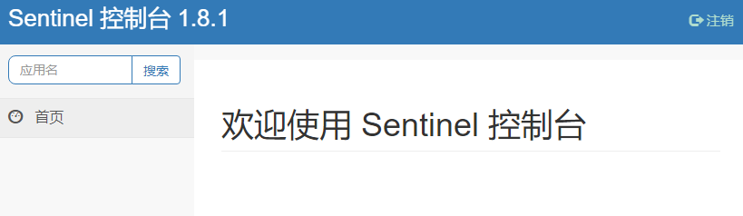
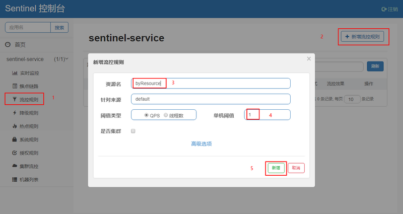
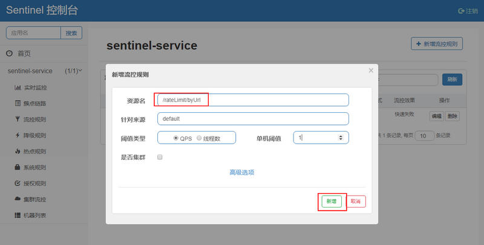

# Sentinel入门实例

[toc]


官方仓库：

> https://github.com/alibaba/Sentinel

本文转自：[Spring Cloud Alibaba：Sentinel实现熔断与限流_macrozheng](https://segmentfault.com/a/1190000021377368)

## 资源合辑

> - [Wiki_Sentinel](https://github.com/alibaba/Sentinel/wiki/%E4%BB%8B%E7%BB%8D)
> - [Awesome Sentinel_sentinel](https://github.com/alibaba/Sentinel/blob/master/doc/awesome-sentinel.md)


## 推荐阅读

> - [Sentinel Example_spring-cloud-alibaba](https://github.com/alibaba/spring-cloud-alibaba/blob/master/spring-cloud-alibaba-examples/sentinel-example/sentinel-core-example/readme-zh.md)
> - 
> - [Spring Cloud 系列之 Alibaba Sentinel 服务哨兵](https://www.cnblogs.com/mrhelloworld/p/sentinel.html)
> - [spring cloud alibaba教程：Sentinel的使用_方志鹏](https://www.fangzhipeng.com/springcloud/2019/06/02/sc-sentinel.html)
> - [Spring Cloud Alibaba：Sentinel实现熔断与限流_macrozheng](https://segmentfault.com/a/1190000021377368)
> - [Sentinel 控制台监控数据持久化【MySQL】](https://www.cnblogs.com/cdfive2018/p/9838577.html) 


## 概述


### 1.什么是Sentinel

随着微服务的流行，服务和服务之间的稳定性变得越来越重要。Sentinel 以流量为切入点，从流量控制、熔断降级、系统负载保护等多个维度保护服务的稳定性。

Sentinel 具有以下特征:

- **丰富的应用场景**：Sentinel 承接了阿里巴巴近 10 年的双十一大促流量的核心场景，例如秒杀（即突发流量控制在系统容量可以承受的范围）、消息削峰填谷、集群流量控制、实时熔断下游不可用应用等。
- **完备的实时监控**：Sentinel 同时提供实时的监控功能。您可以在控制台中看到接入应用的单台机器秒级数据，甚至 500 台以下规模的集群的汇总运行情况。
- **广泛的开源生态**：Sentinel 提供开箱即用的与其它开源框架/库的整合模块，例如与 Spring Cloud、Dubbo、gRPC 的整合。您只需要引入相应的依赖并进行简单的配置即可快速地接入 Sentinel。
- **完善的 SPI 扩展点**：Sentinel 提供简单易用、完善的 SPI 扩展接口。您可以通过实现扩展接口来快速地定制逻辑。例如定制规则管理、适配动态数据源等。


Sentinel 的主要特性：


Sentinel 分为两个部分:

- 核心库（Java 客户端）不依赖任何框架/库，能够运行于所有 Java 运行时环境，同时对 Dubbo / Spring Cloud 等框架也有较好的支持。
- 控制台（Dashboard）基于 Spring Boot 开发，打包后可以直接运行，不需要额外的 Tomcat 等应用容器。


## 一、安装Sentinel控制台

Sentinel控制台是一个轻量级的控制台应用，它可用于实时查看单机资源监控及集群资源汇总，并提供了一系列的规则管理功能，如流控规则、降级规则、热点规则等。


（1）下载

去官方仓库版本发布页下载，这里下载的是 [sentinel-dashboard-1.8.1.jar](https://github.com/alibaba/Sentinel/releases/download/1.8.1/sentinel-dashboard-1.8.1.jar)

> https://github.com/alibaba/Sentinel/releases


（2）运行

在命令行执行如下命令，即可运行Sentinel控制台

```bash
java -jar sentinel-dashboard-1.8.1.jar
```


（3）登录

启动成功之后，使用 用户名密码`sentinel/sentinel`访问如下地址

> http://localhost:8080/





## 二、Sentinel入门实例


### 1.父工程Pom.xml

在父工程中加入 

```xml
	<properties>
        <spring-boot.version>2.3.1.RELEASE</spring-boot.version>
        <spring-cloud.version>Hoxton.SR5</spring-cloud.version>
        <spring-cloud-alibaba.version>2.2.5.RELEASE</spring-cloud-alibaba.version>
    </properties>

    <dependencyManagement>
        <dependencies>
            <dependency>
                <groupId>org.springframework.boot</groupId>
                <artifactId>spring-boot-dependencies</artifactId>
                <version>${spring-boot.version}</version>
                <type>pom</type>
                <scope>import</scope>
            </dependency>
            <dependency>
                <groupId>org.springframework.cloud</groupId>
                <artifactId>spring-cloud-dependencies</artifactId>
                <version>${spring-cloud.version}</version>
                <type>pom</type>
                <scope>import</scope>
            </dependency>
            <dependency>
                <groupId>com.alibaba.cloud</groupId>
                <artifactId>spring-cloud-alibaba-dependencies</artifactId>
                <version>${spring-cloud-alibaba.version}</version>
                <type>pom</type>
                <scope>import</scope>
            </dependency>
        </dependencies>
    </dependencyManagement>
```


### 2.引入依赖

```xml
<?xml version="1.0" encoding="UTF-8"?>
<project xmlns="http://maven.apache.org/POM/4.0.0"
         xmlns:xsi="http://www.w3.org/2001/XMLSchema-instance"
         xsi:schemaLocation="http://maven.apache.org/POM/4.0.0 http://maven.apache.org/xsd/maven-4.0.0.xsd">
    <parent>
        <artifactId>spring-cloud-sample</artifactId>
        <groupId>com.ray.study.sample</groupId>
        <version>1.0-SNAPSHOT</version>
    </parent>
    <modelVersion>4.0.0</modelVersion>

    <artifactId>sample-cb-sentinel</artifactId>


    <dependencies>
        <dependency>
            <groupId>org.springframework.boot</groupId>
            <artifactId>spring-boot-starter-web</artifactId>
        </dependency>
        <dependency>
            <groupId>com.alibaba.cloud</groupId>
            <artifactId>spring-cloud-starter-alibaba-nacos-discovery</artifactId>
        </dependency>
        <dependency>
            <groupId>com.alibaba.cloud</groupId>
            <artifactId>spring-cloud-starter-alibaba-sentinel</artifactId>
        </dependency>
    </dependencies>

</project>
```


### 3.修改配置

#### 3.1 启动类

在启动类上

> - 添加`@EnableDiscoveryClient`注解可启用服务发现

```java
@EnableDiscoveryClient
@SpringBootApplication
public class CircuitBreakerSentinelApplication {

    public static void main(String[] args) {
        SpringApplication.run(CircuitBreakerSentinelApplication.class, args);
    }
}
```


#### 3.2  application.yml

```yml
server:
  port: 8086 #运行端口号
spring:
  application:
    name: consumer-cb-sentinel #指定服务名
  cloud:
    nacos:
      discovery:
        server-addr: localhost:8848
    sentinel:
      transport:
        dashboard: localhost:8080 #配置sentinel dashboard地址
        port: 8087

service-url:
  user-service: http://nacos-user-service

management:
  endpoints:
    web:
      exposure:
        include: '*'
```


### 4.业务实现

限流测试类

```java
@RestController
@RequestMapping("/rateLimit")
public class RateLimitController {

    /**
     * 按资源名称限流，需要指定限流处理逻辑
     */
    @GetMapping("/byResource")
    @SentinelResource(value = "byResource", blockHandler = "handleException")
    public String byResource() {
        return "按资源名称限流";
    }

    /**
     * 按URL限流，有默认的限流处理逻辑
     */
    @GetMapping("/byUrl")
    @SentinelResource(value = "byUrl", blockHandler = "handleException")
    public String byUrl() {
        return "按url限流";
    }

    public String handleException(BlockException exception) {
        return exception.getClass().getCanonicalName();
    }

}
```


### 5.启动服务

（1）参照  [SpringCloud_Discovery_02_Nacos入门实例](../../sample-discovery/doc/SpringCloud_Discovery_02_Nacos入门实例.md)  来启动 nacos-server 注册与配置中心

（2）启动 sentinel-dashboard 

（3）启动 CircuitBreakerSentinelApplication


### 6.效果演示

#### 6.1 根据资源名称限流

> 我们可以根据@SentinelResource注解中定义的value（资源名称）来进行限流操作，但是需要指定限流处理逻辑。

（1）访问 sentinel-dashboard，  可进行流控规则的配置

（2）由于Sentinel采用的懒加载规则，需要我们先访问下接口，Sentinel控制台中才会有对应服务信息，我们先访问下该接口：[http://localhost](http://localhost/):8401/rateLimit/byResource

（3）在Sentinel控制台根据`@SentinelResource`注解的value值来配置流控规则




（4）快速访问上面的接口，可以发现返回了自己定义的限流处理信息：


#### 6.2 根据URL限流

> 我们还可以通过访问的URL来限流，会返回默认的限流处理信息。

（1）在Sentinel控制台配置流控规则，使用访问的URL：



（2）多次访问该接口，会返回默认的限流处理结果：[http://localhost](http://localhost/):8401/rateLimit/byUrl


#### 6.3 熔断


