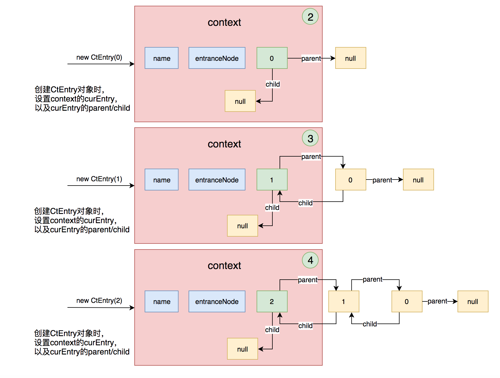

# Sentinel源码分析

[toc]

本文转自：

> - [Sentinel原理：调用链_all4you/sentinel-tutorial](https://github.com/all4you/sentinel-tutorial/blob/master/sentinel-principle/sentinel-slot-chain/sentinel-slot-chain.md)
> - [阿里 Sentinel 源码解析_javadoop](https://www.javadoop.com/post/sentinel)

## 资源合辑

> - [Wiki_Sentinel](https://github.com/alibaba/Sentinel/wiki/%E4%BB%8B%E7%BB%8D)
> - [Awesome Sentinel_sentinel](https://github.com/alibaba/Sentinel/blob/master/doc/awesome-sentinel.md)

## 推荐阅读

> - [https://github.com/all4you/sentinel-tutorial](https://github.com/all4you/sentinel-tutorial)
> - [阿里 Sentinel 源码解析_javadoop](https://www.javadoop.com/post/sentinel)

## 一、概览

在 Sentinel 里面，所有的资源都对应一个资源名称（`resourceName`），每次资源调用都会创建一个 `Entry` 对象。Entry 可以通过对主流框架的适配自动创建，也可以通过注解的方式或调用 `SphU` API 显式创建。Entry 创建的时候，同时也会创建一系列功能插槽（slot chain），这些插槽有不同的职责，例如:

- `NodeSelectorSlot` 负责收集资源的路径，并将这些资源的调用路径，以树状结构存储起来，用于根据调用路径来限流降级；
- `ClusterBuilderSlot` 则用于存储资源的统计信息以及调用者信息，例如该资源的 RT, QPS, thread count 等等，这些信息将用作为多维度限流，降级的依据；
- `StatisticSlot` 则用于记录、统计不同纬度的 runtime 指标监控信息；
- `FlowSlot` 则用于根据预设的限流规则以及前面 slot 统计的状态，来进行流量控制；
- `AuthoritySlot` 则根据配置的黑白名单和调用来源信息，来做黑白名单控制；
- `DegradeSlot` 则通过统计信息以及预设的规则，来做熔断降级；
- `SystemSlot` 则通过系统的状态，例如 load1 等，来控制总的入口流量；

总体的框架如下:


## 二、请求响应概览

### 1. 时序图


### 2.核心类图


### 3.Sentinel用法示例

官方文档中，它的最简单的使用是下面这样的，这里用了 try-with-resource 的写法：

```java

try (Entry entry = SphU.entry("HelloWorld")) {
    // Your business logic here.
    System.out.println("hello world");
} catch (BlockException e) {
    // Handle rejected request.
    e.printStackTrace();
}
```

当然，Sentinel也支持通过注解的方式来定义资源，可参见上一篇：

```java
@RestController
@RequestMapping("/rateLimit")
public class RateLimitController {

    /**
     * 按资源名称限流，需要指定限流处理逻辑
     */
    @GetMapping("/byResource")
    @SentinelResource(value = "byResource", blockHandler = "handleException")
    public String byResource() {
        return "按资源名称限流";
    }

    /**
     * 按URL限流，有默认的限流处理逻辑
     */
    @GetMapping("/byUrl")
    @SentinelResource(value = "byUrl", blockHandler = "handleException")
    public String byUrl() {
        return "按url限流";
    }

    public String handleException(BlockException exception) {
        return exception.getClass().getCanonicalName();
    }

}

```

### 3.请求响应流程

#### 3.1 通过切面处理注解

对于 `@SentinelResource`注解的处理是通过切面`SentinelResourceAspect`来完成的，在此切面中，对注解的处理逻辑与上述 try-with-resource 的写法一致：

```java
@Aspect
public class SentinelResourceAspect extends AbstractSentinelAspectSupport {

    @Pointcut("@annotation(com.alibaba.csp.sentinel.annotation.SentinelResource)")
    public void sentinelResourceAnnotationPointcut() {
    }

    @Around("sentinelResourceAnnotationPointcut()")
    public Object invokeResourceWithSentinel(ProceedingJoinPoint pjp) throws Throwable {
        Method originMethod = resolveMethod(pjp);

        // 1.获取注解，并解析出相关属性
        SentinelResource annotation = originMethod.getAnnotation(SentinelResource.class);
        if (annotation == null) {
            // Should not go through here.
            throw new IllegalStateException("Wrong state for SentinelResource annotation");
        }
        String resourceName = getResourceName(annotation.value(), originMethod);
        EntryType entryType = annotation.entryType();
        int resourceType = annotation.resourceType();
        Entry entry = null;
        try {
            // 2.调用 entry 方法，进入拦截器链中进行各个规则的检查
            entry = SphU.entry(resourceName, resourceType, entryType, pjp.getArgs());
            // 3.执行被保护的业务逻辑
            return pjp.proceed();
        } catch (BlockException ex) {
            // 4.若规则检查没有通过，则尝试执行配置的 blockHandler 方法
            return handleBlockException(pjp, annotation, ex);
        } catch (Throwable ex) {
            Class<? extends Throwable>[] exceptionsToIgnore = annotation.exceptionsToIgnore();
            // The ignore list will be checked first.
            if (exceptionsToIgnore.length > 0 && exceptionBelongsTo(ex, exceptionsToIgnore)) {
                throw ex;
            }
            if (exceptionBelongsTo(ex, annotation.exceptionsToTrace())) {
                traceException(ex);
                // 5.若服务出现异常，则尝试执行配置的 fallback 方法
                return handleFallback(pjp, annotation, ex);
            }

            // No fallback function can handle the exception, so throw it out.
            throw ex;
        } finally {
            if (entry != null) {
                entry.exit(1, pjp.getArgs());
            }
        }
    }
}


```

#### 3.2 获取 Context 和过滤器链

```java

    private Entry entryWithPriority(ResourceWrapper resourceWrapper, int count, boolean prioritized, Object... args)
        throws BlockException {
        // 1.获取Context
        // 1.1 从ThreadLocal中获取Context
        Context context = ContextUtil.getContext();
        if (context instanceof NullContext) {
            // The {@link NullContext} indicates that the amount of context has exceeded the threshold,
            // so here init the entry only. No rule checking will be done.
            return new CtEntry(resourceWrapper, null, context);
        }

        // 1.2 使用默认的Context
        if (context == null) {
            // Using default context.
            context = InternalContextUtil.internalEnter(Constants.CONTEXT_DEFAULT_NAME);
        }

        // Global switch is close, no rule checking will do.
        if (!Constants.ON) {
            return new CtEntry(resourceWrapper, null, context);
        }

        // 2.加载过滤器链
        ProcessorSlot<Object> chain = lookProcessChain(resourceWrapper);

        /*
         * Means amount of resources (slot chain) exceeds {@link Constants.MAX_SLOT_CHAIN_SIZE},
         * so no rule checking will be done.
         */
        if (chain == null) {
            return new CtEntry(resourceWrapper, null, context);
        }

        Entry e = new CtEntry(resourceWrapper, chain, context);
        try {
            // 3.执行过滤器链
            chain.entry(context, resourceWrapper, null, count, prioritized, args);
        } catch (BlockException e1) {
            e.exit(count, args);
            throw e1;
        } catch (Throwable e1) {
            // This should not happen, unless there are errors existing in Sentinel internal.
            RecordLog.info("Sentinel unexpected exception", e1);
        }
        return e;
    }
```

##### 3.2.1 获取Context

```java
/**
 * 从当前线程中获取Context的工具类
 *
 * <p>
 *  每一个SphU#entry() or SphO#entry() 都应该出一个Context中，如果没有显示调用 ContextUtil#enter() ，则会使用默认的
 *  Context
 * </p>
 *
 * @author jialiang.linjl
 * @author leyou(lihao)
 * @author Eric Zhao
 */
public class ContextUtil {

    /**
     * Store the context in ThreadLocal for easy access.
     */
    private static ThreadLocal<Context> contextHolder = new ThreadLocal<>();

    /**
     * Holds all {@link EntranceNode}. Each {@link EntranceNode} is associated with a distinct context name.
     */
    private static volatile Map<String, DefaultNode> contextNameNodeMap = new HashMap<>();

    private static final ReentrantLock LOCK = new ReentrantLock();
    private static final Context NULL_CONTEXT = new NullContext();

    static {
        // Cache the entrance node for default context.
        initDefaultContext();
    }

    private static void initDefaultContext() {
        String defaultContextName = Constants.CONTEXT_DEFAULT_NAME;
        EntranceNode node = new EntranceNode(new StringResourceWrapper(defaultContextName, EntryType.IN), null);
        Constants.ROOT.addChild(node);
        contextNameNodeMap.put(defaultContextName, node);
    }
    
        public static Context enter(String name, String origin) {
        if (Constants.CONTEXT_DEFAULT_NAME.equals(name)) {
            throw new ContextNameDefineException(
                "The " + Constants.CONTEXT_DEFAULT_NAME + " can't be permit to defined!");
        }
        return trueEnter(name, origin);
    }

    protected static Context trueEnter(String name, String origin) {
        Context context = contextHolder.get();
        if (context == null) {
            Map<String, DefaultNode> localCacheNameMap = contextNameNodeMap;
            DefaultNode node = localCacheNameMap.get(name);
            if (node == null) {
                if (localCacheNameMap.size() > Constants.MAX_CONTEXT_NAME_SIZE) {
                    setNullContext();
                    return NULL_CONTEXT;
                } else {
                    LOCK.lock();
                    try {
                        node = contextNameNodeMap.get(name);
                        if (node == null) {
                            if (contextNameNodeMap.size() > Constants.MAX_CONTEXT_NAME_SIZE) {
                                setNullContext();
                                return NULL_CONTEXT;
                            } else {
                                node = new EntranceNode(new StringResourceWrapper(name, EntryType.IN), null);
                                // Add entrance node.
                                Constants.ROOT.addChild(node);

                                Map<String, DefaultNode> newMap = new HashMap<>(contextNameNodeMap.size() + 1);
                                newMap.putAll(contextNameNodeMap);
                                newMap.put(name, node);
                                contextNameNodeMap = newMap;
                            }
                        }
                    } finally {
                        LOCK.unlock();
                    }
                }
            }
            context = new Context(node, name);
            context.setOrigin(origin);
            contextHolder.set(context);
        }

        return context;
    }
    
}
```

因此，当没有在程序中显示调用`Context#enter()` 方法，则会 `1.1 处` 获取的Context就为空，会进入到 `1.2处` ，使用默认的Context，其实就是将一个默认的 `EntranceNode` 的节点加入到Context中，并将Context放入 ThreadLocal

##### 3.2.2 加载过滤器链

（1）通过SPI的方式加载过滤器链

通过注解 `@SentinelResource`或者其他方式定义的资源，会被包装成一个 `ResourceWrapper`，对于每一个 ResourceWrapper 都会创建一个对应的过滤器链，并缓存起来。

```java
    ProcessorSlot<Object> lookProcessChain(ResourceWrapper resourceWrapper) {
        ProcessorSlotChain chain = chainMap.get(resourceWrapper);
        if (chain == null) {
            synchronized (LOCK) {
                chain = chainMap.get(resourceWrapper);
                if (chain == null) {
                    // Entry size limit.
                    if (chainMap.size() >= Constants.MAX_SLOT_CHAIN_SIZE) {
                        return null;
                    }

                    // 创建过滤器链
                    chain = SlotChainProvider.newSlotChain();
                    Map<ResourceWrapper, ProcessorSlotChain> newMap = new HashMap<ResourceWrapper, ProcessorSlotChain>(
                        chainMap.size() + 1);
                    newMap.putAll(chainMap);
                    newMap.put(resourceWrapper, chain);
                    chainMap = newMap;
                }
            }
        }
        return chain;
    }

```

创建过滤器链时，会先通过SPI的方式，加载一个过滤器链的构建器，然后通过这个构建器来创建过滤器链

```java
public final class SlotChainProvider {

    private static volatile SlotChainBuilder slotChainBuilder = null;

    /**
     * The load and pick process is not thread-safe, but it's okay since the method should be only invoked
     * via {@code lookProcessChain} in {@link com.alibaba.csp.sentinel.CtSph} under lock.
     *
     * @return new created slot chain
     */
    public static ProcessorSlotChain newSlotChain() {
        if (slotChainBuilder != null) {
            return slotChainBuilder.build();
        }

        // Resolve the slot chain builder SPI.
        slotChainBuilder = SpiLoader.of(SlotChainBuilder.class).loadFirstInstanceOrDefault();

        if (slotChainBuilder == null) {
            // Should not go through here.
            RecordLog.warn("[SlotChainProvider] Wrong state when resolving slot chain builder, using default");
            slotChainBuilder = new DefaultSlotChainBuilder();
        } else {
            RecordLog.info("[SlotChainProvider] Global slot chain builder resolved: {}",
                slotChainBuilder.getClass().getCanonicalName());
        }
        return slotChainBuilder.build();
    }

    private SlotChainProvider() {}
}
```

构建器的实现类见`src/main/reosurces/META-INF/services`这个文件夹下的`com.alibaba.csp.sentinel.slotchain.SlotChainBuilder`文件：

```java
# Default slot chain builder
com.alibaba.csp.sentinel.slots.DefaultSlotChainBuilder
```

也就是说构建器实现类为：DefaultSlotChainBuilder

```java
@Spi(isDefault = true)
public class DefaultSlotChainBuilder implements SlotChainBuilder {

    @Override
    public ProcessorSlotChain build() {
        ProcessorSlotChain chain = new DefaultProcessorSlotChain();

        List<ProcessorSlot> sortedSlotList = SpiLoader.of(ProcessorSlot.class).loadInstanceListSorted();
        for (ProcessorSlot slot : sortedSlotList) {
            if (!(slot instanceof AbstractLinkedProcessorSlot)) {
                RecordLog.warn("The ProcessorSlot(" + slot.getClass().getCanonicalName() + ") is not an instance of AbstractLinkedProcessorSlot, can't be added into ProcessorSlotChain");
                continue;
            }

            chain.addLast((AbstractLinkedProcessorSlot<?>) slot);
        }

        return chain;
    }
}
```

构建过滤器链时，依旧是通过SPI的方式来获取一组过滤器（也即 ProcessorSlot 处理器槽，等效于过滤器），然后按顺序添加到过滤器链中，这一组过滤器的实现类见`src/main/reosurces/META-INF/services`这个文件夹下的`com.alibaba.csp.sentinel.slotchain.ProcessorSlot`文件：

```java
# Sentinel default ProcessorSlots
com.alibaba.csp.sentinel.slots.nodeselector.NodeSelectorSlot
com.alibaba.csp.sentinel.slots.clusterbuilder.ClusterBuilderSlot
com.alibaba.csp.sentinel.slots.logger.LogSlot
com.alibaba.csp.sentinel.slots.statistic.StatisticSlot
com.alibaba.csp.sentinel.slots.block.authority.AuthoritySlot
com.alibaba.csp.sentinel.slots.system.SystemSlot
com.alibaba.csp.sentinel.slots.block.flow.FlowSlot
com.alibaba.csp.sentinel.slots.block.degrade.DegradeSlot
```

也就是说，过滤器链是由如上过滤器从前往后组成。


（2）过滤器链其实是一个单向链表，并添加有头尾指针

```java
public class DefaultProcessorSlotChain extends ProcessorSlotChain {
     AbstractLinkedProcessorSlot<?> first;
     AbstractLinkedProcessorSlot<?> end = first;
}

public abstract class ProcessorSlotChain extends AbstractLinkedProcessorSlot<Object> {
    
}

public abstract class AbstractLinkedProcessorSlot<T> implements ProcessorSlot<T> {
        private AbstractLinkedProcessorSlot<?> next = null;
}
```

#### 3.3 执行过滤器链

加载好当前资源对应的过滤器链之后，就会执行过滤器链：从头结点开始依次执行过滤器中节点。

```java
public class DefaultProcessorSlotChain extends ProcessorSlotChain {
    AbstractLinkedProcessorSlot<?> first;
    AbstractLinkedProcessorSlot<?> end;
    
        @Override
    public void entry(Context context, ResourceWrapper resourceWrapper, Object t, int count, boolean prioritized, Object... args)
        throws Throwable {
        // 执行头节点
        first.transformEntry(context, resourceWrapper, t, count, prioritized, args);
    }
}
```


执行到相应过滤器节点中时，可通过 `AbstractLinkedProcessorSlot#fireEntry()`来触发下一个过滤器的执行：

```java
public abstract class AbstractLinkedProcessorSlot<T> implements ProcessorSlot<T> {

    private AbstractLinkedProcessorSlot<?> next = null;
    
    @Override
    public void fireEntry(Context context, ResourceWrapper resourceWrapper, Object obj, int count, boolean prioritized, Object... args)
        throws Throwable {
        if (next != null) {
            next.transformEntry(context, resourceWrapper, obj, count, prioritized, args);
        }
    }
}
```


这样就会从前往后触发每个过滤器的执行，每个过滤器都有相应的职责：

> - `NodeSelectorSlot` 负责收集资源的路径，并将这些资源的调用路径，以树状结构存储起来，用于根据调用路径来限流降级；
> - `ClusterBuilderSlot` 则用于存储资源的统计信息以及调用者信息，例如该资源的 RT, QPS, thread count 等等，这些信息将用作为多维度限流，降级的依据；
> - `StatistcSlot` 则用于记录，统计不同纬度的 runtime 信息；
> - `FlowSlot` 则用于根据预设的限流规则，以及前面 slot 统计的状态，来进行限流；
> - `AuthorizationSlot` 则根据黑白名单，来做黑白名单控制；
> - `DegradeSlot` 则通过统计信息，以及预设的规则，来做熔断降级；
> - `SystemSlot` 则通过系统的状态，例如 load1 等，来控制总的入口流量；

其中部分过滤器会进行资源相应的规则校验，若某个规则校验不通过，则会抛出 BlockException，从而进入到切面中去执行注解中定义的blockHandler方法来进行相应的容错处理。

BlockException 的类图如下：


Sentinel 的功能主要就是通过这一个一个的过滤器来实现的，下面我们将针对这些过滤器来进行分析:

> 转自：


## 三、NodeSelectorSlot

`NodeSelectorSlot` 是用来构造调用链的，具体的是将资源的调用路径，封装成一个一个的节点，再组成一个树状的结构来形成一个完整的调用链， `NodeSelectorSlot`是所有Slot中最关键也是最复杂的一个Slot，这里涉及到以下几个核心的概念：

- Resource

资源是 Sentinel 的关键概念。它可以是 Java 应用程序中的任何内容，例如，由应用程序提供的服务，或由应用程序调用的其它服务，甚至可以是一段代码。

只要通过 Sentinel API 定义的代码，就是资源，能够被 Sentinel 保护起来。大部分情况下，可以使用方法签名，URL，甚至服务名称作为资源名来标示资源。

简单来说，资源就是 Sentinel 用来保护系统的一个媒介。源码中用来包装资源的类是： `com.alibaba.csp.sentinel.slotchain.ResourceWrapper`，他有两个子类： `StringResourceWrapper` 和 `MethodResourceWrapper`，通过名字就知道可以将一段字符串或一个方法包装为一个资源。

打个比方，我有一个服务A，请求非常多，经常会被陡增的流量冲垮，为了防止这种情况，简单的做法，我们可以定义一个 Sentinel 的资源，通过该资源来对请求进行调整，使得允许通过的请求不会把服务A搞崩溃。


每个资源的状态也是不同的，这取决于资源后端的服务，有的资源可能比较稳定，有的资源可能不太稳定。那么在整个调用链中，Sentinel 需要对不稳定资源进行控制。当调用链路中某个资源出现不稳定，例如，表现为 timeout，或者异常比例升高的时候，则对这个资源的调用进行限制，并让请求快速失败，避免影响到其它的资源，最终导致雪崩的后果。

- Context

上下文是一个用来保存调用链当前状态的元数据的类，每次进入一个资源时，就会创建一个上下文。**并且相同的资源名只会创建一个上下文。**一个Context中包含了三个核心的对象：

1）当前调用链的根节点：EntranceNode

2）当前的入口：Entry

3）当前入口所关联的节点：Node

上下文中只会保存一个当前正在处理的入口Entry，另外还会保存调用链的根节点。**需要注意的是，每次进入一个新的资源时，都会创建一个新的上下文。**

- Entry

每次调用 `SphU#entry()` 都会生成一个Entry入口，该入口中会保存了以下数据：入口的创建时间，当前入口所关联的节点，当前入口所关联的调用源对应的节点。Entry是一个抽象类，他只有一个实现类，在CtSph中的一个静态类：CtEntry

- Node

节点是用来保存某个资源的各种实时统计信息的，他是一个接口，通过访问节点，就可以获取到对应资源的实时状态，以此为依据进行限流和降级操作。

可能看到这里，大家还是比较懵，这么多类到底有什么用，接下来就让我们更进一步，挖掘一下这些类的作用，在这之前，我先给大家展示一下他们之间的关系，如下图所示：


这里把几种Node的作用先大概介绍下：

| 节点          | 作用                                                         |
| :------------ | :----------------------------------------------------------- |
| StatisticNode | 执行具体的资源统计操作                                       |
| DefaultNode   | 该节点持有指定上下文中指定资源的统计信息，当在同一个上下文中多次调用entry方法时，该节点可能下会创建有一系列的子节点。 另外每个DefaultNode中会关联一个ClusterNode |
| ClusterNode   | 该节点中保存了资源的总体的运行时统计信息，包括rt，线程数，qps等等，相同的资源会全局共享同一个ClusterNode，不管他属于哪个上下文 |
| EntranceNode  | 该节点表示一棵调用链树的入口节点，通过他可以获取调用链树中所有的子节点 |

### 1.Context的创建与销毁

首先我们要清楚的一点就是，每次执行entry()方法，试图冲破一个资源时，都会生成一个上下文。这个上下文中会保存着调用链的根节点和当前的入口。

Context是通过ContextUtil创建的，具体的方法是trueEntry，代码如下：

```java
protected static Context trueEnter(String name, String origin) {
    // 先从ThreadLocal中获取
    Context context = contextHolder.get();
    if (context == null) {
        // 如果ThreadLocal中获取不到Context
        // 则根据name从map中获取根节点，只要是相同的资源名，就能直接从map中获取到node
        Map<String, DefaultNode> localCacheNameMap = contextNameNodeMap;
        DefaultNode node = localCacheNameMap.get(name);
        if (node == null) {
            // 省略部分代码
            try {
                LOCK.lock();
                node = contextNameNodeMap.get(name);
                if (node == null) {
                    // 省略部分代码
                    // 创建一个新的入口节点
                    node = new EntranceNode(new StringResourceWrapper(name, EntryType.IN), null);
                    Constants.ROOT.addChild(node);
                    // 省略部分代码
                }
            } finally {
                LOCK.unlock();
            }
        }
        // 创建一个新的Context，并设置Context的根节点，即设置EntranceNode
        context = new Context(node, name);
        context.setOrigin(origin);
        // 将该Context保存到ThreadLocal中去
        contextHolder.set(context);
    }
    return context;
}
```

上面的代码中我省略了部分代码，只保留了核心的部分。从源码中还是可以比较清晰的看出生成Context的过程：

- 1.先从ThreadLocal中获取，如果能获取到直接返回，如果获取不到则继续第2步
- 2.从一个static的map中根据上下文的名称获取，如果能获取到则直接返回，否则继续第3步
- 3.加锁后进行一次double check，如果还是没能从map中获取到，则创建一个EntranceNode，并把该EntranceNode添加到一个全局的ROOT节点中去，然后将该节点添加到map中去(这部分代码在上述代码中省略了)
- 4.根据EntranceNode创建一个上下文，并将该上下文保存到ThreadLocal中去，下一个请求可以直接获取

那保存在ThreadLocal中的上下文什么时候会清除呢？从代码中可以看到具体的清除工作在ContextUtil的exit方法中，当执行该方法时，会将保存在ThreadLocal中的context对象清除，具体的代码非常简单，这里就不贴代码了。

那ContextUtil.exit方法什么时候会被调用呢？有两种情况：一是主动调用ContextUtil.exit的时候，二是当一个入口Entry要退出，执行该Entry的trueExit方法的时候，此时会触发ContextUtil.exit的方法。但是有一个前提，就是当前Entry的父Entry为null时，此时说明该Entry已经是最顶层的根节点了，可以清除context。

### 2.调用链树

当在一个上下文中多次调用了 SphU#entry() 方法时，就会创建一棵调用链树。具体的代码在entry方法中创建CtEntry对象时：

```java
    CtEntry(ResourceWrapper resourceWrapper, ProcessorSlot<Object> chain, Context context) {
        super(resourceWrapper);
        this.chain = chain;
        this.context = context;

        // 设置上下文入口
        setUpEntryFor(context);
    }

    private void setUpEntryFor(Context context) {
        // The entry should not be associated to NullContext.
        if (context instanceof NullContext) {
            return;
        }
        // 获取「上下文」中上一次的入口
        this.parent = context.getCurEntry();
        if (parent != null) {
            // 然后将当前入口设置为上一次入口的子节点
            ((CtEntry) parent).child = this;
        }
        // 设置「上下文」的当前入口为该类本身
        context.setCurEntry(this);
    }
```


这里可能看代码没有那么直观，可以用一些图形来描述一下这个过程。

#### 2.1 构造树干

##### 2.1.1 创建context

context的创建在上面已经分析过了，初始化的时候，context中的curEntry属性是没有值的，如下图所示：


##### 2.1.2 创建Entry

每创建一个新的Entry对象时，都会重新设置context的curEntry，并将context原来的curEntry设置为该新Entry对象的父节点，如下图所示：




##### 2.1.3 退出Entry

某个Entry退出时，将会重新设置context的curEntry，当该Entry是最顶层的一个入口时，将会把ThreadLocal中保存的context也清除掉，如下图所示：


#### 2.2 构造叶子节点

上面的过程是构造了一棵调用链的树，但是这棵树只有树干，没有叶子，那叶子节点是在什么时候创建的呢？DefaultNode就是叶子节点，在叶子节点中保存着目标资源在当前状态下的统计信息。通过分析，我们知道了叶子节点是在NodeSelectorSlot的entry方法中创建的。具体的代码如下：

```java
	@Override
    public void entry(Context context, ResourceWrapper resourceWrapper, Object obj, int count, boolean prioritized, Object... args)
        throws Throwable {
        // 根据「上下文」的名称获取DefaultNode
        // 多线程环境下，每个线程都会创建一个context，
        // 只要资源名相同，则context的名称也相同，那么获取到的节点就相同  
        DefaultNode node = map.get(context.getName());
        if (node == null) {
            synchronized (this) {
                node = map.get(context.getName());
                if (node == null) {
                    // 如果当前「上下文」中没有该节点，则创建一个DefaultNode节点
                    node = new DefaultNode(resourceWrapper, null);
                    HashMap<String, DefaultNode> cacheMap = new HashMap<String, DefaultNode>(map.size());
                    cacheMap.putAll(map);
                    cacheMap.put(context.getName(), node);
                    map = cacheMap;
                    // Build invocation tree
                    // 将当前node作为「上下文」的最后一个节点的子节点添加进去
                    // 如果context的curEntry.parent.curNode为null，则添加到entranceNode中去
                    // 否则添加到context的curEntry.parent.curNode中去
                    ((DefaultNode) context.getLastNode()).addChild(node);
                }

            }
        }
        // 将该节点设置为「上下文」中的当前节点
        // 实际是将当前节点赋值给context中curEntry的curNode
        // 在Context的getLastNode中会用到在此处设置的curNode
        context.setCurNode(node);
        fireEntry(context, resourceWrapper, node, count, prioritized, args);
    }
```


上面的代码可以分解成下面这些步骤：
1）获取当前上下文对应的DefaultNode，如果没有的话会为当前的调用新生成一个DefaultNode节点，它的作用是对资源进行各种统计度量以便进行流控；
2）将新创建的DefaultNode节点，添加到context中，作为「entranceNode」或者「curEntry.parent.curNode」的子节点；
3）将DefaultNode节点，添加到context中，作为「curEntry」的curNode。

上面的第2步，不是每次都会执行。我们先看第3步，把当前DefaultNode设置为context的curNode，实际上是把当前节点赋值给context中curEntry的curNode，用图形表示就是这样：


多次创建不同的Entry，并且执行NodeSelectorSlot的entry方法后，就会变成这样一棵调用链树：


**PS：这里图中的node0，node1，node2可能是相同的node，因为在同一个context中从map中获取的node是同一个，这里只是为了表述的更清楚所以用了不同的节点名。**

#### 2.3 保存子节点

上面已经分析了叶子节点的构造过程，叶子节点是保存在各个Entry的curNode属性中的。

我们知道context中只保存了入口节点和当前Entry，那子节点是什么时候保存的呢，其实子节点就是上面代码中的第2步中保存的。

下面我们来分析上面的第2步的情况：

第一次调用NodeSelectorSlot的entry方法时，map中肯定是没有DefaultNode的，那就会进入第2步中，创建一个node，创建完成后会把该节点加入到context的lastNode的子节点中去。我们先看一下context的getLastNode方法：

```java
    public Node getLastNode() {
        // 如果curEntry不存在时，返回entranceNode
        // 否则返回curEntry的lastNode，
        // 需要注意的是curEntry的lastNode是获取的parent的curNode，
        // 如果每次进入的资源不同，就会每次都创建一个CtEntry，则parent为null，
        // 所以curEntry.getLastNode()也为null
        if (curEntry != null && curEntry.getLastNode() != null) {
            return curEntry.getLastNode();
        } else {
            return entranceNode;
        }
    }
```


代码中我们可以知道，lastNode的值可能是context中的entranceNode也可能是curEntry.parent.curNode，但是他们都是「DefaultNode」类型的节点，DefaultNode的所有子节点是保存在一个HashSet中的。

第一次调用getLastNode方法时，context中curEntry是null，因为curEntry是在第3步中才赋值的。所以，lastNode最初的值就是context的entranceNode。那么将node添加到entranceNode的子节点中去之后就变成了下面这样：


紧接着再进入一次，资源名不同，会再次生成一个新的Entry，上面的图形就变成下图这样：


此时再次调用context的getLastNode方法，因为此时curEntry的parent不再是null了，所以获取到的lastNode是curEntry.parent.curNode，在上图中可以很方便的看出，这个节点就是**node0**。那么把当前节点node1添加到lastNode的子节点中去，上面的图形就变成下图这样：


然后将当前node设置给context的curNode，上面的图形就变成下图这样：


假如再创建一个Entry，然后再进入一次不同的资源名，上面的图就变成下面这样：


至此NodeSelectorSlot的基本功能已经大致分析清楚了。

**PS：以上的分析是基于每次执行SphU.entry(name)时，资源名都是不一样的前提下。如果资源名都一样的话，那么生成的node都相同，则只会再第一次把node加入到entranceNode的子节点中去，其他的时候，只会创建一个新的Entry，然后替换context中的curEntry的值。**

## 四、ClusterBuilderSlot

NodeSelectorSlot的entry方法执行完之后，会调用fireEntry方法，此时会触发ClusterBuilderSlot的entry方法。

ClusterBuilderSlot的entry方法比较简单，具体代码如下：

```java
@Override
public void entry(Context context, ResourceWrapper resourceWrapper, DefaultNode node, int count, Object... args) throws Throwable {
    if (clusterNode == null) {
        synchronized (lock) {
            if (clusterNode == null) {
                // Create the cluster node.
                clusterNode = new ClusterNode(resourceWrapper.getName(), resourceWrapper.getResourceType());
                // 将clusterNode保存到全局的map中去
                HashMap<ResourceWrapper, ClusterNode> newMap = new HashMap<>(Math.max(clusterNodeMap.size(), 16));
                newMap.putAll(clusterNodeMap);
                newMap.put(node.getId(), clusterNode);

                clusterNodeMap = newMap;
            }
        }
    }
    // 将clusterNode塞到DefaultNode中去
    node.setClusterNode(clusterNode);

    // 省略部分代码

    fireEntry(context, resourceWrapper, node, count, args);
}
```


ClusterBuilderSlot的职责比较简单，主要做了两件事：

一、为每个资源创建一个clusterNode，然后把clusterNode塞到DefaultNode中去

二、将clusterNode保持到全局的map中去，用资源作为map的key

**PS：一个资源只有一个ClusterNode，但是可以有多个DefaultNode**


## 五、StatisticSlot

StatisticSlot负责来统计资源的实时状态，具体的代码如下：

```java
@Override
public void entry(Context context, ResourceWrapper resourceWrapper, DefaultNode node, int count, Object... args) throws Throwable {
    try {
        // 触发下一个Slot的entry方法
        fireEntry(context, resourceWrapper, node, count, args);
        // 如果能通过SlotChain中后面的Slot的entry方法，说明没有被限流或降级
        // 统计信息
        node.increaseThreadNum();
        node.addPassRequest();
        // 省略部分代码
    } catch (BlockException e) {
        context.getCurEntry().setError(e);
        // Add block count.
        node.increaseBlockedQps();
        // 省略部分代码
        throw e;
    } catch (Throwable e) {
        context.getCurEntry().setError(e);
        // Should not happen
        node.increaseExceptionQps();
        // 省略部分代码
        throw e;
    }
}

@Override
public void exit(Context context, ResourceWrapper resourceWrapper, int count, Object... args) {
    DefaultNode node = (DefaultNode)context.getCurNode();
    if (context.getCurEntry().getError() == null) {
        long rt = TimeUtil.currentTimeMillis() - context.getCurEntry().getCreateTime();
        if (rt > Constants.TIME_DROP_VALVE) {
            rt = Constants.TIME_DROP_VALVE;
        }
        node.rt(rt);
        // 省略部分代码
        node.decreaseThreadNum();
        // 省略部分代码
    }
    fireExit(context, resourceWrapper, count);
}
```


代码分成了两部分，第一部分是entry方法，该方法首先会触发后续slot的entry方法，即SystemSlot、FlowSlot、DegradeSlot等的规则，如果规则不通过，就会抛出BlockException，则会在node中统计被block的数量。反之会在node中统计通过的请求数和线程数等信息。第二部分是在exit方法中，当退出该Entry入口时，会统计rt的时间，并减少线程数。

这些统计的实时数据会被后续的校验规则所使用，具体的统计方式是通过 `滑动窗口` 来实现的。后面我会详细分析滑动窗口的原理。


## 六、SystemSlot

SystemSlot就是根据总的请求统计信息，来做流控，主要是防止系统被搞垮，具体的代码如下：

```java
@Override
public void entry(Context context, ResourceWrapper resourceWrapper, DefaultNode node, int count, Object... args)
    throws Throwable {
    SystemRuleManager.checkSystem(resourceWrapper);
    fireEntry(context, resourceWrapper, node, count, args);
}

public static void checkSystem(ResourceWrapper resourceWrapper) throws BlockException {
    // 省略部分代码
    // total qps
    double currentQps = Constants.ENTRY_NODE.successQps();
    if (currentQps > qps) {
        throw new SystemBlockException(resourceWrapper.getName(), "qps");
    }
    // total thread
    int currentThread = Constants.ENTRY_NODE.curThreadNum();
    if (currentThread > maxThread) {
        throw new SystemBlockException(resourceWrapper.getName(), "thread");
    }
    double rt = Constants.ENTRY_NODE.avgRt();
    if (rt > maxRt) {
        throw new SystemBlockException(resourceWrapper.getName(), "rt");
    }
    // 完全按照RT,BBR算法来
    if (highestSystemLoadIsSet && getCurrentSystemAvgLoad() > highestSystemLoad) {
        if (currentThread > 1 &&
            currentThread > Constants.ENTRY_NODE.maxSuccessQps() * Constants.ENTRY_NODE.minRt() / 1000) {
            throw new SystemBlockException(resourceWrapper.getName(), "load");
        }
    }
}
```


其中的Constants.ENTRY_NODE是一个全局的ClusterNode，该节点的值是在StatisticsSlot中进行统计的。

## 七、AuthoritySlot

AuthoritySlot做的事也比较简单，主要是根据黑白名单进行过滤，只要有一条规则校验不通过，就抛出异常。

```java
@Override
public void entry(Context context, ResourceWrapper resourceWrapper, DefaultNode node, int count, Object... args) throws Throwable {
    AuthorityRuleManager.checkAuthority(resourceWrapper, context, node, count);
    fireEntry(context, resourceWrapper, node, count, args);
}

public static void checkAuthority(ResourceWrapper resource, Context context, DefaultNode node, int count) throws BlockException {
    if (authorityRules == null) {
        return;
    }
    // 根据资源名称获取相应的规则
    List<AuthorityRule> rules = authorityRules.get(resource.getName());
    if (rules == null) {
        return;
    }
    for (AuthorityRule rule : rules) {
        // 只要有一条规则校验不通过，就抛出AuthorityException
        if (!rule.passCheck(context, node, count)) {
            throw new AuthorityException(context.getOrigin());
        }
    }
}
```


## 八、FlowSlot

FlowSlot主要是根据前面统计好的信息，与设置的限流规则进行匹配校验，如果规则校验不通过则进行限流，具体的代码如下：

```java
@Override
public void entry(Context context, ResourceWrapper resourceWrapper, DefaultNode node, int count, Object... args) throws Throwable {
    FlowRuleManager.checkFlow(resourceWrapper, context, node, count);
    fireEntry(context, resourceWrapper, node, count, args);
}

public static void checkFlow(ResourceWrapper resource, Context context, DefaultNode node, int count) throws BlockException {
    List<FlowRule> rules = flowRules.get(resource.getName());
    if (rules != null) {
        for (FlowRule rule : rules) {
            if (!rule.passCheck(context, node, count)) {
                throw new FlowException(rule.getLimitApp());
            }
        }
    }
}
```


## 九、DegradeSlot

DegradeSlot主要是根据前面统计好的信息，与设置的降级规则进行匹配校验，如果规则校验不通过则进行降级，具体的代码如下：

```java
@Override
public void entry(Context context, ResourceWrapper resourceWrapper, DefaultNode node, int count, Object... args) throws Throwable {
    DegradeRuleManager.checkDegrade(resourceWrapper, context, node, count);
    fireEntry(context, resourceWrapper, node, count, args);
}

public static void checkDegrade(ResourceWrapper resource, Context context, DefaultNode node, int count) throws BlockException {
    List<DegradeRule> rules = degradeRules.get(resource.getName());
    if (rules != null) {
        for (DegradeRule rule : rules) {
            if (!rule.passCheck(context, node, count)) {
                throw new DegradeException(rule.getLimitApp());
            }
        }
    }
}
```


## 总结

sentinel的限流降级等功能，主要是通过一个SlotChain实现的。在链式插槽中，有7个核心的Slot，这些Slot各司其职，可以分为以下几种类型：

一、进行资源调用路径构造的NodeSelectorSlot和ClusterBuilderSlot

二、进行资源的实时状态统计的StatisticsSlot

三、进行系统保护，限流，降级等规则校验的SystemSlot、AuthoritySlot、FlowSlot、DegradeSlot

后面几个Slot依赖于前面几个Slot统计的结果。至此，每种Slot的功能已经基本分析清楚了。