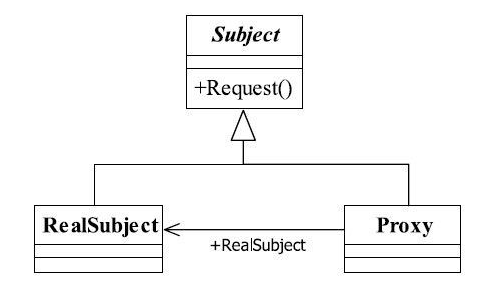

# Spring源码分析_04_AOP

[toc]

## 推荐阅读

> - [Spring 源码学习(八) AOP 使用和实现原理](http://www.justdojava.com/2019/07/17/spring-analysis-note-8/)
> - [SpringBoot2 | Spring AOP 原理深度源码分析（八）](https://juejin.im/post/5ce4d8e451882533591d549a)
> - [Spring 源码学习(八) AOP 使用和实现原理](https://juejin.im/post/5d2f43ab5188257e302863de)
> - [Spring源码分析-AOP](https://binglau7.github.io/2017/12/18/Spring%E6%BA%90%E7%A0%81%E5%88%86%E6%9E%90-AOP/)

## 推荐项目

> - https://gitee.com/vip-augus/spring-analysis-note
> - https://github.com/MrSorrow/spring-framework

## 一、动态 AOP 使用示例

### 1. 创建用于拦截的 bean

创建用于拦截的 bean

```java
public class TestBean {

	private String testStr = "testStr";

	public void testAop() {
		// 被拦截的方法，简单打印
		System.out.println("I am the true aop bean");
	}
}

```


### 2.创建 Advisor

```java
@Aspect
public class TestBeanAspect {

	@Pointcut("execution(* *.testAop(..))")
	public void test() {

	}

	@Before("test()")
	public void beforeTest() {
		System.out.println("beforeTest");
	}

	@After("test()")
	public void afterTest() {
		System.out.println("afterTest");
	}

	@Around("test()")
	public Object aroundTest(ProceedingJoinPoint p) {
		System.out.println("brfore around");
		Object o = null;
		try {
			o = p.proceed();
		} catch (Throwable e) {
			e.printStackTrace();
		}
		System.out.println("after around");
		return o;
	}
}

```


### 3.创建配置文件

- src/test/resource/aop/TestBeanAspect-aop.xml

  ```
  <?xml version="1.0" encoding="UTF-8"?>
  <beans xmlns="http://www.springframework.org/schema/beans"
  	   xmlns:xsi="http://www.w3.org/2001/XMLSchema-instance"
  	   xmlns:aop="http://www.springframework.org/schema/aop"
  	   xsi:schemaLocation="http://www.springframework.org/schema/beans https://www.springframework.org/schema/beans/spring-beans-2.0.xsd
         http://www.springframework.org/schema/aop https://www.springframework.org/schema/aop/spring-aop-2.0.xsd">
  
  	<!--开启 AOP 功能-->
  	<aop:aspectj-autoproxy />
  
  	<bean id="testBean" class="com.ray.study.spring.aop.TestBean"/>
  
  	<bean class="com.ray.study.spring.aop.TestBeanAspect" />
  
  </beans>
  ```

  


### 4.测试

```
	@Test
	public void testAop() {
		ApplicationContext ctx = new ClassPathXmlApplicationContext("aop/TestBeanAspect.xml");
		TestBean bean = (TestBean) ctx.getBean("testBean");
		bean.testAop();
	}
```


输出日志：

```
brfore around
beforeTest
I am the true aop bean
after around
afterTest
```


## 二、基本概念与相关类图

### 1.基本概念

参考：
> - [Spring AOP(一) AOP基本概念](https://segmentfault.com/a/1190000018120725)

基本概念：

> - Join point: 连接点, 也是关注点，目标对象的目标方法
> - pointcut: 切点，匹配一系列连接点
> - Weaving：织入, 对关注点的增强过程叫做织入
> - Advice：即是增强,包括 Before 、After 等增强
> - Aspect： 切面,是横切关注点的模块化，包括连接点，切点，增强的一个载体.
> - Target object: 目标对象
> - AOP proxy: AOP 代理器，包括JDK动态代理器，和CGLIG 动态代理器
> - Proxy: 代理对象，由代理器创建的代理对象


简单来讲，整个 aspect 可以描述为:

> 满足 pointcut 规则的 joinpoint 会被添加相应的 advice 操作


SpringAOP 代理过程：


### 2.相关类图

参考：

> - [SpringBoot2 | Spring AOP 原理深度源码分析（八）](https://juejin.im/post/6844903848566325261#heading-2)


#### 2.1 advisorCreator

```plantuml
@startuml
interface BeanPostProcessor

interface InstantiationAwareBeanPostProcessor extends BeanPostProcessor

class ProxyProcessorSupport extends ProxyConfig implements Ordered, BeanClassLoaderAware, AopInfrastructureBean


interface SmartInstantiationAwareBeanPostProcessor extends InstantiationAwareBeanPostProcessor

abstract class AbstractAutoProxyCreator extends ProxyProcessorSupport implements SmartInstantiationAwareBeanPostProcessor, BeanFactoryAware

class BeanNameAutoProxyCreator extends AbstractAutoProxyCreator
abstract class AbstractAdvisorAutoProxyCreator extends AbstractAutoProxyCreator

class InfrastructureAdvisorAutoProxyCreator extends AbstractAdvisorAutoProxyCreator
class DefaultAdvisorAutoProxyCreator extends AbstractAdvisorAutoProxyCreator
class AspectJAwareAdvisorAutoProxyCreator extends AbstractAdvisorAutoProxyCreator

class AnnotationAwareAspectJAutoProxyCreator extends AspectJAwareAdvisorAutoProxyCreator


@enduml
```


> - AbstractAutoProxyCreator: Spring 为Spring AOP 模块暴露的可扩展抽象类，也是 AOP 中最核心的抽象类
> - AbstractAdvisorAutoProxyCreator: 扫描所有类，判断是否可以被代理，并寻找合适的增强类，以及生成代理类
> - AnnotationAwareAspectJAutoProxyCreator: 开启AOP功能后，该类会扫描所有@Aspect注释的类，生成对应的adviosr


#### 2.2 advisor

```plantuml
@startuml
interface PointcutAdvisor extends Advisor , Ordered
abstract class StaticMethodMatcherPointcutAdvisor extends StaticMethodMatcherPointcut implements PointcutAdvisor

interface InstantiationModelAwarePointcutAdvisor extends PointcutAdvisor

class InstantiationModelAwarePointcutAdvisorImpl implements InstantiationModelAwarePointcutAdvisor

abstract class AbstractPointcutAdvisor implements PointcutAdvisor

abstract class AbstractGenericPointcutAdvisor extends AbstractPointcutAdvisor
class AspectJExpressionPointcutAdvisor extends AbstractGenericPointcutAdvisor implements BeanFactoryAware
class RegexpMethodPointcutAdvisor extends AbstractGenericPointcutAdvisor
class NameMatchMethodPointcutAdvisor extends AbstractGenericPointcutAdvisor
class DefaultPointcutAdvisor extends AbstractGenericPointcutAdvisor

@enduml
```


#### 2.3 advice


```plantuml
@startuml
interface Interceptor extends Advice
interface BeforeAdvice extends Advice
interface DynamicIntroductionAdvice extends Advice
abstract class AbstractAspectJAdvice implements Advice
interface AfterAdvice extends Advice

interface MethodInterceptor extends Interceptor

interface IntroductionInterceptor extends MethodInterceptor, DynamicIntroductionAdvice
class DynamicAdvisedInterceptor implements MethodInterceptor

interface MethodBeforeAdvice extends BeforeAdvice
class AspectJMethodBeforeAdvice extends AbstractAspectJAdvice implements MethodBeforeAdvice


class AspectJAfterAdvice extends AbstractAspectJAdvice implements MethodInterceptor, AfterAdvice


@enduml
```


## 三、JDK动态代理与CGLIB动态代理

## 1.代理模式





### 2.1 JDK动态代理


### 2.2 CGLIB动态代理


## 四、AOP 代理对象的创建流程

主要涉及如下流程：
> (1) 容器创建过程中，注册或升级 AnnotationAwareAspectJAutoProxyCreator
> (2) Bean创建时，创建AOP代理
> 

### 1.注册或升级 AnnotationAwareAspectJAutoProxyCreator

```plantuml
@startuml

[-> AspectJAutoProxyBeanDefinitionParser++ :parse
AspectJAutoProxyBeanDefinitionParser -> AopNamespaceUtils++ #FFBBBB: registerAspectJAnnotationAutoProxyCreatorIfNecessary

AopNamespaceUtils -[#green]> AopConfigUtils++ : 1.registerAspectJAnnotationAutoProxyCreatorIfNecessary
AopConfigUtils->AopConfigUtils:registerOrEscalateApcAsRequired

AopConfigUtils --> AopNamespaceUtils
deactivate AopConfigUtils

AopNamespaceUtils -[#green]> AopNamespaceUtils: 2.useClassProxyingIfNecessary
AopNamespaceUtils -[#green]> AopNamespaceUtils: 3.registerComponentIfNecessary
AopNamespaceUtils --> AspectJAutoProxyBeanDefinitionParser
deactivate AopNamespaceUtils

[<-- AspectJAutoProxyBeanDefinitionParser

@enduml
```

> (1) 注册或升级 AnnotationAwareAspectJAutoProxyCreator 的 BeanDefinition
> (2) 处理 proxy-target-class 以及 expose-proxy 属性的处理
> (3) 注册组件并通知，便于监听器作进一步处理

#### 1.1 AOP 功能的开启

配置文件中的 `<aop:aspectj-autoproxy />` 标签开启了AOP功能

```java
public class AopNamespaceHandler extends NamespaceHandlerSupport {

	/**
	 * Register the {@link BeanDefinitionParser BeanDefinitionParsers} for the
	 * '{@code config}', '{@code spring-configured}', '{@code aspectj-autoproxy}'
	 * and '{@code scoped-proxy}' tags.
	 */
	@Override
	public void init() {
		// In 2.0 XSD as well as in 2.1 XSD.
		registerBeanDefinitionParser("config", new ConfigBeanDefinitionParser());
		registerBeanDefinitionParser("aspectj-autoproxy", new AspectJAutoProxyBeanDefinitionParser());
		registerBeanDefinitionDecorator("scoped-proxy", new ScopedProxyBeanDefinitionDecorator());

		// Only in 2.0 XSD: moved to context namespace as of 2.1
		registerBeanDefinitionParser("spring-configured", new SpringConfiguredBeanDefinitionParser());
	}

}
```

这个标签的解析器为 `AspectJAutoProxyBeanDefinitionParser` 


### 2.创建AOP代理

在容器创建过程中，注册了 AnnotationAwareAspectJAutoProxyCreator 的 BeanDefinition, 而在后续加载这个Bean时，由于此Bean实现了 BeanPostProcessor，因此会在其实例化时，调用其 postProcessAfterInstantiation 方法。

> - AbstractApplicationContext.refresh() -> finishBeanFactoryInitialization() 
> - DefaultListableBeanFactory.preInstantiateSingletons() -> getBean() -> doGetBean()
> - AbstractAutowireCapableBeanFactory.createBean() -> doCreateBean() -> initializeBean() -> applyBeanPostProcessorsAfterInitialization()
> - BeanPostProcessor.postProcessAfterInitialization()

也就是说AOP代理创建的入口为 AnnotationAwareAspectJAutoProxyCreator父类AbstractAutoProxyCreator的postProcessAfterInitialization 方法

```plantuml
@startuml

[-> AbstractAutoProxyCreator++ :postProcessAfterInitialization

AbstractAutoProxyCreator -> AbstractAutoProxyCreator: getCacheKey
AbstractAutoProxyCreator -> AbstractAutoProxyCreator++: wrapIfNecessary
AbstractAutoProxyCreator -> AbstractAdvisorAutoProxyCreator++:1.getAdvicesAndAdvisorsForBean
AbstractAdvisorAutoProxyCreator -> AbstractAdvisorAutoProxyCreator++: findEligibleAdvisors
AbstractAdvisorAutoProxyCreator -> AnnotationAwareAspectJAutoProxyCreator++: findCandidateAdvisors

AnnotationAwareAspectJAutoProxyCreator -> BeanFactoryAspectJAdvisorsBuilder++: buildAspectJAdvisors
BeanFactoryAspectJAdvisorsBuilder -> ReflectiveAspectJAdvisorFactory++:getAdvisors
return
return
return


AbstractAdvisorAutoProxyCreator -> AbstractAdvisorAutoProxyCreator++: findAdvisorsThatCanApply
AbstractAdvisorAutoProxyCreator -> AopUtils++:findAdvisorsThatCanApply
AopUtils -> AopUtils++: canApply
AopUtils -> AopUtils++: canApply
deactivate AopUtils
deactivate AopUtils
return

deactivate AbstractAdvisorAutoProxyCreator
deactivate AbstractAdvisorAutoProxyCreator

return


AbstractAutoProxyCreator -> AbstractAutoProxyCreator++:2.createProxy
AbstractAutoProxyCreator -> ProxyFactory++:getProxy
ProxyFactory -> AopProxy++: getProxy
AopProxy --> ProxyFactory
deactivate AopProxy

ProxyFactory --> AbstractAutoProxyCreator
deactivate AbstractAutoProxyCreator
deactivate AbstractAutoProxyCreator


[<-- AbstractAutoProxyCreator

@enduml
```

> (1) 获取符合条件的增强
> (2) 根据获取的增强创建 AOP代理
> (3) 根据AOP代理创建代理对象


