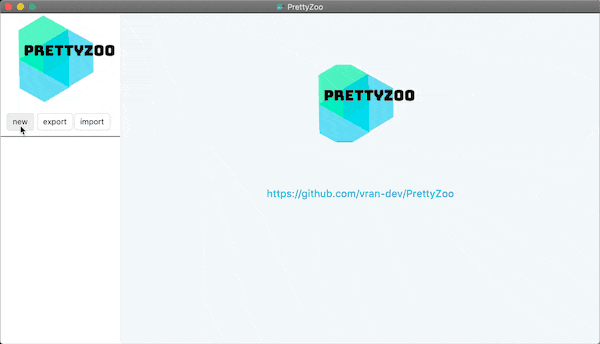
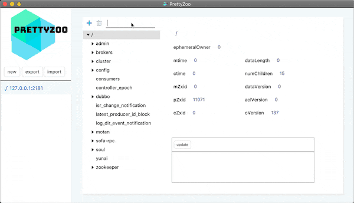
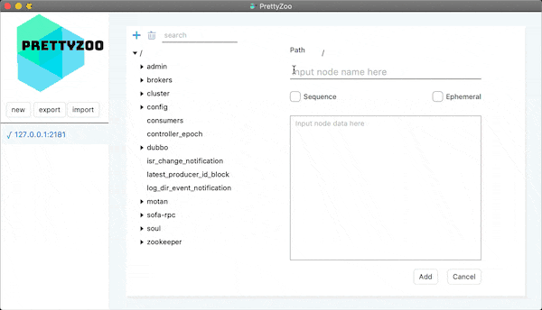
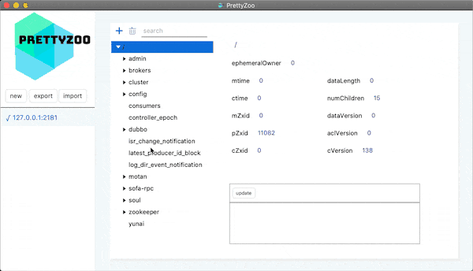

# Zookeeper 环境搭建

[toc]


## 推荐阅读

> - [ZooKeeper环境搭建（单机/集群）（转）](https://www.cnblogs.com/EasonJim/p/7482961.html)
> - [zookeeper 集群搭建](https://www.cnblogs.com/ysocean/p/9860529.html)
> - 
> - 


## 一、Zookeeper 伪集群搭建

### 1.下载并解压Zookeeper

前往 Zookeeper 版本发布页下载

> https://zookeeper.apache.org/releases.html


解压之后目录如下：

```bash

$ ls -l | awk '{print $9}'

bin/
conf/
docs/
lib/
LICENSE.txt
NOTICE.txt
README.md
README_packaging.md
```


### 2.创建Data目录和Log目录

创建数据存储目录和日志存储目录

```bash
$ mkdir data_1 data_2 data_3 logs_1 logs_2 logs_3
```

创建好之后，目录如下：

```bash
$ ls -l | awk '{print $9}'

bin/
conf/
data_1/              # 数据存储目录1
data_2/              # 数据存储目录2
data_3/              # 数据存储目录3
logs_1/              # 日志存储目录1
logs_2/              # 日志存储目录2
logs_3/              # 日志存储目录3
docs/
lib/
LICENSE.txt
NOTICE.txt
README.md
README_packaging.md
```


### 3.配置 zoo.cfg

（1）进入 conf 目录，复制 `zoo_sample.cfg` ，并分别重命名为`zoo1.cfg`、`zoo2.cfg`、`zoo3.cfg`。

（2）然后修改这三个配置文件，需要修改下面三个属性

> - `clientPort`
> - ` dataDir` ：属性值为数据存储目录
> - `server.{num}=ip/domain:port1:port2`

（3）修改后，各个配置文件内容如下：

- zoo1.cfg

  ```properties
  # The number of milliseconds of each tick
  tickTime=2000
  # The number of ticks that the initial 
  # synchronization phase can take
  initLimit=10
  # The number of ticks that can pass between 
  # sending a request and getting an acknowledgement
  syncLimit=5
  # the directory where the snapshot is stored.
  # do not use /tmp for storage, /tmp here is just 
  # example sakes.
  # 注意Windows上路径要用 \\
  dataDir=D:\\dev-env\\zookeeper\\apache-zookeeper-3.6.2-bin\\data_1
  
  #the location of the log file
  dataLogDir=D:\\dev-env\\zookeeper\\apache-zookeeper-3.6.2-bin\\logs_1
  
  # the port at which the clients will connect
  clientPort=2181
  # the maximum number of client connections.
  # increase this if you need to handle more clients
  #maxClientCnxns=60
  #
  # Be sure to read the maintenance section of the 
  # administrator guide before turning on autopurge.
  #
  # http://zookeeper.apache.org/doc/current/zookeeperAdmin.html#sc_maintenance
  #
  # The number of snapshots to retain in dataDir
  #autopurge.snapRetainCount=3
  # Purge task interval in hours
  # Set to "0" to disable auto purge feature
  #autopurge.purgeInterval=1
  
  ## Metrics Providers
  #
  # https://prometheus.io Metrics Exporter
  #metricsProvider.className=org.apache.zookeeper.metrics.prometheus.PrometheusMetricsProvider
  #metricsProvider.httpPort=7000
  #metricsProvider.exportJvmInfo=true
  
  server.1=localhost:2287:3387
  server.2=localhost:2288:3388
  server.3=localhost:2289:3389
  ```

  

- zoo2.cfg

  ```properties
  # The number of milliseconds of each tick
  tickTime=2000
  # The number of ticks that the initial 
  # synchronization phase can take
  initLimit=10
  # The number of ticks that can pass between 
  # sending a request and getting an acknowledgement
  syncLimit=5
  # the directory where the snapshot is stored.
  # do not use /tmp for storage, /tmp here is just 
  # example sakes.
  # 注意Windows上路径要用 \\
  dataDir=D:\\dev-env\\zookeeper\\apache-zookeeper-3.6.2-bin\\data_2
  
  #the location of the log file
  dataLogDir=D:\\dev-env\\zookeeper\\apache-zookeeper-3.6.2-bin\\logs_2
  
  # the port at which the clients will connect
  clientPort=2182
  # the maximum number of client connections.
  # increase this if you need to handle more clients
  #maxClientCnxns=60
  #
  # Be sure to read the maintenance section of the 
  # administrator guide before turning on autopurge.
  #
  # http://zookeeper.apache.org/doc/current/zookeeperAdmin.html#sc_maintenance
  #
  # The number of snapshots to retain in dataDir
  #autopurge.snapRetainCount=3
  # Purge task interval in hours
  # Set to "0" to disable auto purge feature
  #autopurge.purgeInterval=1
  
  ## Metrics Providers
  #
  # https://prometheus.io Metrics Exporter
  #metricsProvider.className=org.apache.zookeeper.metrics.prometheus.PrometheusMetricsProvider
  #metricsProvider.httpPort=7000
  #metricsProvider.exportJvmInfo=true
  
  server.0=localhost:2287:3387
  server.1=localhost:2288:3388
  server.2=localhost:2289:3389
  ```


- zoo3.cfg

  ```properties
  # The number of milliseconds of each tick
  tickTime=2000
  # The number of ticks that the initial 
  # synchronization phase can take
  initLimit=10
  # The number of ticks that can pass between 
  # sending a request and getting an acknowledgement
  syncLimit=5
  # the directory where the snapshot is stored.
  # do not use /tmp for storage, /tmp here is just 
  # example sakes.
  # 注意Windows上路径要用 \\
  dataDir=D:\\dev-env\\zookeeper\\apache-zookeeper-3.6.2-bin\\data_1
  
  #the location of the log file
  dataLogDir=D:\\dev-env\\zookeeper\\apache-zookeeper-3.6.2-bin\\logs_1
  
  # the port at which the clients will connect
  clientPort=2183
  # the maximum number of client connections.
  # increase this if you need to handle more clients
  #maxClientCnxns=60
  #
  # Be sure to read the maintenance section of the 
  # administrator guide before turning on autopurge.
  #
  # http://zookeeper.apache.org/doc/current/zookeeperAdmin.html#sc_maintenance
  #
  # The number of snapshots to retain in dataDir
  #autopurge.snapRetainCount=3
  # Purge task interval in hours
  # Set to "0" to disable auto purge feature
  #autopurge.purgeInterval=1
  
  ## Metrics Providers
  #
  # https://prometheus.io Metrics Exporter
  #metricsProvider.className=org.apache.zookeeper.metrics.prometheus.PrometheusMetricsProvider
  #metricsProvider.httpPort=7000
  #metricsProvider.exportJvmInfo=true
  
  server.0=localhost:2287:3387
  server.1=localhost:2288:3388
  server.2=localhost:2289:3389
  ```


各参数含义如下：

> - `tickTime`：基本事件单元，这个时间是作为Zookeeper服务器之间或客户端与服务器之间维持心跳的时间间隔，每隔tickTime时间就会发送一个心跳；最小 的session过期时间为2倍tickTime
> - `initLimit`：允许follower连接并同步到Leader的初始化连接时间，以tickTime为单位。当初始化连接时间超过该值，则表示连接失败。
> - `syncLimit`：表示Leader与Follower之间发送消息时，请求和应答时间长度。如果follower在设置时间内不能与leader通信，那么此follower将会被丢弃。
> - `dataDir`：存储内存中数据库快照的位置，除非另有说明，否则指向数据库更新的事务日志。注意：应该谨慎的选择日志存放的位置，使用专用的日志存储设备能够大大提高系统的性能，如果将日志存储在比较繁忙的存储设备上，那么将会很大程度上影像系统性能。
> - `clientPort`：监听客户端连接的端口
> - `server.{num}=ip/domain:port1:port2`：
>   - num：服务器的编号，对应 myid 文件
>   - ip/domain：服务器ip或域名，即集群中各个节点的地址
>   - port1：Leader选举的端口
>   - port2：Zookeeper服务器之间的通信端口


### 4.创建myid 文件

分别在 dataDir 指定的目录下，创建 myid 文件，文件内容为服务器编号

```bash
echo "1"> data_1/myid
echo "2"> data_2/myid
echo "3"> data_3/myid
```


### 5.启动服务端

进入 bin  目录，然后执行如下命令分别启动三个ZooKeeper实例：

```bash
$ ./zkServer.sh start ../conf/zoo1.cfg
$ ./zkServer.sh start ../conf/zoo2.cfg
$ ./zkServer.sh start ../conf/zoo3.cfg
```


关闭实例的命令：

```bash
$ ./zkServer.sh stop ../conf/zoo1.cfg
```


### 6.校验

通过jps命令可查看 zookeeper对应的进程，进程名为 QuorumPeerMain

```bash
$ jps
21632 QuorumPeerMain
17444 QuorumPeerMain
28280 QuorumPeerMain
```


通过`zkServer.sh status`命令可查看对应节点的状态

```bash
$ ./zkServer.sh status ../conf/zoo1.cfg
ZooKeeper JMX enabled by default
Using config: D:\dev-env\zookeeper\apache-zookeeper-3.6.2-bin\conf\zoo1.cfg
Client port found: 2181. Client address: localhost. Client SSL: false.
Mode: follower


$ ./zkServer.sh status ../conf/zoo2.cfg
ZooKeeper JMX enabled by default
Using config: D:\dev-env\zookeeper\apache-zookeeper-3.6.2-bin\conf\zoo2.cfg
Client port found: 2182. Client address: localhost. Client SSL: false.
Mode: leader


$ ./zkServer.sh status ../conf/zoo3.cfg
ZooKeeper JMX enabled by default
Using config: D:\dev-env\zookeeper\apache-zookeeper-3.6.2-bin\conf\zoo3.cfg
Client port found: 2183. Client address: localhost. Client SSL: false.
Mode: follower

```


可以看到有一台 leader，两台 follower


## 二、Zookeeper 图形化客户端工具

> - PrettyZoo：https://github.com/vran-dev/PrettyZoo
> - zkui：https://github.com/DeemOpen/zkui


推荐PrettyZoo，转自：[ZooKeeper GUI 客户端_芋道源码](http://www.iocoder.cn/Zookeeper/PrettyZoo/)

### 1.PrettyZoo 快速体验

#### 1.1 下载安装

可访问 https://github.com/vran-dev/PrettyZoo/releases 地址下载，然后安装即可


#### 1.2 连接 ZooKeeper Server




#### 1.3 搜索 ZooKeeper 节点




#### 1.4 添加 ZooKeeper 节点




#### 1.5 删除 ZooKeeper 节点




