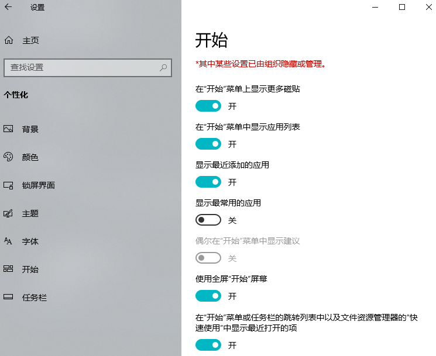
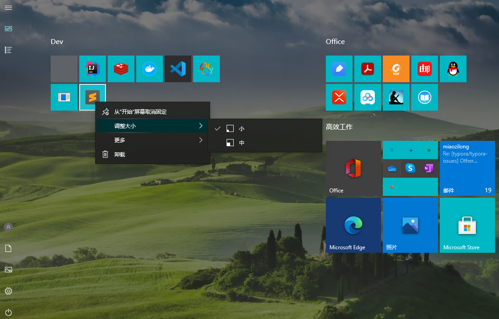

# 简洁的桌面

[toc]

## 推荐阅读

> - [为什么很多人电脑桌面上软件图标寥寥无几甚至空空荡荡?请问怎么做到的?](https://www.zhihu.com/question/358547747)
> - [TrayS - 终极美化任务栏（透明、应用居中）](https://zhuanlan.zhihu.com/p/148141287)
> - 

## 一、善用开始屏幕

### 1.设置开始屏幕

`Win + I` 打开设置  -> 个性化 -> 开始，设置开始菜单，如下图所示：

 ### 2.将软件固定到开始屏幕

在软件的桌面快捷方式图标上邮件，然后选择 `固定到"开始"屏幕(P)` 即可

### 3.自行调整磁贴位置、大小

在开始屏幕的软件图标上右键即可调整图标大小，并且还可以任意给图标分组，任意摆放位置。

## 二、任务栏居中

参考：[TrayS - 终极美化任务栏（透明、应用居中）](https://zhuanlan.zhihu.com/p/148141287)

