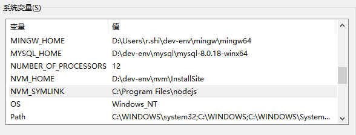

# NodeJs环境搭建

[toc]


## 推荐阅读


## 一、NodeJs环境搭建

### 1.下载并安装NVM

前往GitHub [coreybutler/nvm-windows](https://github.com/coreybutler/nvm-windows) 下载最新版安装包。

运行安装程序，除了设置个自定义安装目录，其余一路Next.

安装时，程序会自动配置环境变量，可以看到配置了两个环境变量




这两个目录，一个是 nvm 的安装目录，一个是node的版本库目录。


### 2.配置node和npm的镜像源

在nvm的安装目录下，找到 `settings.txt`，追加如下内容：

```pro
node_mirror: https://npm.taobao.org/mirrors/node/
npm_mirror: https://npm.taobao.org/mirrors/npm/
```


然后检查是否安装完成：

```bash
$ nvm version
1.1.7
```


### 3.安装nodejs

先安装nodejs

```bash
nvm list available          # 列出nodejs的可用版本
nvm install v14.17.0        # 安装 指定版本的nodejs (v可要可不要)
nvm use v14.17.0   		  	# 使用指定版本的nodejs
nvm alias default v14.17.0  # 设置默认版本，macOS系统的use指令只是临时切换
nvm uninstall v14.17.0      # 删除指定版本的nodejs
nvm ls					  # 查看本地所有版本
```

然后配置npm镜像源：

```bash
npm config set registry https://registry.npm.taobao.org --global 
npm config set disturl https://npm.taobao.org/dist --global
```


### 4.切换node版本

直接使用如下命令即可切换至对应版本

```bash
nvm install 版本 
nvm use 版本
```


