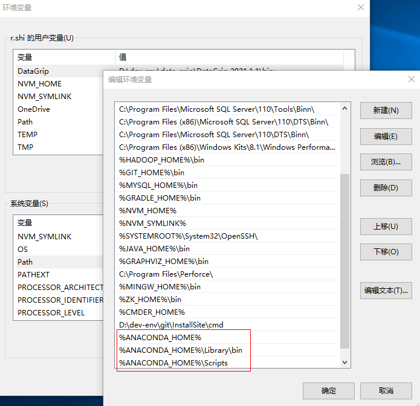
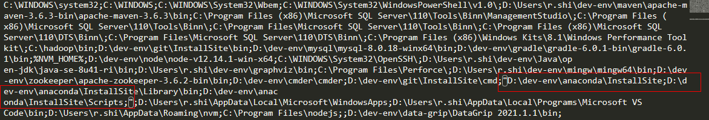
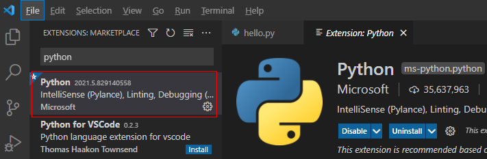

# VsCode搭建Python开发环境

[toc]

## 推荐阅读


## 一、安装Python

### 1.安装Anaconda

Anaconda是一个用于科学计算的Python发行版，支持Linux、Mac和Window系统，提供了包管理与环境管理的功能，可以很方便地解决Python并存、切换，以及各种第三方包安装的问题。

#### 1.1 下载

可以直接前往 [Anaconda官网](https://www.anaconda.com/) 下载，但因为Anaconda的服务器在国外，所以下载速度会很慢，这里推荐使用[清华的镜像](https://mirrors.tuna.tsinghua.edu.cn/anaconda/archive/)来下载。

选择合适版本，然后下载即可，这里选择的是 [Anaconda3-5.3.1-Windows-x86_64.exe](https://mirrors.tuna.tsinghua.edu.cn/anaconda/archive/Anaconda3-5.3.1-Windows-x86_64.exe)

#### 1.2 安装

自定义一个安装路径，然后一路Next即可

#### 1.3 配置环境变量

```properties
ANACONDA_HOME=Anaconda安装目录
Path=%ANACONDA_HOME%;%ANACONDA_HOME%\Library\bin;%ANACONDA_HOME%\Scripts;
```



注意：环境变量要拆开，新建多条，若只新建一个的话，则会当做一个字符串：

```bash
C:\WINDOWS\system32;C:\WINDOWS;C:\WINDOWS\System32\Wbem;C:\WINDOWS\System32\WindowsPowerShell\v1.0\;D:\Users\r.shi\dev-env\maven\apache-maven-3.6.3-bin\apache-maven-3.6.3\bin;C:\Program Files (x86)\Microsoft SQL Server\110\Tools\Binn\ManagementStudio\;C:\Program Files (x86)\Microsoft SQL Server\110\Tools\Binn\;C:\Program Files\Microsoft SQL Server\110\Tools\Binn\;C:\Program Files (x86)\Microsoft SQL Server\110\DTS\Binn\;C:\Program Files\Microsoft SQL Server\110\DTS\Binn\;C:\Program Files (x86)\Windows Kits\8.1\Windows Performance Toolkit\;C:\hadoop\bin;D:\dev-env\git\InstallSite\bin;D:\dev-env\mysql\mysql-8.0.18-winx64\bin;D:\dev-env\gradle\gradle-6.0.1-bin\gradle-6.0.1\bin;%NVM_HOME%;D:\dev-env\node\node-v12.14.1-win-x64;C:\WINDOWS\System32\OpenSSH\;D:\Users\r.shi\dev-env\Java\open-jdk\java-se-8u41-ri\bin;D:\Users\r.shi\dev-env\graphviz\bin;C:\Program Files\Perforce\;D:\Users\r.shi\dev-env\mingw\mingw64\bin;D:\dev-env\zookeeper\apache-zookeeper-3.6.2-bin\bin;D:\dev-env\cmder\cmder;D:\dev-env\git\InstallSite\cmd;"D:\dev-env\anaconda\InstallSite;D:\dev-env\anaconda\InstallSite\Library\bin;D:\dev-env\anaconda\InstallSite\Scripts;";D:\Users\r.shi\AppData\Local\Microsoft\WindowsApps;D:\Users\r.shi\AppData\Local\Programs\Microsoft VS Code\bin;D:\Users\r.shi\AppData\Roaming\nvm;C:\Program Files\nodejs;;D:\dev-env\data-grip\DataGrip 2021.1.1\bin;
```




验证：

```bash
python -v
```

#### 1.4 安装成功

这时应该就安装成功了，但是如果安装失败，则可以按照下文解决：

> - [Windows里Anaconda-Navigator无法打开的解决方案（详细）](https://blog.csdn.net/weixin_42529892/article/details/81503261)


## 二、VsCode搭建Python开发环境

### 1.安装Python插件

直接搜索Python然后安装即可




安装成功后，即可拥有代码智能提示、语法检查、debug、代码格式化等功能。

新建一个文件 `hello.py`，内容如下：

```python
#!/usr/bin/python3

print('hello, world')
```

然后打开控制台执行命令`python .\hello.py`来运行Python脚本，然后控制台会输出

```bash
hello, world
```

至此，已经完成了VsCode搭建Python开发环境的任务了。

